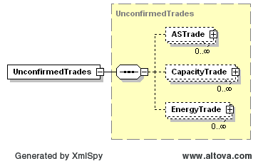

### Confirmed and Unconfirmed Trades

A notification is issued periodically to a QSE where they have been
identified as the counter party in a trade, but have not yet entered a
matching energy, capacity, or ancillary services trade. If a matching
trade is not entered by the close of the market, the trade is
rejected.

The following response message structure will be used for created
Unconfirmed trade notification:

| Message Element | Value                |
|-------------------------------------------|------------------------------------------------|
| Header/Verb                               | Created                                        |
| Header/Noun                               | UnconfirmedTrades                              |
| Header/Source                             | ERCOT                                          |
| Reply/ReplyCode                           | *Reply code, success=OK, error=ERROR or FATAL* |
| Reply/Error                               | *Error message, if error encountered*          |
| Reply/Timestamp                           | *Current System Timestamp*                     |
| Payload                                   | UnconfirmedTrades                              |

The following structure is used for conveying unconfirmed trades:

The details of the structures for ASTrades, CapacityTrades, and EnergyTrades are 
described in the corresponding documents within the Market Transaction Services
transaction section.

The following is an XML of an unconfirmed trade’s payload:

~~~
<UnconfirmedTrades>
    <ASTrade>
        <mRID>ACME.20080101.AST.<ASType>.<BuyerQSE>.<SellerQSE></mRID>
    </ASTrade>
    <CapacityTrade>
        <mRID>ACME.20080101.CT.<BuyerQSE>.<SellerQSE></mRID>
    </CapacityTrade>
    <EnergyTrade>
        <mRID>ACME.20080101.ET.<SettlementPoint>.<BuyerQSE>.<SellerQSE></mRID>
    </EnergyTrade>
</UnconfirmedTrades>
~~~

The mRID used in the message is the mRID for the trade that was
submitted by the counterparty. Similarly to unconfirmed trades, the
following figure describes the container for confirmed trades.

The following response message structure will be used for Confirmed
trade notification:

| Message Element | Value                |
|-------------------------------------------|------------------------------------------------|
| Header/Verb                               | Created                                        |
| Header/Noun                               | ConfirmedTrades                                |
| Header/Source                             | ERCOT                                          |
| Reply/ReplyCode                           | *Reply code, success=OK, error=ERROR or FATAL* |
| Reply/Error                               | *Error message, if error encountered*          |
| Reply/Timestamp                           | *Current System Timestamp*                     |
| Payload                                   | ConfirmedTrades                                |

The following is an XML of a confirmed trade’s payload:

~~~
<ConfirmedTrades>
    <ASTrade>
        <mRID>ACME.20080101.AST.<ASType>.<BuyerQSE>.<SellerQSE></mRID>
    </ASTrade>
    <CapacityTrade>
        <mRID>ACME.20080101.CT.<BuyerQSE>.<SellerQSE></mRID>
    </CapacityTrade>
    <EnergyTrade>
        <mRID>ACME.20080101.ET.<SettlementPoint>.<BuyerQSE>.<SellerQSE></mRID>
    </EnergyTrade>
</ConfirmedTrades>
~~~

Confirmed and Unconfirmed Trades – cancel update

A separate notification is issued to a QSE when a
Confirmed/Unconfirmed trade is canceled by counter party.

The following response message structure will be used for cancelled
Unconfirmed trade notification:

| Message Element | Value                |
|-------------------------------------------|------------------------------------------------|
| Header/Verb                               | canceled                                       |
| Header/Noun                               | UnconfirmedTrades                              |
| Header/Source                             | ERCOT                                          |
| Reply/ReplyCode                           | *Reply code, success=OK, error=ERROR or FATAL* |
| Reply/Error                               | *Error message, if error encountered*          |
| Reply/Timestamp                           | *Current System Timestamp*                     |
| Payload                                   | UnconfirmedTrades                              |

The mRID used in the message is the mRID for the trade that was
submitted by the counterparty. Similarly to unconfirmed trades, the
following figure describes the container for confirmed trades.

The following response message structure will be used for Confirmed
trade cancel notification:

| Message Element | Value                |
|-------------------------------------------|------------------------------------------------|
| Header/Verb                               | canceled                                       |
| Header/Noun                               | ConfirmedTrades                                |
| Header/Source                             | ERCOT                                          |
| Reply/ReplyCode                           | *Reply code, success=OK, error=ERROR or FATAL* |
| Reply/Error                               | *Error message, if error encountered*          |
| Reply/Timestamp                           | *Current System Timestamp*                     |
| Payload                                   | ConfirmedTrades                                |

The payloads for cancelled confirmed and unconfirmed trades uses the same XSDs as created
confirmed and unconfirmed trades.
