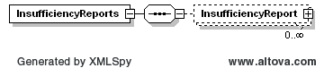

### DAM Ancillary Service Offer Insufficiency Report

Upon DAM market closure and before the start of the MMS optimization
process, if there are not enough AS offers, the DAM AS Offer
Insufficiency Report will be used to notify the market participants of
available and insufficient AS Offer quantities.

The following response message structure will be used for DAM AS Offer
Insufficiency Report notification:

| Message Element | Value                |
|-------------------------------------------|------------------------------------------------|
| Header/Verb                               | created                                        |
| Header/Noun                               | InsufficiencyReport                            |
| Header/Source                             | ERCOT                                          |
| Reply/ReplyCode                           | *Reply code, success=OK, error=ERROR or FATAL* |
| Reply/Error                               | *Error message, if error encountered*          |
| Reply/Timestamp                           | *Current System Timestamp*                     |
| Payload/                                  | InsufficiencyReports                           |

The following payload structure is used to convey these notifications.

The following is an XML example:

~~~
<InsufficiencyReports xsi:schemaLocation="http://www.ercot.com/schema/2007-06/nodal/ews ErcotAwards.xsd" xmlns="http://www.ercot.com/schema/2007-06/nodal/ews" xmlns:xsi="http://www.w3.org/2001/XMLSchema-instance">
    <InsufficiencyReport>
        <qse>ERCOT</qse>
        <startTime>2008-01-01T10:00:00-06:00</startTime>
        <endTime>2008-01-01T12:00:00-06:00</endTime>
        <tradingDate>2008-01-01</tradingDate>
        <marketType>DAM</marketType>
        <asType>Reg-Up</asType>
        <asOfferQuantity>3.1</asOfferQuantity>
        <asInsufficiencyQuantity>3.1</asInsufficiencyQuantity>
        <asInsufficiencyStatus>3.1</asInsufficiencyStatus>
        <clearedAS>String</clearedAS>
        <draftAlert>String</draftAlert>
    </InsufficiencyReport>
</InsufficiencyReports>
~~~
