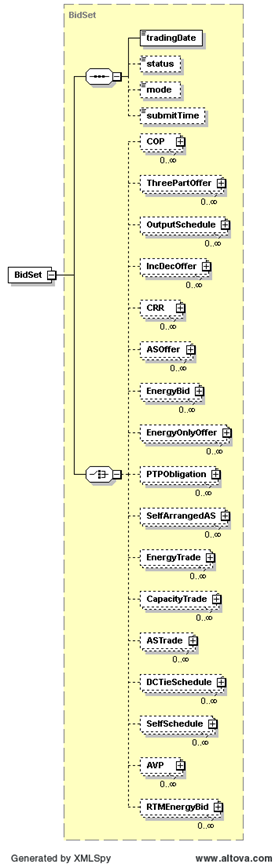

### DAM Phase II Validation Results

The purpose of this notification message is to notify DAM Phase II
Validation results to a QSE.

The payload will hold the Bid Validation results (bid cancellations
only) for the specified trading date.

The following response message structure will be used for Phase II
validation results notification:

<table>
<colgroup>
<col style="width: 35%" />
<col style="width: 64%" />
</colgroup>
<thead>
<tr class="header">
<th><mark>Message Element</mark></th>
<th><mark>Value</mark></th>
</tr>
</thead>
<tbody>
<tr class="odd">
<td>Header/Verb</td>
<td>canceled</td>
</tr>
<tr class="even">
<td>Header/Noun</td>
<td>P2ValidationSet</td>
</tr>
<tr class="odd">
<td>Header/Source</td>
<td>ERCOT</td>
</tr>
<tr class="even">
<td>Reply/ReplyCode</td>
<td><em>Reply code, success=OK, error=ERROR or FATAL</em></td>
</tr>
<tr class="odd">
<td>Reply/Error</td>
<td><em>Error message, if error encountered</em></td>
</tr>
<tr class="even">
<td>Reply/Timestamp</td>
<td><em>Current System Timestamp</em></td>
</tr>
<tr class="odd">
<td>Payload/</td>
<td>
BidSet/&lt;BidType&gt;

&lt;BidType&gt; : one of the valid bid type like COP etc
</td>
</tr>
</tbody>
</table>

The payload structure is described by the following diagram:>

The following is an XML example for DAM Phase II validation:

~~~
<BidSet xmlns="http://www.ercot.com/schema/2007-05/nodal/ews" xmlns:xsi="http://www.w3.org/2001/XMLSchema-instance">
    <tradingDate>2008-02-19</tradingDate>
    <ThreePartOffer>
        <mRID>ACME.20080101.TPO.DG_BIOE_2UNITS</mRID>
        <status>CANCELED</status>
        <error> 
            <severity>ERROR</severity>
            <text>Validation of the Energy Three Part Offer failed.</text>
        </error>
        <error> 
            <severity>ERROR</severity>
            <text>The data required for credit exposure calculation cannot be found</text>
        </error>
    </ThreePartOffer>
</BidSet>
~~~
