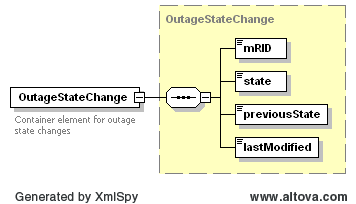

### Outage Notifications

The purpose of this notification is to notify market participants of
outage state changes.

The following response message structure will be used for Outage State
change notification:

| Message Element | Value                |
|-------------------------------------------|------------------------------------------------|
| Header/Verb                               | changed                                        |
| Header/Noun                               | OutageSet                                      |
| Header/Source                             | ERCOT                                          |
| Reply/ReplyCode                           | *Reply code, success=OK, error=ERROR or FATAL* |
| Reply/Error                               | *Error message, if error encountered*          |
| Reply/Timestamp                           | *Current System Timestamp*                     |
| Payload/                                  | OutageStateChange                              |

The following high-level payload structure is used to convey outage
notifications.

The following is an XML example:

~~~
<OutageStateChange>
    <mRID>TESTQSE.OTG.M1.Resource.XYZ121548</mRID>
    <state>Cancl</state>
    <previousState>Recvd</previousState>
    <lastModified>2010-03-15</lastModified>
</OutageStateChange>
~~~
