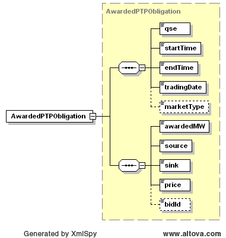

### PTP Obligation Awards

The purpose of this message is to notify a QSE of DAM PTP Obligation
Awards.

The following response message structure will be used for PTP Obligation
Awards notification:

| Message Element | Value                |
|-------------------------------------------|------------------------------------------------|
| Header/Verb                               | created                                        |
| Header/Noun                               | AwardedPTPObligation                           |
| Header/Source                             | ERCOT                                          |
| Reply/ReplyCode                           | *Reply code, success=OK, error=ERROR or FATAL* |
| Reply/Error                               | *Error message, if error encountered*          |
| Reply/Timestamp                           | *Current System Timestamp*                     |
| Payload/AwardSet                          | AwardedPTPObligation                           |

The structure of this message is shown by the following diagram:

The following is an XML example:

~~~
<ns0:AwardedPTPObligation>
    <ns0:qse>LUMN</ns0:qse>
    <ns0:startTime>2008-04-30T00:00:00-05:00</ns0:startTime>
    <ns0:endTime>2008-04-30T01:00:00-05:00</ns0:endTime>
    <ns0:tradingDate>2008-04-30</ns0:tradingDate>
    <ns0:marketType>DAM</ns0:marketType >
    <ns0:awardedMW>0</ns0:awardedMW>
    <ns0:source>BBSES_UNIT1</ns0:source>
    <ns0:sink>LZ_NORTH</ns0:sink>
    <ns0:price>0</ns0:price>
    <ns0:bidId>01</ns0:bidId>
</ns0:AwardedPTPObligation>
~~~
