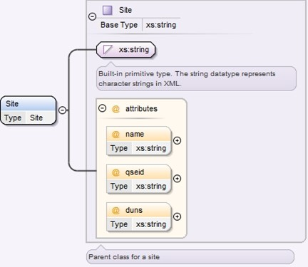
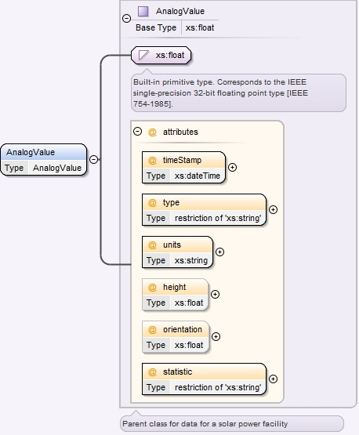

### Solar Generation Forecast

The purpose of this interface is to provide a notification for
Photovoltaic Generation Resource Production Potential (PVGRPP), which
is a forecast of Renewable Production Potential (RPP) for Photovoltaic
Generation Resources (PVGR). ERCOT will provide forecasts for each
PVGR to the QSEs representing PVGRs. The QSEs shall use the ERCOT
provided forecasts for PVGRs throughout the Day-Ahead and Operating
Day for applicable markets and RUCs.

The following response message structure will be used for forecast
notification:

| Message Element | Value                |
|-------------------------------------------|------------------------------------------------|
| Header/Verb                               | create                                         |
| Header/Noun                               | SolarForecastData                              |
| Header/Source                             | ERCOT                                          |
| Reply/ReplyCode                           | *Reply code, success=OK, error=ERROR or FATAL* |
| Reply/Error                               | *Error message, if error encountered*          |
| Reply/Timestamp                           | *Current System Timestamp*                     |
| Payload/                                  | ForecastSolarPayload                           |

The following diagram defines the structure of a site about which
information must be exchanged by the ERCOT and Market Participants
Notification listener using the Site tag:

<table>
<colgroup>
<col style="width: 18%" />
<col style="width: 10%" />
<col style="width: 14%" />
<col style="width: 20%" />
<col style="width: 35%" />
</colgroup>
<tbody>
<tr class="odd">
<td><blockquote>

<em>Element</em>

</blockquote></td>
<td><em>REQ</em></td>
<td><blockquote>

<em>Data type</em>

</blockquote></td>
<td><em>Description</em></td>
<td><blockquote>

<em>Values</em>

</blockquote></td>
</tr>
<tr class="even">
<td>Site</td>
<td><blockquote>

Y

</blockquote></td>
<td>String</td>
<td>Unique site ID</td>
<td>Prescribed at registration</td>
</tr>
<tr class="odd">
<td><em>Attribute</em></td>
<td><em>REQ</em></td>
<td><em>Data type</em></td>
<td><em>Description</em></td>
<td><em>Values</em></td>
</tr>
<tr class="even">
<td>name</td>
<td><blockquote>

N

</blockquote></td>
<td>String</td>
<td>Verbose site ID</td>
<td>Prescribed at registration</td>
</tr>
<tr class="odd">
<td>qseid</td>
<td><blockquote>

N

</blockquote></td>
<td>String</td>
<td>QSE short name</td>
<td>Prescribed at registration</td>
</tr>
<tr class="even">
<td>duns</td>
<td><blockquote>

N

</blockquote></td>
<td>String</td>
<td>QSE DUNS</td>
<td>DUNS Number</td>
</tr>
</tbody>
</table>

The following diagram defines the structure of Analog Values which
must be exchanged by the ERCOT and Market Participants Notification
Listener applications using the AnalogValue tag:

<table>
<colgroup>
<col style="width: 16%" />
<col style="width: 8%" />
<col style="width: 19%" />
<col style="width: 22%" />
<col style="width: 32%" />
</colgroup>
<tbody>
<tr class="odd">
<td><em>Element</em></td>
<td><em>REQ</em></td>
<td><em>Data type</em></td>
<td><blockquote>

<em>Description</em>

</blockquote></td>
<td><blockquote>

<em>Values</em>

</blockquote></td>
</tr>
<tr class="even">
<td><blockquote>

Analog Value

</blockquote></td>
<td>Y</td>
<td>AnalogValue</td>
<td>Value of data</td>
<td>Valid floating point value</td>
</tr>
<tr class="odd">
<td><em>Attribute</em></td>
<td><em>REQ</em></td>
<td><em>Data type</em></td>
<td><em>Description</em></td>
<td><em>Values</em></td>
</tr>
<tr class="even">
<td>timeStamp</td>
<td>Y</td>
<td>dateTime</td>
<td>Time of data</td>
<td>Valid dateTime format</td>
</tr>
<tr class="odd">
<td>Type</td>
<td>Y</td>
<td>String</td>
<td>Value of data</td>
<td>Enumeration (STPPF, PVGRPP, TE, PR, WS, WD, PWR, BPAVG)</td>
</tr>
<tr class="even">
<td>Units</td>
<td>Y</td>
<td>String</td>
<td>Units of data</td>
<td>Enumeration (MW, m/s, Celsius)</td>
</tr>
<tr class="odd">
<td>Height</td>
<td>N</td>
<td>Float</td>
<td>Height above ground level of data</td>
<td>Not Applicable</td>
</tr>
<tr class="even">
<td>orientation</td>
<td>N</td>
<td>Float</td>
<td>Directional orientation from true north of sensor</td>
<td>Not Applicable</td>
</tr>
<tr class="odd">
<td>Statistic</td>
<td>Y</td>
<td>String</td>
<td>Statistic used to create data</td>
<td>Enumeration (SAMPLE,MEAN,SD,ME,MAE,RMS)</td>
</tr>
</tbody>
</table>

The following is an abbreviated XML example for Solar Forecast
payload:

~~~
<ns1:ForecastSolarPayload xmlns:ns0="http://www.ercot.com/schema/2007-05/nodal/eip/il" xmlns:ns1="http://www.ercot.com/schema/2007-06/nodal/ews">
    <ns1:ForecastSet>
        <ns1:Site name="ABC_DEF1" qseid="QSE1" duns="1234567890000">SITE1</ns1:Site>
        <ns1:Created>2016-01-20T17:10:01-06:00</ns1:Created>
        <ns1:AnalogValue timeStamp="2016-01-20T17:10:01-06:00" type="STPPF" units="MW" statistic="MEAN">4.4</ns1:AnalogValue>
        <ns1:AnalogValue timeStamp="2016-01-20T17:10:01-06:00" type="PVGRPP" units="MW" statistic="MEAN">4.4</ns1:AnalogValue>
        <ns1:AnalogValue timeStamp="2016-01-20T17:10:01-06:00" type="STPPF" units="MW" statistic="MEAN">0</ns1:AnalogValue>
        <ns1:AnalogValue timeStamp="2016-01-20T17:10:01-06:00" type="PVGRPP" units="MW" statistic="MEAN">0</ns1:AnalogValue>
        <ns1:AnalogValue timeStamp="2016-01-20T17:10:01-06:00" type="STPPF" units="MW" statistic="MEAN">0</ns1:AnalogValue>
        <ns1:AnalogValue timeStamp="2016-01-20T17:10:01-06:00" type="PVGRPP" units="MW" statistic="MEAN">0</ns1:AnalogValue>
        <ns1:AnalogValue timeStamp="2016-01-20T17:10:01-06:00" type="STPPF" units="MW" statistic="MEAN">0</ns1:AnalogValue>
        <ns1:AnalogValue timeStamp="2016-01-20T17:10:01-06:00" type="PVGRPP" units="MW" statistic="MEAN">0</ns1:AnalogValue>
        <ns1:AnalogValue timeStamp="2016-01-20T17:10:01-06:00" type="STPPF" units="MW" statistic="MEAN">1.7</ns1:AnalogValue>
        <ns1:AnalogValue timeStamp="2016-01-20T17:10:01-06:00" type="PVGRPP" units="MW" statistic="MEAN">0</ns1:AnalogValue>
</ns1:ForecastSolarPayload> 
~~~
