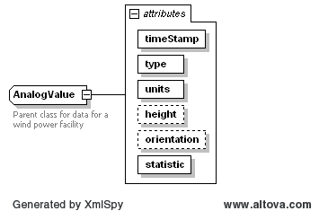
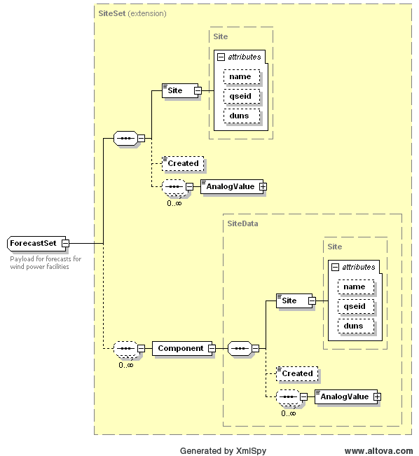

### Wind Generation Forecast

The purpose of this interface is to provide a notification for Wind
Generation Resource Production Potential (WGRPP).

The purpose of Interface is to provide forecasts of Renewable
Production Potential (RPP) for Wind Powered Generation Resources
(WGR). ERCOT will provide forecasts for each WGR to the QSEs
representing WGRs. The QSEs shall use the ERCOT provided forecasts for
WGRs throughout the Day-Ahead and Operating Day for applicable markets
and RUCs. Additionally the purpose is to allow WGRs to submit the
LTWPF for their Resources to ERCOT and their respective QSE.

The following response message structure will be used for forecast
notification:

| Message Element | Value                |
|-------------------------------------------|------------------------------------------------|
| Header/Verb                               | create                                         |
| Header/Noun                               | WindForecastData                               |
| Header/Source                             | ERCOT                                          |
| Reply/ReplyCode                           | *Reply code, success=OK, error=ERROR or FATAL* |
| Reply/Error                               | *Error message, if error encountered*          |
| Reply/Timestamp                           | *Current System Timestamp*                     |
| Payload/                                  | ForecastPayload                                |

The following diagram defines the structure of a site about which
information must be exchanged by the ERCOT and Market Participants
Notification listener using the Site tag:

<table>
<colgroup>
<col style="width: 16%" />
<col style="width: 11%" />
<col style="width: 14%" />
<col style="width: 20%" />
<col style="width: 35%" />
</colgroup>
<tbody>
<tr class="odd">
<td><blockquote>

<em>Element</em>

</blockquote></td>
<td><em>REQ</em></td>
<td><blockquote>

<em>Data type</em>

</blockquote></td>
<td><em>Description</em></td>
<td><blockquote>

<em>Values</em>

</blockquote></td>
</tr>
<tr class="even">
<td>Site</td>
<td><blockquote>

Y

</blockquote></td>
<td>String</td>
<td>Unique site ID</td>
<td>Prescribed at registration</td>
</tr>
<tr class="odd">
<td><em>Attribute</em></td>
<td><em>REQ</em></td>
<td><em>Data type</em></td>
<td><em>Description</em></td>
<td><em>Values</em></td>
</tr>
<tr class="even">
<td>name</td>
<td><blockquote>

N

</blockquote></td>
<td>String</td>
<td>Verbose site ID</td>
<td>Prescribed at registration</td>
</tr>
</tbody>
</table>

The following diagram defines the structure of Analog Values which
must be exchanged by the ERCOT and Market Participants Notification
Listener applications using the AnalogValue tag:

<table>
<colgroup>
<col style="width: 16%" />
<col style="width: 7%" />
<col style="width: 13%" />
<col style="width: 28%" />
<col style="width: 32%" />
</colgroup>
<tbody>
<tr class="odd">
<td><em>Element</em></td>
<td><em>REQ</em></td>
<td><em>Data type</em></td>
<td><blockquote>

<em>Description</em>

</blockquote></td>
<td><blockquote>

<em>Values</em>

</blockquote></td>
</tr>
<tr class="even">
<td><blockquote>

Analog Value

</blockquote></td>
<td>Y</td>
<td>AnalogValue</td>
<td>Value of data</td>
<td>Valid floating point value</td>
</tr>
<tr class="odd">
<td><em>Attribute</em></td>
<td><em>REQ</em></td>
<td><em>Data type</em></td>
<td><em>Description</em></td>
<td><em>Values</em></td>
</tr>
<tr class="even">
<td>timeStamp</td>
<td>Y</td>
<td>dateTime</td>
<td>Time of data</td>
<td>Valid dateTime format</td>
</tr>
<tr class="odd">
<td>Value</td>
<td>Y</td>
<td>Float</td>
<td>Value of data</td>
<td>Valid floating point value</td>
</tr>
<tr class="even">
<td>units</td>
<td>Y</td>
<td>String</td>
<td>Units of data</td>
<td>Enumeration (MW, m/s, Celsius)</td>
</tr>
<tr class="odd">
<td>height</td>
<td>N</td>
<td>Float</td>
<td>Height above ground level of data</td>
<td>Valid floating point value</td>
</tr>
<tr class="even">
<td>orientation</td>
<td>N</td>
<td>Float</td>
<td>Directional orientation from true north of sensor</td>
<td>Valid floating point value between 0.0 and 359.99 inclusive.</td>
</tr>
<tr class="odd">
<td>statistic</td>
<td>Y</td>
<td>String</td>
<td>Statistic used to create data</td>
<td>Enumeration (AVG, MIN, MAX, SDV)</td>
</tr>
</tbody>
</table>

> [!NOTE]
> The “Component” element is used only by the Wind Forecasting vendor 
> to send the forecast information to ERCOT for all QSEs. It is not used to 
> send the QSE specific forecast information to their listeners (see example
> below).

The following is an XML example for Forecast payload:

~~~
<ns1:ForecastPayload xmlns:ns0="http://www.ercot.com/schema/2007-05/nodal/eip/il" xmlns:ns1="http://www.ercot.com/schema/2007-06/nodal/ews">
    <ns1:ForecastSet>
        <ns1:Site name="SITE1" qseid="TESTQSE1" duns="0012345676901">XXX</ns1:Site>
        <ns1:Created>2010-04-27T15:14:01-05:00</ns1:Created>
        <ns1:AnalogValue timeStamp="2010-04-27T16:00:00-05:00" type="STWPF" units="MW" statistic="MEAN">4.4</ns1:AnalogValue>
        <ns1:AnalogValue timeStamp="2010-04-27T16:00:00-05:00" type="WGRPP" units="MW" statistic="MEAN">0</ns1:AnalogValue>
        <ns1:AnalogValue timeStamp="2010-04-27T17:00:00-05:00" type="STWPF" units="MW" statistic="MEAN">5.7</ns1:AnalogValue>
        <ns1:AnalogValue timeStamp="2010-04-27T17:00:00-05:00" type="WGRPP" units="MW" statistic="MEAN">0</ns1:AnalogValue>
        <ns1:AnalogValue timeStamp="2010-04-27T18:00:00-05:00" type="STWPF" units="MW" statistic="MEAN">5.5</ns1:AnalogValue>
        <ns1:AnalogValue timeStamp="2010-04-27T18:00:00-05:00" type="WGRPP" units="MW" statistic="MEAN">0</ns1:AnalogValue>
        <ns1:AnalogValue timeStamp="2010-04-27T19:00:00-05:00" type="STWPF" units="MW" statistic="MEAN">6.6</ns1:AnalogValue>
        <ns1:AnalogValue timeStamp="2010-04-27T19:00:00-05:00" type="WGRPP" units="MW" statistic="MEAN">0</ns1:AnalogValue>
        <ns1:AnalogValue timeStamp="2010-04-27T20:00:00-05:00" type="STWPF" units="MW" statistic="MEAN">7.7</ns1:AnalogValue>
        <ns1:AnalogValue timeStamp="2010-04-27T20:00:00-05:00" type="WGRPP" units="MW" statistic="MEAN">0.3</ns1:AnalogValue>
        <ns1:AnalogValue timeStamp="2010-04-27T21:00:00-05:00" type="STWPF" units="MW" statistic="MEAN">15</ns1:AnalogValue>
        <ns1:AnalogValue timeStamp="2010-04-27T21:00:00-05:00" type="WGRPP" units="MW" statistic="MEAN">7.6</ns1:AnalogValue>
        <ns1:AnalogValue timeStamp="2010-04-27T22:00:00-05:00" type="STWPF" units="MW" statistic="MEAN">23.1</ns1:AnalogValue>
        <ns1:AnalogValue timeStamp="2010-04-27T22:00:00-05:00" type="WGRPP" units="MW" statistic="MEAN">15.7</ns1:AnalogValue>
        <ns1:AnalogValue timeStamp="2010-04-27T23:00:00-05:00" type="STWPF" units="MW" statistic="MEAN">23.3</ns1:AnalogValue>
        <ns1:AnalogValue timeStamp="2010-04-27T23:00:00-05:00" type="WGRPP" units="MW" statistic="MEAN">16</ns1:AnalogValue>
        <ns1:AnalogValue timeStamp="2010-04-28T00:00:00-05:00" type="STWPF" units="MW" statistic="MEAN">25.9</ns1:AnalogValue>
        <ns1:AnalogValue timeStamp="2010-04-28T00:00:00-05:00" type="WGRPP" units="MW" statistic="MEAN">18.5</ns1:AnalogValue>
        <ns1:AnalogValue timeStamp="2010-04-28T01:00:00-05:00" type="STWPF" units="MW" statistic="MEAN">31.4</ns1:AnalogValue>
        <ns1:AnalogValue timeStamp="2010-04-28T01:00:00-05:00" type="WGRPP" units="MW" statistic="MEAN">24</ns1:AnalogValue>
        <ns1:AnalogValue timeStamp="2010-04-28T02:00:00-05:00" type="STWPF" units="MW" statistic="MEAN">34.7</ns1:AnalogValue>
        <ns1:AnalogValue timeStamp="2010-04-28T02:00:00-05:00" type="WGRPP" units="MW" statistic="MEAN">27.3</ns1:AnalogValue>
        <ns1:AnalogValue timeStamp="2010-04-28T03:00:00-05:00" type="STWPF" units="MW" statistic="MEAN">39.4</ns1:AnalogValue>
        <ns1:AnalogValue timeStamp="2010-04-28T03:00:00-05:00" type="WGRPP" units="MW" statistic="MEAN">32</ns1:AnalogValue>
        <ns1:AnalogValue timeStamp="2010-04-28T04:00:00-05:00" type="STWPF" units="MW" statistic="MEAN">42.3</ns1:AnalogValue>
        <ns1:AnalogValue timeStamp="2010-04-28T04:00:00-05:00" type="WGRPP" units="MW" statistic="MEAN">34.9</ns1:AnalogValue>
        <ns1:AnalogValue timeStamp="2010-04-28T05:00:00-05:00" type="STWPF" units="MW" statistic="MEAN">46.4</ns1:AnalogValue>
        <ns1:AnalogValue timeStamp="2010-04-28T05:00:00-05:00" type="WGRPP" units="MW" statistic="MEAN">39</ns1:AnalogValue>
        <ns1:AnalogValue timeStamp="2010-04-28T06:00:00-05:00" type="STWPF" units="MW" statistic="MEAN">44.3</ns1:AnalogValue>
        <ns1:AnalogValue timeStamp="2010-04-28T06:00:00-05:00" type="WGRPP" units="MW" statistic="MEAN">36.9</ns1:AnalogValue>
        <ns1:AnalogValue timeStamp="2010-04-28T07:00:00-05:00" type="STWPF" units="MW" statistic="MEAN">45.6</ns1:AnalogValue>
        <ns1:AnalogValue timeStamp="2010-04-28T07:00:00-05:00" type="WGRPP" units="MW" statistic="MEAN">38.2</ns1:AnalogValue>
        <ns1:AnalogValue timeStamp="2010-04-28T08:00:00-05:00" type="STWPF" units="MW" statistic="MEAN">44.7</ns1:AnalogValue>
        <ns1:AnalogValue timeStamp="2010-04-28T08:00:00-05:00" type="WGRPP" units="MW" statistic="MEAN">37.3</ns1:AnalogValue>
        <ns1:AnalogValue timeStamp="2010-04-28T09:00:00-05:00" type="STWPF" units="MW" statistic="MEAN">37</ns1:AnalogValue>
        <ns1:AnalogValue timeStamp="2010-04-28T09:00:00-05:00" type="WGRPP" units="MW" statistic="MEAN">29.6</ns1:AnalogValue>
        <ns1:AnalogValue timeStamp="2010-04-28T10:00:00-05:00" type="STWPF" units="MW" statistic="MEAN">34.4</ns1:AnalogValue>
        <ns1:AnalogValue timeStamp="2010-04-28T10:00:00-05:00" type="WGRPP" units="MW" statistic="MEAN">27</ns1:AnalogValue>
        <ns1:AnalogValue timeStamp="2010-04-28T11:00:00-05:00" type="STWPF" units="MW" statistic="MEAN">31.2</ns1:AnalogValue>
        <ns1:AnalogValue timeStamp="2010-04-28T11:00:00-05:00" type="WGRPP" units="MW" statistic="MEAN">23.8</ns1:AnalogValue>
        <ns1:AnalogValue timeStamp="2010-04-28T12:00:00-05:00" type="STWPF" units="MW" statistic="MEAN">28.4</ns1:AnalogValue>
        <ns1:AnalogValue timeStamp="2010-04-28T12:00:00-05:00" type="WGRPP" units="MW" statistic="MEAN">21</ns1:AnalogValue>
        <ns1:AnalogValue timeStamp="2010-04-28T13:00:00-05:00" type="STWPF" units="MW" statistic="MEAN">27.1</ns1:AnalogValue>
        <ns1:AnalogValue timeStamp="2010-04-28T13:00:00-05:00" type="WGRPP" units="MW" statistic="MEAN">19.7</ns1:AnalogValue>
        <ns1:AnalogValue timeStamp="2010-04-28T14:00:00-05:00" type="STWPF" units="MW" statistic="MEAN">26.7</ns1:AnalogValue>
        <ns1:AnalogValue timeStamp="2010-04-28T14:00:00-05:00" type="WGRPP" units="MW" statistic="MEAN">19.3</ns1:AnalogValue>
        <ns1:AnalogValue timeStamp="2010-04-28T15:00:00-05:00" type="STWPF" units="MW" statistic="MEAN">27</ns1:AnalogValue>
        <ns1:AnalogValue timeStamp="2010-04-28T15:00:00-05:00" type="WGRPP" units="MW" statistic="MEAN">19.6</ns1:AnalogValue>
        <ns1:AnalogValue timeStamp="2010-04-28T16:00:00-05:00" type="STWPF" units="MW" statistic="MEAN">27.6</ns1:AnalogValue>
        <ns1:AnalogValue timeStamp="2010-04-28T16:00:00-05:00" type="WGRPP" units="MW" statistic="MEAN">20.2</ns1:AnalogValue>
        <ns1:AnalogValue timeStamp="2010-04-28T17:00:00-05:00" type="STWPF" units="MW" statistic="MEAN">28.6</ns1:AnalogValue>
        <ns1:AnalogValue timeStamp="2010-04-28T17:00:00-05:00" type="WGRPP" units="MW" statistic="MEAN">21.3</ns1:AnalogValue>
        <ns1:AnalogValue timeStamp="2010-04-28T18:00:00-05:00" type="STWPF" units="MW" statistic="MEAN">29.4</ns1:AnalogValue>
        <ns1:AnalogValue timeStamp="2010-04-28T18:00:00-05:00" type="WGRPP" units="MW" statistic="MEAN">22</ns1:AnalogValue>
        <ns1:AnalogValue timeStamp="2010-04-28T19:00:00-05:00" type="STWPF" units="MW" statistic="MEAN">32.1</ns1:AnalogValue>
        <ns1:AnalogValue timeStamp="2010-04-28T19:00:00-05:00" type="WGRPP" units="MW" statistic="MEAN">24.7</ns1:AnalogValue>
        <ns1:AnalogValue timeStamp="2010-04-28T20:00:00-05:00" type="STWPF" units="MW" statistic="MEAN">37.7</ns1:AnalogValue>
        <ns1:AnalogValue timeStamp="2010-04-28T20:00:00-05:00" type="WGRPP" units="MW" statistic="MEAN">30.3</ns1:AnalogValue>
        <ns1:AnalogValue timeStamp="2010-04-28T21:00:00-05:00" type="STWPF" units="MW" statistic="MEAN">41.2</ns1:AnalogValue>
        <ns1:AnalogValue timeStamp="2010-04-28T21:00:00-05:00" type="WGRPP" units="MW" statistic="MEAN">33.8</ns1:AnalogValue>
        <ns1:AnalogValue timeStamp="2010-04-28T22:00:00-05:00" type="STWPF" units="MW" statistic="MEAN">44.1</ns1:AnalogValue>
        <ns1:AnalogValue timeStamp="2010-04-28T22:00:00-05:00" type="WGRPP" units="MW" statistic="MEAN">36.7</ns1:AnalogValue>
        <ns1:AnalogValue timeStamp="2010-04-28T23:00:00-05:00" type="STWPF" units="MW" statistic="MEAN">48</ns1:AnalogValue>
        <ns1:AnalogValue timeStamp="2010-04-28T23:00:00-05:00" type="WGRPP" units="MW" statistic="MEAN">40.6</ns1:AnalogValue>
        <ns1:AnalogValue timeStamp="2010-04-29T00:00:00-05:00" type="STWPF" units="MW" statistic="MEAN">51.4</ns1:AnalogValue>
        <ns1:AnalogValue timeStamp="2010-04-29T00:00:00-05:00" type="WGRPP" units="MW" statistic="MEAN">44.1</ns1:AnalogValue>
        <ns1:AnalogValue timeStamp="2010-04-29T01:00:00-05:00" type="STWPF" units="MW" statistic="MEAN">55.5</ns1:AnalogValue>
        <ns1:AnalogValue timeStamp="2010-04-29T01:00:00-05:00" type="WGRPP" units="MW" statistic="MEAN">48.1</ns1:AnalogValue>
        <ns1:AnalogValue timeStamp="2010-04-29T02:00:00-05:00" type="STWPF" units="MW" statistic="MEAN">61</ns1:AnalogValue>
        <ns1:AnalogValue timeStamp="2010-04-29T02:00:00-05:00" type="WGRPP" units="MW" statistic="MEAN">53.6</ns1:AnalogValue>
        <ns1:AnalogValue timeStamp="2010-04-29T03:00:00-05:00" type="STWPF" units="MW" statistic="MEAN">64.6</ns1:AnalogValue>
        <ns1:AnalogValue timeStamp="2010-04-29T03:00:00-05:00" type="WGRPP" units="MW" statistic="MEAN">57.2</ns1:AnalogValue>
        <ns1:AnalogValue timeStamp="2010-04-29T04:00:00-05:00" type="STWPF" units="MW" statistic="MEAN">63.4</ns1:AnalogValue>
        <ns1:AnalogValue timeStamp="2010-04-29T04:00:00-05:00" type="WGRPP" units="MW" statistic="MEAN">56</ns1:AnalogValue>
        <ns1:AnalogValue timeStamp="2010-04-29T05:00:00-05:00" type="STWPF" units="MW" statistic="MEAN">61.1</ns1:AnalogValue>
        <ns1:AnalogValue timeStamp="2010-04-29T05:00:00-05:00" type="WGRPP" units="MW" statistic="MEAN">53.7</ns1:AnalogValue>
        <ns1:AnalogValue timeStamp="2010-04-29T06:00:00-05:00" type="STWPF" units="MW" statistic="MEAN">60.5</ns1:AnalogValue>
        <ns1:AnalogValue timeStamp="2010-04-29T06:00:00-05:00" type="WGRPP" units="MW" statistic="MEAN">53.1</ns1:AnalogValue>
        <ns1:AnalogValue timeStamp="2010-04-29T07:00:00-05:00" type="STWPF" units="MW" statistic="MEAN">59.7</ns1:AnalogValue>
        <ns1:AnalogValue timeStamp="2010-04-29T07:00:00-05:00" type="WGRPP" units="MW" statistic="MEAN">52.3</ns1:AnalogValue>
        <ns1:AnalogValue timeStamp="2010-04-29T08:00:00-05:00" type="STWPF" units="MW" statistic="MEAN">57.6</ns1:AnalogValue>
        <ns1:AnalogValue timeStamp="2010-04-29T08:00:00-05:00" type="WGRPP" units="MW" statistic="MEAN">50.2</ns1:AnalogValue>
        <ns1:AnalogValue timeStamp="2010-04-29T09:00:00-05:00" type="STWPF" units="MW" statistic="MEAN">55.4</ns1:AnalogValue>
        <ns1:AnalogValue timeStamp="2010-04-29T09:00:00-05:00" type="WGRPP" units="MW" statistic="MEAN">48</ns1:AnalogValue>
        <ns1:AnalogValue timeStamp="2010-04-29T10:00:00-05:00" type="STWPF" units="MW" statistic="MEAN">47.7</ns1:AnalogValue>
        <ns1:AnalogValue timeStamp="2010-04-29T10:00:00-05:00" type="WGRPP" units="MW" statistic="MEAN">40.4</ns1:AnalogValue>
        <ns1:AnalogValue timeStamp="2010-04-29T11:00:00-05:00" type="STWPF" units="MW" statistic="MEAN">41.8</ns1:AnalogValue>
        <ns1:AnalogValue timeStamp="2010-04-29T11:00:00-05:00" type="WGRPP" units="MW" statistic="MEAN">34.4</ns1:AnalogValue>
        <ns1:AnalogValue timeStamp="2010-04-29T12:00:00-05:00" type="STWPF" units="MW" statistic="MEAN">38.9</ns1:AnalogValue>
        <ns1:AnalogValue timeStamp="2010-04-29T12:00:00-05:00" type="WGRPP" units="MW" statistic="MEAN">31.5</ns1:AnalogValue>
        <ns1:AnalogValue timeStamp="2010-04-29T13:00:00-05:00" type="STWPF" units="MW" statistic="MEAN">37.5</ns1:AnalogValue>
        <ns1:AnalogValue timeStamp="2010-04-29T13:00:00-05:00" type="WGRPP" units="MW" statistic="MEAN">30.1</ns1:AnalogValue>
        <ns1:AnalogValue timeStamp="2010-04-29T14:00:00-05:00" type="STWPF" units="MW" statistic="MEAN">42.9</ns1:AnalogValue>
        <ns1:AnalogValue timeStamp="2010-04-29T14:00:00-05:00" type="WGRPP" units="MW" statistic="MEAN">35.5</ns1:AnalogValue>
        <ns1:AnalogValue timeStamp="2010-04-29T15:00:00-05:00" type="STWPF" units="MW" statistic="MEAN">47.1</ns1:AnalogValue>
        <ns1:AnalogValue timeStamp="2010-04-29T15:00:00-05:00" type="WGRPP" units="MW" statistic="MEAN">39.7</ns1:AnalogValue>
    </ns1:ForecastSet>
</ns1:ForecastPayload>
~~~
