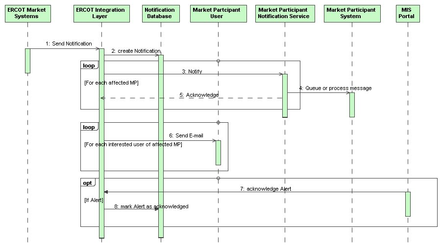

# Notifications

A key aspect of the design for external interfaces for Market
Participants is to provide a simplified variant of the OASIS
WS-Notifications standard for the definition of an ERCOT Notification
interface. Each Market Participant using the external interface would be
required to provide a listener interface for the receipt of notification
messages, compliant with the interface provided by ERCOT.

## Interfaces Provided

The interfaces provided are based upon the WS-Notifications
specification, although for use by ERCOT the interface has been
simplified and augmented to fill one gap in the WS-Notification
specification. For the purposes of use by Market Participants, there
is only one interfaces of interest that is implemented by a Market
Participant listener; this is the ‘Notify’ interface.

The ‘Notify’ interface is used as a means to asynchronously receive
information by Market Participants from ERCOT. Specific examples of this
information include:

- Notices

- Alerts

- BidSet acceptance or error reporting

- Awards

- Obligations

- Startup/Shutdown Instructions

- Outages

The following sequence diagram describes the typical/potential set of
information exchanges related to Notifications. The actual flows would
be different based on the type of notification:

## Interfaces Required

The contents of the any structure would be wrapped using the
ResponseMessage structure defined in section 2.1.4, as this would allow
necessary security information to be passed in a uniform manner. The
following table describes the contents of the Notify message.

| Message Element | Value                                        |
|-------------------------------------------|------------------------------------------------------------------------|
| NotificationMessage/Message/any           | *One or more messages as defined using ERCOT common message structure* |

The following table describes the contents of the Acknowledge message.

| Message Element | Value |
|-------------------------------------------|---------------------------------|
| ReplyCode                                 | *OK or ERROR*                   |
| TimeStamp                                 | *Current time string*           |

## Message Specifications

The WS-Notifications specification identifies a single message structure
for notification messages. The payload that is to be delivered by the
notification message is represented by the ‘any’ element in the
following message structure, loosely coupling the definition of the
payload from the definition of the container message structure defined
by WS-Notifications thereby allowing WS-Notifications to be used with
any XML data structure. ERCOT uses the SubscriptionReference, Topic and
ProducerReference are not used.

> [!IMPORTANT]
> The payloads for NotificationMessages are > ALWAYS conveyed using the 
> common message structure (e.g. Message, RequestMessage, or ResponseMessage)
> as defined in the Services Organization section serving as the ‘any’ 
> sub-structure in the NotificationMessage structure.

ERCOT uses a variant of WS-Notifications, where an ‘Acknowledge’
message is sent to acknowledge the receipt of a notification. The WSDL
and XSD provided by ERCOT are also simplified to eliminate definitions
for interfaces and structures not used by ERCOT. These are described
in the appendix.

ERCOT will allow a Market Participant to specify up to two URLs. ERCOT
will send notifications to port 443 of the specified URL using an
HTTPS connection. ERCOT will sign the SOAP message, where the
signature can be verified using the ERCOT public key. This will verify
that the notification was sent by ERCOT and was not altered. The
‘Acknowledge’ message does not need to be signed.

[Offer and Bid Set Acceptance](/ews/Notifications%20Messages/Offer%20and%20Bid%20Set%20Acceptance.md)

[Offer and Bid Set Errors](/ews/Notifications%20Messages/Offer%20and%20Bid%20Set%20Errors.md)

[Confirmed and Unconfirmed Trades](/ews/Notifications%20Messages/Confirmed%20and%20Unconfirmed%20Trades.md)

[Energy Offer Awards](/ews/Notifications%20Messages/Energy%20Offer%20Awards.md)

[DAM Energy-Only Offer Awards](/ews/Notifications%20Messages/DAM%20Energy-Only%20Offer%20Awards.md)

[DAM Energy Bid Awards](/ews/Notifications%20Messages/DAM%20Energy%20Bid%20Award.md)

[Ancillary Service Awards](/ews/Notifications%20Messages/Ancillary%20Service%20Awards.md)

[CRR Awards](/ews/Notifications%20Messages/CRR%20Awards.md)

[PTP Obligation Awards](/ews/Notifications%20Messages/PTP%20Obligation%20Awards.md)

[Ancillary Service Obligations](/ews/Notifications%20Messages/Ancillary%20Service%20Obligations.md)

[Outage Notifications](/ews/Notifications%20Messages/Outage%20Notifications.md)

[Startup/Shutdown Instructions](/ews/Notifications%20Messages/Startup_Shutdown%20Instructions.md)

[Wind Generation Forecast](/ews/Notifications%20Messages/Wind%20Generation%20Forecast.md)

[DAM Ancillary Service Offer Insufficiency Report](/ews/Notifications%20Messages/DAM%20Ancillary%20Service%20Offer%20Insufficiency%20Report.md)

[End of Adjustment Period Results](/ews/Notifications%20Messages/End%20of%20Adjustment%20Period%20Results.md)

[Two Hour Warning Results](/ews/Notifications%20Messages/Two%20Hour%20Warning%20Results.md)

[DAM Phase II Validation Results](/ews/Notifications%20Messages/DAM%20Phase%20II%20Validation%20Results.md)

[Solar Generation Forecast](/ews/Notifications%20Messages/Solar%20Generation%20Forecast.md)

## Notices and Alerts 

The specific payload for an Alert or Notice is described in the
following diagram. Event container is used to hold Alerts and Notices.
While there may be many different types of Notifications, the primary
difference between a Notice and an Alert is that there is an expectation
that an Alert would be acknowledged:

Example:

~~~
<Event xmlns:xsi="http://www.w3.org/2001/XMLSchema-instance" xsi:schemaLocation="http://www.ercot.com/schema/2007-06/nodal/ews ErcotEvents.xsd" xmlns="http://www.ercot.com/schema/2007-06/nodal/ews">
    <qse>TXU</qse>
    <ID>CM-CAPTRD-NOTF</ID>
    <type>Reported Trade</type>
    <priority>High</priority>
    <source>MMS</source>
    <issued> 2008-10-17T12:53:41.115-05:00 </issued>
    
Trade Submission update by TXU: Confirmed: YES, for Trade Date: 11/21/2008,  Buyer: TXU, Seller: Calpine

</Event>
~~~

[MMS System-Generated Notices](/ews/Notifications%20Messages/Notices%20and%20Alerts/MMS%20System-Generated%20Notices.md)

[EMS System-Generated Notices](/ews/Notifications%20Messages/Notices%20and%20Alerts/EMS%20System-Generated%20Notices.md)

[NMMS System-Generated Notices](/ews/Notifications%20Messages/Notices%20and%20Alerts/NMMS%20System-Generated%20Notices.md)

[Operator Notices](/ews/Notifications%20Messages/Notices%20and%20Alerts/Operator%20notices.md)