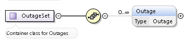
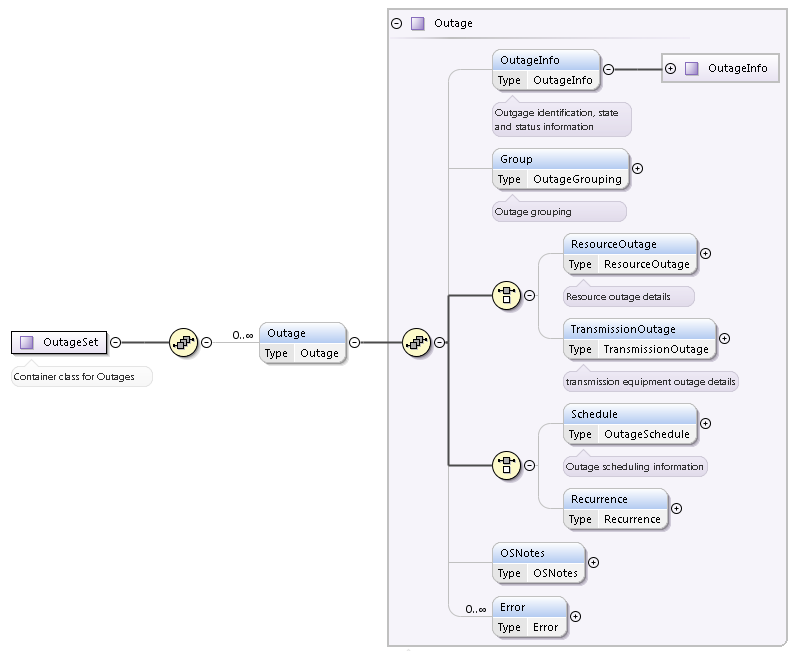
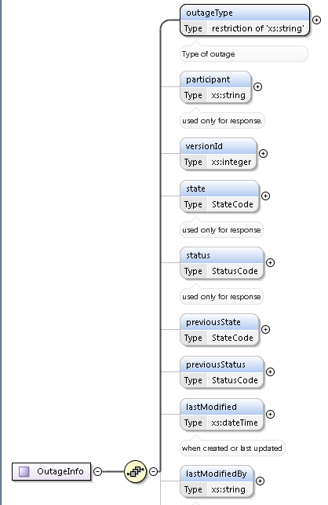
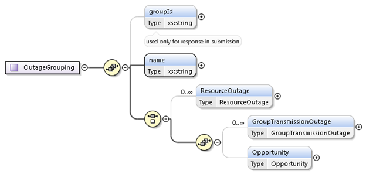
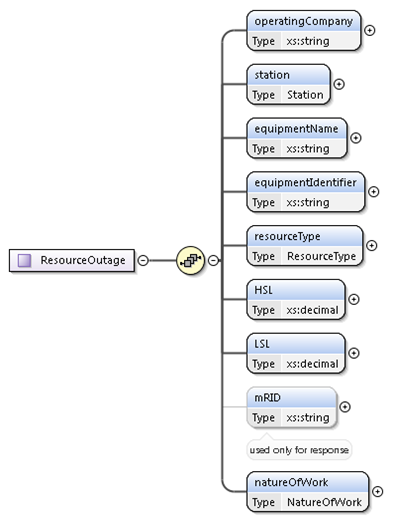
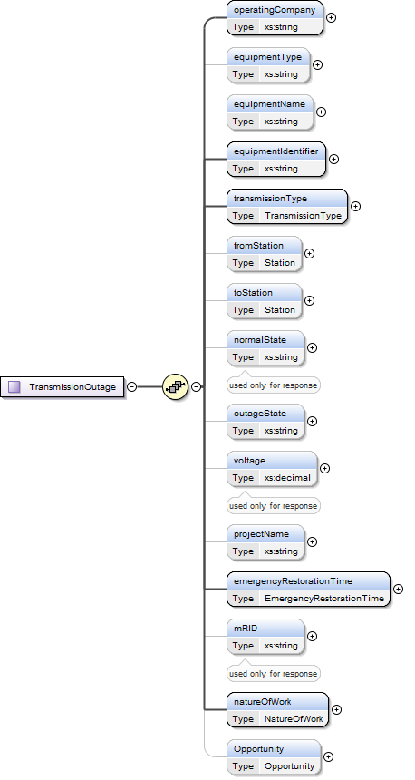
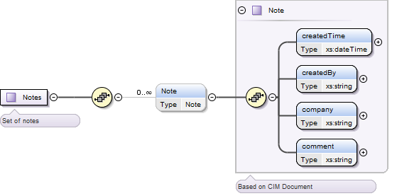
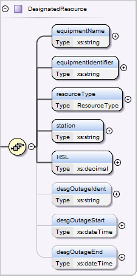

### Outage Creation 

The request message for outage creation or update would use the
following message fields:

| Message Element | Value |
|-------------------------------------------|---------------------------------|
| Header/Verb                               | create                          |
| Header/Noun                               | OutageSet                       |
| Header/Source                             | *Market participant ID*         |
| Header/UserID                             | *ID of user*                    |
| Payload                                   | *OutageSet*                     |

The corresponding response messages would use the following message
fields:

| Message Element | Value                |
|-------------------------------------------|------------------------------------------------|
| Header/Verb                               | reply                                          |
| Header/Noun                               | OutageSet                                      |
| Header/Source                             | ERCOT                                          |
| Reply/ReplyCode                           | *Reply code, success=OK, error=ERROR or FATAL* |
| Reply/Error                               | *Error message, if error encountered*          |
| Payload                                   | *OutageSet*                                    |

An Outage Scheduler mRID is constructed and returned in the payload of
the response (included in ResourceOutage or Equipment Outage) as part of
the OutageSet structure in the  following format

`*mRID:<QSEID>.OTG.<outageType>.<outageCategory>.<outageIdent>*`

> [!NOTE]
> OutageIdent is assigned by Outage Scheduler Application.

The structure of the OutageSet payload is described by the following
diagram. This leverages the structure of an Outage defined later in
this section:

The high-level structure of an Outage record is described by the
following diagram:

Within the OutageInfo substructure, the outage type, and state,
status, and nature of work are identified.

Valid outage type codes include:

- FR  - Forced Outage

- M1 - Maintenance Level 1

- M2 - Maintenance Level 2

- M3 - Maintenance Level 3

- OP - Planned Outage Non-Reliability with Opportunity

- PL - Planned Outage Reliability

- RS - Forced Outage with Remedial Switching Action

- SM -  Simple Transmission Outage

- UE - Forced Outage with Unavoidable Extension

- FE - Forced Outage with Forced Extension

- RO - Rescheduled Outage

The valid state codes include:

- ENYS : Entered Not Yet Submitted

- Recvd: Received at ERCOT

- Study : Study

- Rejct : Rejected

- Accpt: Accepted

- Apprv: Approved

- Active: Active

- AExt: Active Extension

- PotOp: Potential Opportunity

- Withd: Withdrawn

- Cancl : Canceled

- PComp: Pending Completion

- ExpOp: Expired Opportunity

- CompEd: Completed - Editable

- CompNE: Completed - Not Editable

> The valid status codes include:

- ENYS: Entered Not Yet Submitted

- RatE: Received at ERCOT

- Accpt: Accepted

- Apprv: Approved

- Rejct: Rejected

- Study: Selected for Study

- Withd: Withdrawn

- ExpOp: ExpiredOpportunity

- Cancl: Canceled

The valid Nature of Work codes for Resource Outages include:

- BS : Black Start Test

- BO : Boroscope

- CI : Combustion Inspection and Repair

- CW : Cooling Water Problems/Repairs

- EX : Exhaust Problems/Repairs

- FW : Feedwater Problems/Repairs

- FL : Fuel Limitation/Lack of Fuel Availability

- FP : Fuel Problems/Repairs

- GW : Gas Company Pipeline Work

- IP : Inlet Air Problems/Repairs

- LS : Lack of Steam Load Availability

- MO : Mothballed

- NE : New Equipment Energization

- OT : Other

- OV : Overhaul

- OE : Retirement of Old Equipment

- SE : Seasonal Resource

- TW : Steam Turbine Limited/Unavailable Due to CT/GT Work

- TL : Tube Leak

- VR : Turbine/Generator Vibration/Repair

- UN : Unknown

The valid Nature of Work codes for Transmission Outages include:

- AO : Associated Equipment Outage

- BM : Breaker Maintenance

- BR : Breaker Repair/Replace

- LM : Line Maintenance

- LR : Line Rebuild/Upgrade

- NE : New Equipment Energization

- OT : Other

- RW : Relay Work - See Notes

- HS : Repair Hot Spot

- DR : Repair/Replace Damaged Equipment

- RE : Replace Equipment

- OE : Retirement of Old Equipment

- SM : Switch Maintenance

- SR : Switch Repair/Replace

- TC : Telcom Work

- PR : Third Party Request

- TM : Transformer Maintenance

- TR : Transformer Repair/Replace

- TT : Transformer Testing

- UN : Unknown

As shown by the sub-structures, details are provided to reflect a
resource outage or a transmission outage. For each resource, a name
and resource type must be supplied. The resource is identified by its
short name, and the resource type is one of ‘UN’, ‘LR’, ‘DGR’ or
‘DESR’. For each transmission equipment, a name and a transmission
type must be supplied. The equipment is identified by its short name
and the equipment type is one of ‘LN’, ‘DCLN’, ‘DSC’, ‘CB’, ‘XF’,
‘CP’, ‘SR’, ‘SVC’, ‘LD’, ‘SC’, ‘SCM’.

Notes provided may be types as ‘General’, ‘Supporting’ or ‘RASPS’.

On submission, the following table describes the items used for an
Outage creation:

<table>
<colgroup>
<col style="width: 25%" />
<col style="width: 7%" />
<col style="width: 9%" />
<col style="width: 24%" />
<col style="width: 32%" />
</colgroup>
<thead>
<tr class="header">
<th><em>Element</em></th>
<th><em>Req?</em></th>
<th><em>Data type</em></th>
<th><em>Description</em></th>
<th><em>Values</em></th>
</tr>
</thead>
<tbody>
<tr class="odd">
<td>OutageInfo/outageType</td>
<td>Y</td>
<td>string</td>
<td>Type of Outage</td>
<td>
FR,M1,M2,M3,OP,PL,

RS,SM,UE,FE, RO
</td>
</tr>
<tr class="even">
<td>OutageInfo/participant</td>
<td>N</td>
<td>string</td>
<td>Outage Participant</td>
<td></td>
</tr>
<tr class="odd">
<td>OutageInfo/versionId</td>
<td>N</td>
<td>string</td>
<td>It is automatically generated by the system, it is used for keeping
an audit trail of all changes made to an Outage.</td>
<td></td>
</tr>
<tr class="even">
<td>OutageInfo/state</td>
<td>Y</td>
<td>string</td>
<td>The State of the Outage, taken from ENYS, Recvd, Study, Rejct,
Accpt, Apprv, Active, FExt, UExt, Withd, Cancl, ExpOp, CompEd, CompNE,
PComp</td>
<td>
ENSYS,Recvd,Study,Rejctd

Accptd,Active,FExt,UExt,Withdr

Cancld,PComp,ExpOp,CompEd

CompNE
</td>
</tr>
<tr class="odd">
<td>OutageInfo/status</td>
<td>N</td>
<td>string</td>
<td>The Status of the Outage, taken from ENYS, RetE, Study, Rejct,
Apprv, Accpt, Withd, Cancl, <mark>ExpOp</mark> .</td>
<td>
ENYS,RatE,Accpt,Apprv,Rejct,

Study,Withd,Cancl,Pendg,Compl
</td>
</tr>
<tr class="even">
<td>OutageInfo/previousState</td>
<td>N</td>
<td>string</td>
<td>The previous value of the Outage State, used by the State
Machine.</td>
<td>
ENSYS,Recvd,Study,Rejctd

Accptd,Active,FExt,UExt,Withdr

Cancld,PComp, <mark>ExpOp</mark> ,CompEd

CompNE
</td>
</tr>
<tr class="odd">
<td>OutageInfo/previousStatus</td>
<td>N</td>
<td>string</td>
<td>The previous value of the Outage Status, used by the State
Machine.</td>
<td>
ENYS,RatE,Accpt,Apprv,Rejct,

Study,Withd,Cancl,Pendg,Compl
</td>
</tr>
<tr class="even">
<td>OutageInfo/lastModifiedBy</td>
<td>N</td>
<td>string</td>
<td>Creator or responsible for last update</td>
<td></td>
</tr>
<tr class="odd">
<td>OutageInfo/warningFlag</td>
<td>N</td>
<td>Boolean</td>
<td>Warning Exists</td>
<td>true/false</td>
</tr>
<tr class="even">
<td>OutageInfo/warningAcknowledge</td>
<td>N</td>
<td>Boolean</td>
<td>Warning Acknowledge</td>
<td>true/false</td>
</tr>
<tr class="odd">
<td>OutageInfo/warningMessage</td>
<td>N</td>
<td>string</td>
<td>Warnings are part of the xml response. The message indicates the
issue to be resolved, they are fixed messages with integrated variables
for customizing the message for the Outage.</td>
<td>The free-form text of the message.</td>
</tr>
<tr class="even">
<td>OutageInfo/highImpactOutage</td>
<td>N</td>
<td>boolean</td>
<td>A Boolean indicating if the Outage includes equipment on the High
Impact Transmission Elements (HITE) list.</td>
<td>Output only; Returned for single outages. For Group outages, see
Group/GroupTransmissionOutage below.</td>
</tr>
<tr class="odd">
<td>OutageInfo/greater90Days</td>
<td>N</td>
<td>boolean</td>
<td>A Boolean indicating if the Outage is greater than 90 days in
advance.</td>
<td>Output only; Returned for single outages. For Group outages, see
Group/GroupTransmissionOutage below.</td>
</tr>
<tr class="even">
<td>OutageInfo/Requestor/name</td>
<td>N</td>
<td>string</td>
<td>Contact name</td>
<td></td>
</tr>
<tr class="odd">
<td>OutageInfo/Requestor/userFullName</td>
<td>Y</td>
<td>string</td>
<td>Full name of requestor</td>
<td>UserFullName is required on a Submit, Update and Cancel. Note: the
element is defined as optional in the XSD.</td>
</tr>
<tr class="even">
<td>OutageInfo/Requestor/primaryContact</td>
<td>N</td>
<td>string</td>
<td>Primary Contact phone no.</td>
<td></td>
</tr>
<tr class="odd">
<td>OutageInfo/Requestor/SecondaryContact</td>
<td>N</td>
<td>string</td>
<td>Secondary Contact Phone No.</td>
<td></td>
</tr>
<tr class="even">
<td>OutageInfo/Requestor/tertiaryContact</td>
<td>N</td>
<td>string</td>
<td>Tertiary Contact Phone No.</td>
<td></td>
</tr>
<tr class="odd">
<td>OutageInfo/requestDate</td>
<td>N</td>
<td>date</td>
<td>Request Date</td>
<td></td>
</tr>
<tr class="even">
<td>OutageInfo/Disclaimer</td>
<td>Y</td>
<td>String</td>
<td>Outage disclaimer</td>
<td>Free-form text</td>
</tr>
<tr class="odd">
<td>OutageInfo/disclaimerAck</td>
<td>Y</td>
<td>Boolean</td>
<td>Outage disclaimer acknowledge flag</td>
<td>true/false</td>
</tr>
<tr class="even">
<td>Group/groupId</td>
<td>N</td>
<td>string</td>
<td>
This is the ability to group outages. A group outage has a Group
ID. Each outage is still a separate outage with an outage ID as well.
The Requestor can add to a group when creating the outage request. Once
the outages have been submitted they can be removed from the group,
creating an independent outage. Once the group has been submitted the
requestor can’t add to it. The grouping will be used in the EMS-Outage
Evaluation tool.

Outage grouping name
</td>
<td>
An Outage may be a member of an Outage Group. An Outage Group
must have at least one and can have more than one Outage.

groupId Pattern

groupId will conform to the following three token pattern:

&lt;ShortName&gt;.OTG.&lt;groupId&gt;

groupId Example

For example, the XML document may contain the following groupId
value:

<blockquote>

&lt;ns1:groupId&gt;ShortName.OTG.1930&lt;/ns1:groupId&gt;

</blockquote>

Cancel Outage Reference

In this example, “1930” is the portion of the groupId token set that
should be used when referring to this grouped outage in a cancel or get
request.
</td>
</tr>
<tr class="odd">
<td>Group/name</td>
<td>Y</td>
<td>string</td>
<td>Outage Group Name</td>
<td></td>
</tr>
<tr class="even">
<td>Group/ResourceOutage/operatingCompany</td>
<td>Y</td>
<td>string</td>
<td>Group Resource Outage Operating Company Name</td>
<td></td>
</tr>
<tr class="odd">
<td>Group/ResourceOutage/station</td>
<td>Y</td>
<td>string</td>
<td>Group Resource Outage Station Name</td>
<td></td>
</tr>
<tr class="even">
<td>Group/ResourceOutage/equipmentName</td>
<td>Y</td>
<td>string</td>
<td>This is the name of a Resource that is a Designated Resource for
this Opportunity Outage.</td>
<td></td>
</tr>
<tr class="odd">
<td>Group/ResourceOutage/equipmentIdentifier</td>
<td>Y</td>
<td>string</td>
<td>RDFID used for uniquely identifying equipment</td>
<td>
Example:

_{123AE789-4477-4A1B-8D09-E41615AF38EC}
</td>
</tr>
<tr class="even">
<td>Group/ResourceOutage/resourceType</td>
<td>Y</td>
<td>string</td>
<td>This is the type of a Resource that is a Designated Resource for
this Opportunity Outage</td>
<td>UN (Unit),LR (Load Resource), Distribution Generation Resource (DGR)
and Distribution Energy Storage Resource (DESR)</td>
</tr>
<tr class="odd">
<td>Group/ResourceOutage/HSL</td>
<td>Y</td>
<td>Decimal</td>
<td>Group Outage Resource HSL</td>
<td></td>
</tr>
<tr class="even">
<td>Group/ResourceOutage/LSL</td>
<td>Y</td>
<td>Decimal</td>
<td>Group Outage Resource LSL</td>
<td></td>
</tr>
<tr class="odd">
<td>Group/ResourceOutage/mRID</td>
<td>N</td>
<td>string</td>
<td>Unique identifier for an outage.</td>
<td>mRID is in the  format of
&lt;QSEID&gt;.OTG.&lt;outageType&gt;.&lt;outageCategory&gt;.&lt;outageIdent&gt;</td>
</tr>
<tr class="even">
<td>Group/ResourceOutage/natureOfWork</td>
<td>Y</td>
<td>string</td>
<td>This is a description of the nature of the work to be performed
during the Outage. The allowable values for this field are stated
above.</td>
<td></td>
</tr>
<tr class="odd">
<td>Group/GroupTransmissionOutage/OperatingCompany</td>
<td>Y</td>
<td>string</td>
<td></td>
<td></td>
</tr>
<tr class="even">
<td>Group/ GroupTransmissionOutage /equipmentName</td>
<td>Y</td>
<td>string</td>
<td></td>
<td></td>
</tr>
<tr class="odd">
<td>Group/ GroupTransmissionOutage /equipmentIdentifier</td>
<td>Y</td>
<td>string</td>
<td>RDFID used for uniquely identifying equipment</td>
<td>
Example:

_{123AE789-4477-4A1B-8D09-E41615AF38EC}
</td>
</tr>
<tr class="even">
<td>Group/ GroupTransmissionOutage /transmissionType</td>
<td>Y</td>
<td>string</td>
<td>This is the type of Equipment subject to removal from service as a
consequence of the Outage: e.g. CB, LINE, etc.</td>
<td></td>
</tr>
<tr class="odd">
<td>Group/ GroupTransmissionOutage /fromStation</td>
<td>Y</td>
<td>string</td>
<td>The name of the “From” Station in which an Equipment resides for all
lines.</td>
<td></td>
</tr>
<tr class="even">
<td>Group/ GroupTransmissionOutage /toStation</td>
<td>N</td>
<td>string</td>
<td>The name of the “To” Station in which an Equipment resides for all
lines.</td>
<td></td>
</tr>
<tr class="odd">
<td>Group/ GroupTransmissionOutage /highImpactOutage</td>
<td>N</td>
<td>boolean</td>
<td>A Boolean indicating if the Outage includes equipment on the High
Impact Transmission Elements (HITE) list.</td>
<td>Output only; Returned for group outages. For single outages, see
OutageInfo above.</td>
</tr>
<tr class="even">
<td>Group/ GroupTransmissionOutage /greater90Days</td>
<td>N</td>
<td>boolean</td>
<td>A Boolean indicating if the Outage is greater than 90 days in
advance.</td>
<td>Output only; Returned for group outages. For single outages, see
OutageInfo above.</td>
</tr>
<tr class="odd">
<td>Group/GroupTransmissionOutage/normalState</td>
<td>N</td>
<td>string</td>
<td>Equipment Normal State</td>
<td>Output only</td>
</tr>
<tr class="even">
<td>Group/GroupTransmissionOutage/outageState</td>
<td>N</td>
<td>string</td>
<td>This field, which is pertinent (and required) only for switching
devices, contains the state of the device when taken out of service:
OPEN or CLOSED. This field is the opposite of the Normal State of the
Equipment entity.</td>
<td>“C’,”O” or “”</td>
</tr>
<tr class="odd">
<td>Group/GroupTransmissionOutage/voltage</td>
<td>N</td>
<td>Decimal</td>
<td>Equipment Outage Voltage</td>
<td></td>
</tr>
<tr class="even">
<td>Group/GroupTransmissionOutage/projectName</td>
<td>N</td>
<td>string</td>
<td>Equipment Outage NOMCR</td>
<td></td>
</tr>
<tr class="odd">
<td>Group/GroupTransmissionOutage/emergencyRestorationTime</td>
<td>Y</td>
<td>string</td>
<td>Eq. Outage Emer Restoration Time</td>
<td></td>
</tr>
<tr class="even">
<td>Group/GroupTransmissionOutage/mRID</td>
<td>N</td>
<td>string</td>
<td>Outage Identity</td>
<td>mRID is in the  format of
&lt;QSEID&gt;.OTG.&lt;outageType&gt;.&lt;outageCategory&gt;.&lt;outageIdent&gt;</td>
</tr>
<tr class="odd">
<td>Group/GroupTransmissionOutage/natureOfWork</td>
<td>Y</td>
<td>string</td>
<td>Eq. Outage Nature of Work</td>
<td></td>
</tr>
<tr class="even">
<td>Group/Opportunity/opportunityDuration/days</td>
<td>N</td>
<td>unsigned Byte</td>
<td>For Opportunity Outages, the outage no. of days.</td>
<td>Positive no.</td>
</tr>
<tr class="odd">
<td>Group/Opportunity/opportunityDuration/hours</td>
<td>N</td>
<td>unsigned Byte</td>
<td>For Opportunity Outages, the outage no. of hours</td>
<td>Positive no.</td>
</tr>
<tr class="even">
<td>Group/Opportunity/end</td>
<td>Y</td>
<td>DateTime</td>
<td>For Opportunity Outages, the outage end time</td>
<td>Date Time</td>
</tr>
<tr class="odd">
<td>Group/Opportunity/designatedResource/equipmentName</td>
<td>Y</td>
<td>string</td>
<td>This is the Resource name of a Resource that has been designated to
an Opportunity</td>
<td></td>
</tr>
<tr class="even">
<td>Group/Opportunity/designatedResource/equipmentIdentifier</td>
<td>Y</td>
<td>string</td>
<td>RDFID used for uniquely identifying equipment</td>
<td>
Example:

_{123AE789-4477-4A1B-8D09-E41615AF38EC}
</td>
</tr>
<tr class="odd">
<td>Group/Opportunity/designatedResource/resourceType</td>
<td>Y</td>
<td>string</td>
<td>This is the Resource type of a Resource that has been designated to
an Opportunity</td>
<td>UN (Unit),LR (Load Resource), Distribution Generation Resource (DGR)
and Distribution Energy Storage Resource (DESR)</td>
</tr>
<tr class="even">
<td>Group/Opportunity/designatedResource/station</td>
<td>Y</td>
<td>string</td>
<td>This is the station name of a Resource that has been designated to
an Opportunity</td>
<td></td>
</tr>
<tr class="odd">
<td>Group/Opportunity/designatedResource/HSL</td>
<td>Y</td>
<td>Decimal</td>
<td></td>
<td></td>
</tr>
<tr class="even">
<td>Group/Opportunity/desgOutageIdent</td>
<td>N</td>
<td>string</td>
<td>Designated Resource Outage Identifier corresponding to a valid TOO (
Transmission Opportunity Outage).</td>
<td>
Not required for outage create transaction.

Outage Schedule will populate this field in OS query
response
</td>
</tr>
<tr class="odd">
<td>Group/Opportunity/desgOutageStart</td>
<td>N</td>
<td>DateTime</td>
<td>Designated Resource outage start dateTime</td>
<td>
Not required for outage create transaction.

Outage Schedule will populate this field in OS query
response
</td>
</tr>
<tr class="even">
<td>Group/Opportunity/desgOutageEnd</td>
<td>N</td>
<td>DateTime</td>
<td>Designated Resource outage End dateTime</td>
<td>
Not required for outage create transaction.

Outage Schedule will populate this field in OS query
response
</td>
</tr>
<tr class="odd">
<td>ResourceOutage/operatingCompany</td>
<td>Y</td>
<td>string</td>
<td></td>
<td></td>
</tr>
<tr class="even">
<td>ResourceOutage/station</td>
<td>Y</td>
<td>string</td>
<td>This is the station name of a Resource that is a Designated Resource
for this Outage.</td>
<td></td>
</tr>
<tr class="odd">
<td>ResourceOutage/equipmentName</td>
<td>Y</td>
<td>string</td>
<td>This is the name of a Resource that is a Designated Resource for
this Outage.</td>
<td></td>
</tr>
<tr class="even">
<td>ResourceOutage/equipmentIdentifier</td>
<td>Y</td>
<td>string</td>
<td>RDFID used for uniquely identifying equipment</td>
<td>
Example:

_{123AE789-4477-4A1B-8D09-E41615AF38EC}
</td>
</tr>
<tr class="odd">
<td>ResourceOutage/resourceType</td>
<td>N</td>
<td>string</td>
<td>This is the type of a Resource that is a Designated Resource for
this Outage.</td>
<td>UN (Unit),LR (Load Resource), Distribution Generation Resource (DGR)
and Distribution Energy Storage Resource (DESR)</td>
</tr>
<tr class="even">
<td>ResourceOutage/HSL</td>
<td>Y</td>
<td>Decimal</td>
<td>Resource Outage HSL</td>
<td></td>
</tr>
<tr class="odd">
<td>ResourceOutage/LSL</td>
<td>Y</td>
<td>Decimal</td>
<td>Resource Outage LSL</td>
<td></td>
</tr>
<tr class="even">
<td>ResourceOutage/mRID</td>
<td>N</td>
<td>string</td>
<td>Outage Identity</td>
<td>mRID is in the  format of
&lt;QSEID&gt;.OTG.&lt;outageType&gt;.&lt;outageCategory&gt;.&lt;outageIdent&gt;</td>
</tr>
<tr class="odd">
<td>ResourceOutage/natureOfWork</td>
<td>Y</td>
<td>string</td>
<td>Resource Outage Nature of Work. . The allowable values for this
field are stated above.</td>
<td></td>
</tr>
<tr class="even">
<td>TransmissionOutage/operatingCompany</td>
<td>Y</td>
<td>string</td>
<td></td>
<td></td>
</tr>
<tr class="odd">
<td>TransmissionOutage/equipmentType</td>
<td>N</td>
<td>string</td>
<td>Allowed values for Transmission equipment types as stated
above.</td>
<td></td>
</tr>
<tr class="even">
<td>TransmissionOutage/equipmentName</td>
<td>Y</td>
<td>string</td>
<td>The name of the Equipment that can be the subject of an Outage.</td>
<td></td>
</tr>
<tr class="odd">
<td>TransmissionOutage/equipmentIdentifier</td>
<td>Y</td>
<td>string</td>
<td>RDFID used for uniquely identifying equipment</td>
<td>
Example:

_{123AE789-4477-4A1B-8D09-E41615AF38EC}
</td>
</tr>
<tr class="even">
<td>TransmissionOutage/transmissionType</td>
<td>Y</td>
<td>string</td>
<td>The Type of the Transmission Equipment that can be the subject of an
Outage.</td>
<td></td>
</tr>
<tr class="odd">
<td>TransmissionOutage/fromStation</td>
<td>Y</td>
<td>string</td>
<td>This is the name of the Station in which an Equipment resides for
all equipment types other than lines. For lines this refers to the
“From” station</td>
<td></td>
</tr>
<tr class="even">
<td>TransmissionOutage/toStation</td>
<td>N</td>
<td>string</td>
<td>This is the name of the “To” Station in which an Equipment resides
for all lines.</td>
<td></td>
</tr>
<tr class="odd">
<td>TransmissionOutage/normalState</td>
<td>N</td>
<td>string</td>
<td>This field, which is pertinent only for switching devices, contains
the normal state of the device: OPEN or CLOSED. This field is the same
as the Normal State of the Equipment entity.</td>
<td>Output only</td>
</tr>
<tr class="even">
<td>TransmissionOutage/outageState</td>
<td>N</td>
<td>string</td>
<td>This field, which is pertinent (and required) only for switching
devices, contains the state of the device when taken out of service:
OPEN or CLOSED. This field is the opposite of the Normal State of the
Equipment entity.</td>
<td>“C’,”O” or “”</td>
</tr>
<tr class="odd">
<td>TransmissionOutage/voltage</td>
<td>N</td>
<td>Decimal</td>
<td>The voltage level at which the Equipment resides. For transformers
it is the high side voltage level.</td>
<td></td>
</tr>
<tr class="even">
<td>TransmissionOutage/projectName</td>
<td>N</td>
<td>String</td>
<td></td>
<td></td>
</tr>
<tr class="odd">
<td>TransmissionOutage/emergencyRestorationTime</td>
<td>Y</td>
<td>positiveInteger</td>
<td>This is the time in hours necessary to terminate the Outage and
return the Equipment to service.</td>
<td></td>
</tr>
<tr class="even">
<td>TransmissionOutage/mRID</td>
<td>N</td>
<td>string</td>
<td>Outage Identity</td>
<td>mRID is in the  format of
&lt;QSEID&gt;.OTG.&lt;outageType&gt;.&lt;outageCategory&gt;.&lt;outageIdent&gt;</td>
</tr>
<tr class="odd">
<td>TransmissionOutage/natureOfWork</td>
<td>Y</td>
<td>string</td>
<td></td>
<td></td>
</tr>
<tr class="even">
<td>TransmissionOutage/Opportunity/opportunityDuration/days</td>
<td>N</td>
<td>unsigned Byte</td>
<td>For Opportunity Outages, the outage no. of days.</td>
<td>Positive no.</td>
</tr>
<tr class="odd">
<td>TransmissionOutage/Opportunity/opportunityDuration/hours</td>
<td>N</td>
<td>unsigned Byte</td>
<td>For Opportunity Outages, the outage no. of hours</td>
<td>Positive no.</td>
</tr>
<tr class="even">
<td>TransmissionOutage/Opportunity/opportunityEnd</td>
<td>Y</td>
<td>DateTime</td>
<td>For Opportunity Outages, the outage end time</td>
<td>Date Time</td>
</tr>
<tr class="odd">
<td>TransmissionOutage/Opportunity/designatedResource/equipmentName</td>
<td>Y</td>
<td>string</td>
<td>This is the Resource name of a Resource that has been designated to
an Opportunity</td>
<td></td>
</tr>
<tr class="even">
<td>TransmissionOutage/Opportunity/designatedResource/equipmentIdentifier</td>
<td>Y</td>
<td>String</td>
<td></td>
<td></td>
</tr>
<tr class="odd">
<td>TransmissionOutage/Opportunity/designatedResource/resourceType</td>
<td>Y</td>
<td>String</td>
<td>This is the Resource type of a Resource that has been designated to
an Opportunity</td>
<td>UN (Unit) or LR (Load Resource), Distribution Generation Resource
(DGR) and Distribution Energy Storage Resource (DESR)</td>
</tr>
<tr class="even">
<td>TransmissionOutage/Opportunity/designatedResource/station</td>
<td>Y</td>
<td>String</td>
<td></td>
<td></td>
</tr>
<tr class="odd">
<td>TransmissionOutage/Opportunity/designatedResource/HSL</td>
<td>Y</td>
<td>Decimal</td>
<td></td>
<td></td>
</tr>
<tr class="even">
<td>TransmissionOutage/Opportunity/designatedResource/desgOutageIdent</td>
<td>N</td>
<td>String</td>
<td>Designated Resource Outage Identifier corresponding to a valid TOO (
Transmission Opportunity Outage).</td>
<td>
Not required for outage create transaction.

Outage Schedule will populate this field in OS query
response
</td>
</tr>
<tr class="odd">
<td>TransmissionOutage/Opportunity/designatedResource/desgOutageStart</td>
<td>N</td>
<td>dateTime</td>
<td>Designated Resource outage start dateTime</td>
<td>
Not required for outage create transaction.

Outage Schedule will populate this field in OS query
response
</td>
</tr>
<tr class="even">
<td>TransmissionOutage/Opportunity/designatedResource/desgOutageEnd</td>
<td>N</td>
<td>dateTime</td>
<td>Designated Resource outage End dateTime</td>
<td>
Not required for outage create transaction.

Outage Schedule will populate this field in OS query
response
</td>
</tr>
<tr class="odd">
<td>Schedule/plannedSart</td>
<td>N</td>
<td>dateTime</td>
<td>This is the date/time at which the Outage is planned to start.</td>
<td rowspan="10"><ul>
<li>
Forced (Transmission and Resource) - Forced outages don’t have a
Planned Start when created
</li>
<li>
Transmission Opportunity outages (TOO).  TOO’s doesn’t have a
Planned Start or a Planned End when created
</li>
</ul></td>
</tr>
<tr class="even">
<td>Schedule/plannedEnd</td>
<td>N</td>
<td>dateTime</td>
<td>This is the date/time at which the Outage is planned to end.</td>
</tr>
<tr class="odd">
<td>Schedule/earliestStart</td>
<td>N</td>
<td>dateTime</td>
<td>This is the earliest date/time at which the Outage may start.</td>
</tr>
<tr class="even">
<td>Schedule/latestEnd</td>
<td>N</td>
<td>dateTime</td>
<td>This is the latest date/time at which the Outage may end.</td>
</tr>
<tr class="odd">
<td>Schedule/actualStart</td>
<td>N</td>
<td>dateTime</td>
<td>This is the actual date/time at which the Outage started.</td>
</tr>
<tr class="even">
<td>Schedule/actualEnd</td>
<td>N</td>
<td>dateTime</td>
<td>This is the actual date/time at which the Outage ended.</td>
</tr>
<tr class="odd">
<td>Schedule/new_plannedStart</td>
<td>N</td>
<td>dateTime</td>
<td>This is the proposed date/time at which an Unavoidable Extension may
start.</td>
</tr>
<tr class="even">
<td>Schedule/new_plannedEnd</td>
<td>N</td>
<td>dateTime</td>
<td>This is the proposed date/time at which an Unavoidable Extension may
end.</td>
</tr>
<tr class="odd">
<td>Schedule/new_earliestStart</td>
<td>N</td>
<td>dateTime</td>
<td>This is the proposed earliest date/time at which a Resource
Opportunity Outage may start.</td>
</tr>
<tr class="even">
<td>Schedule/new_latestEnd</td>
<td>N</td>
<td>dateTime</td>
<td>This is the proposed latest date/time at which a Resource
Opportunity Outage may end.</td>
</tr>
<tr class="odd">
<td>Recurrence/datesList/dates/mRID</td>
<td>N</td>
<td>String</td>
<td>Outage Identity</td>
<td>mRID is in the  format of
&lt;QSEID&gt;.OTG.&lt;outageType&gt;.&lt;outageCategory&gt;.&lt;outageIdent&gt;</td>
</tr>
<tr class="even">
<td>Recurrence/datesList/dates/plannedStart</td>
<td>Y</td>
<td>Date</td>
<td>Planned start date of outage recurrence</td>
<td></td>
</tr>
<tr class="odd">
<td>Recurrence/datesList/dates/plannedEnd</td>
<td>Y</td>
<td>Date</td>
<td>Planned End date of outage recurrence</td>
<td></td>
</tr>
<tr class="even">
<td>Recurrence/datesList/dates/earliestStart</td>
<td>Y</td>
<td>Date</td>
<td>Earliest start date of outage recurrence</td>
<td></td>
</tr>
<tr class="odd">
<td>Recurrence/datesList/dates/latestEnd</td>
<td>Y</td>
<td>Date</td>
<td>Latest Planned End date of outage recurrence</td>
<td></td>
</tr>
<tr class="even">
<td>OSNotes/RequestorNotes/Note/createdTime</td>
<td>Y</td>
<td>string</td>
<td>There are three sections that the requestor can enter notes,
Requestor Notes, Supporting Information, and Remedial Action or Special
Protection System notes. Notes are required for some outage types but
not all. They are not required when the outage is submitted but are
required for some outages to be completed. There is another section for
reviewer notes. This is for ERCOT to enter notes and the MP can only
read them.</td>
<td></td>
</tr>
<tr class="odd">
<td>OSNotes/RequestorNotes/Note/createdBy</td>
<td>Y</td>
<td>string</td>
<td></td>
<td></td>
</tr>
<tr class="even">
<td>OSNotes/RequestorNotes/Note/company</td>
<td>Y</td>
<td>string</td>
<td></td>
<td></td>
</tr>
<tr class="odd">
<td>OSNotes/RequestorNotes/Note/comment</td>
<td>Y</td>
<td>string</td>
<td></td>
<td></td>
</tr>
<tr class="even">
<td>OSNotes/ReviewerNotes/Note/createdTime</td>
<td>Y</td>
<td>string</td>
<td></td>
<td></td>
</tr>
<tr class="odd">
<td>OSNotes/ReviewerNotes/Note/createdBy</td>
<td>Y</td>
<td>string</td>
<td></td>
<td></td>
</tr>
<tr class="even">
<td>OSNotes/ReviewerNotes/Note/company</td>
<td>Y</td>
<td>string</td>
<td></td>
<td></td>
</tr>
<tr class="odd">
<td>OSNotes/ReviewerNotes/Note/comment</td>
<td>Y</td>
<td>string</td>
<td></td>
<td></td>
</tr>
<tr class="even">
<td>OSNotes/SupportingNotes/Note/createdTime</td>
<td>Y</td>
<td>string</td>
<td></td>
<td></td>
</tr>
<tr class="odd">
<td>OSNotes/SupportingNotes/Note/createdBy</td>
<td>Y</td>
<td>string</td>
<td></td>
<td></td>
</tr>
<tr class="even">
<td>OSNotes/SupportingNotes/Note/company</td>
<td>Y</td>
<td>string</td>
<td></td>
<td></td>
</tr>
<tr class="odd">
<td>OSNotes/SupportingNotes/Note/comment</td>
<td>Y</td>
<td>string</td>
<td></td>
<td></td>
</tr>
<tr class="even">
<td>OSNotes/RASPSNotes/Note/createdTime</td>
<td>Y</td>
<td>string</td>
<td></td>
<td></td>
</tr>
<tr class="odd">
<td>OSNotes/RASPSNotes/Note/createdBy</td>
<td>Y</td>
<td>string</td>
<td></td>
<td></td>
</tr>
<tr class="even">
<td>OSNotes/RASPSNotes/Note/company</td>
<td>Y</td>
<td>string</td>
<td></td>
<td></td>
</tr>
<tr class="odd">
<td>OSNotes/RASPSNotes/Note/comment</td>
<td>Y</td>
<td>string</td>
<td></td>
<td></td>
</tr>
<tr class="even">
<td>Error/severity</td>
<td>N</td>
<td>string</td>
<td>Severity of Error Generated</td>
<td></td>
</tr>
<tr class="odd">
<td>Error/area</td>
<td>N</td>
<td>string</td>
<td>Area of generated error</td>
<td></td>
</tr>
<tr class="even">
<td>Error/interval</td>
<td>N</td>
<td>string</td>
<td></td>
<td></td>
</tr>
<tr class="odd">
<td>Error/text</td>
<td>Y</td>
<td>string</td>
<td>Error Text</td>
<td></td>
</tr>
</tbody>
</table>

The following is an example of an OutageSet submission by a Market
Participant:

~~~
<ns2:OutageSet xmlns="http://www.ercot.com/schema/2007-06/nodal/ews" xmlns:ns2="http://www.ercot.com/schema/2007-06/nodal/ews">
    <ns2:Outage>
        <ns2:OutageInfo>
            <ns2:outageType>PL</ns2:outageType>
            <ns2:participant>TABC</ns2:participant>
            <ns2:lastModified>2016-08-03T14:08:00-05:00</ns2:lastModified>
            <ns2:lastModifiedBy>USER1</ns2:lastModifiedBy>
            <ns2:Requestor>
                <ns2:name>USER1</ns2:name>
                <ns2:userFullName>Alex Smith</ns2:userFullName>
                <ns2:primaryContact>512-555-5555</ns2:primaryContact>
                <ns2:secondaryContact>512-555-5556</ns2:secondaryContact>
                <ns2:tertiaryContact>512-555-5557</ns2:tertiaryContact>
            </ns2:Requestor>
            <ns2:requestDate>2016-08-03T14:09:00-05:00</ns2:requestDate>
            <ns2:Disclaimer>temp disclaimer</ns2:Disclaimer>
            <ns2:disclaimerAck>true</ns2:disclaimerAck>
        </ns2:OutageInfo>
        <ns2:TransmissionOutage>
            <ns2:operatingCompany>TABC</ns2:operatingCompany>
            <ns2:equipmentName>ABC_123</ns2:equipmentName>
            <ns2:equipmentIdentifier>_{123AE789-4477-4A1B-8D09-E41615AF38EC}</ns2:equipmentIdentifier>
            <ns2:transmissionType>LN</ns2:transmissionType>
            <ns2:fromStation>STATION1</ns2:fromStation>
            <ns2:normalState>C</ns2:normalState>
            <ns2:outageState>O</ns2:outageState>
            <ns2:voltage>6.9</ns2:voltage>
            <ns2:projectName>project123</ns2:projectName>
            <ns2:emergencyRestorationTime>1</ns2:emergencyRestorationTime>
            <ns2:natureOfWork>OE</ns2:natureOfWork>
        </ns2:TransmissionOutage>						
        <ns2:Schedule>
            <ns2:plannedStart>2016-08-16T10:00:00</ns2:plannedStart>
            <ns2:plannedEnd>2016-08-16T12:00:00</ns2:plannedEnd>
            <ns2:earliestStart>2016-08-16T10:00:00</ns2:earliestStart>
            <ns2:latestEnd>2016-08-16T14:00:00</ns2:latestEnd>
        </ns2:Schedule>
        <ns2:OSNotes>
            <ns2:RequestorNotes>
                <ns2:Note>
                    <ns2:createdTime>2016-04-11T11:00:00</ns2:createdTime>
                    <ns2:createdBy>ASmith</ns2:createdBy>
                    <ns2:company>TABC</ns2:company>
                    <ns2:comment>temp comment</ns2:comment>
                </ns2:Note>
            </ns2:RequestorNotes>            
        </ns2:OSNotes>
    </ns2:Outage>
</ns2:OutageSet>
~~~

The following is an example response message for the above request:

~~~
<ns1:OutageSet xmlns:ns0="http://www.ercot.com/schema/2007-05/nodal/eip/il"
    xmlns:ns1="http://www.ercot.com/schema/2007-06/nodal/ews">
    <ns1:Outage>
        <ns1:OutageInfo>
            <ns1:outageType>PL</ns1:outageType>
            <ns1:participant>TABC</ns1:participant>
            <ns1:versionId>1</ns1:versionId>
            <ns1:state>Recvd</ns1:state>
            <ns1:status>RatE</ns1:status>
            <ns1:previousState>ENYS</ns1:previousState>
            <ns1:highImpactOutage>true</ns1:highImpactOutage>
            <ns1:greater90Days>false</ns1:greater90Days>
            <ns1:Requestor>
                <ns1:name>USER1</ns1:name>
                <ns1:userFullName>Alex Smith</ns1:userFullName>
                <ns1:primaryContact/>
                <ns1:secondaryContact/>
                <ns1:tertiaryContact>512-555-5557</ns1:tertiaryContact>
            </ns1:Requestor>
            <ns1:requestDate>2016-08-03T14:33:00-05:00</ns1:requestDate>
        </ns1:OutageInfo>
        <ns1:TransmissionOutage>
            <ns1:operatingCompany>TABC</ns1:operatingCompany>
            <ns1:equipmentType>LN</ns1:equipmentType>
            <ns1:equipmentName> ABC_123</ns1:equipmentName>
            <ns1:equipmentIdentifier>_{123AE789-4477-4A1B-8D09-E41615AF38EC}</ns1:equipmentIdentifier>
            <ns1:transmissionType>LN</ns1:transmissionType>
            <ns1:fromStation>STATION1</ns1:fromStation>
            <ns1:toStation>STATION2</ns1:toStation>
            <ns1:outageState>O</ns1:outageState>
            <ns1:projectName>project123</ns1:projectName>
            <ns1:emergencyRestorationTime>1</ns1:emergencyRestorationTime>
            <ns1:mRID>TABC.OTG.PL.Transmission.ABC00118301</ns1:mRID>
            <ns1:natureOfWork>OE</ns1:natureOfWork>
        </ns1:TransmissionOutage>
        <ns1:Schedule>
            <ns1:plannedStart>2016-08-16T10:00:00-05:00</ns1:plannedStart>
            <ns1:plannedEnd>2016-08-16T12:00:00-05:00</ns1:plannedEnd>
            <ns1:earliestStart>2016-08-16T10:00:00-05:00</ns1:earliestStart>
            <ns1:latestEnd>2016-08-16T14:00:00-05:00</ns1:latestEnd>
        </ns1:Schedule>
        <ns1:OSNotes>
            <ns1:RequestorNotes>
                <ns1:Note>
                    <ns1:createdTime>2016-04-11T11:00:00-05:00</ns1:createdTime>
                    <ns1:createdBy>ASmith</ns1:createdBy>
                    <ns1:company>TABC</ns1:company>
                    <ns1:comment>temp comment</ns1:comment>
                </ns1:Note>
            </ns1:RequestorNotes>
            <ns1:ReviewerNotes/>
            <ns1:SupportingNotes/>
            <ns1:RASPSNotes/>
        </ns1:OSNotes>
    </ns1:Outage>
</ns1:OutageSet>
~~~

The following is an example of a Group OutageSet Submission by a
Market Participant:

~~~
<OutageSet xmlns="http://www.ercot.com/schema/2007-06/nodal/ews"
    xmlns:xsi="http://www.w3.org/2001/XMLSchema-instance"
    xsi:schemaLocation="http://www.ercot.com/schema/2007-06/nodal/ews">
    <Outage>
        <OutageInfo>
            <outageType>PL</outageType>
            <participant>TABC</participant>
            <lastModified>2016-08-04T15:24:00-05:00</lastModified>
            <lastModifiedBy>asmith</lastModifiedBy>
            <Requestor>
                <name>2241</name>
                <userFullName>Alex Smith</userFullName>
                <tertiaryContact>512-555-1234</tertiaryContact>
            </Requestor>
            <requestDate>2016-08-04T15:24:00-05:00</requestDate>
            <Disclaimer>Temp Disclaimer</Disclaimer>
            <disclaimerAck>true</disclaimerAck>
        </OutageInfo>
        <Group>
            <name>Grp2</name>
            <GroupTransmissionOutage>
                <operatingCompany>TABC</operatingCompany>
                <equipmentName>ABC_1234</equipmentName>
                <equipmentIdentifier>_{123AB3F7-11A4-4F87-A2C0-125F79F221B4}</equipmentIdentifier>
                <transmissionType>DSC</transmissionType>
                <fromStation>Station1</fromStation>
                <normalState>C</normalState>
                <outageState>O</outageState>
                <voltage>69</voltage>
                <projectName>Project2</projectName>
                <emergencyRestorationTime>1</emergencyRestorationTime>
                <natureOfWork>RE</natureOfWork>
            </GroupTransmissionOutage>
            <GroupTransmissionOutage>
                <operatingCompany>TABC</operatingCompany>
                <equipmentName>ABC_2345</equipmentName>
                <equipmentIdentifier>_{A12BCD24-5968-45F3-9471-728032982EE3}</equipmentIdentifier>
                <transmissionType>DSC</transmissionType>
                <fromStation>Station1</fromStation>
                <normalState>C</normalState>
                <outageState>O</outageState>
                <voltage>138</voltage>
                <projectName>Project3</projectName>
                <emergencyRestorationTime>1</emergencyRestorationTime>
                <natureOfWork>RE</natureOfWork>
            </GroupTransmissionOutage>
        </Group>
        <Schedule>
            <plannedStart>2016-08-12T08:00:00-05:00</plannedStart>
            <plannedEnd>2016-08-12T12:00:00-05:00</plannedEnd>
            <earliestStart>2016-08-12T08:00:00-05:00</earliestStart>
            <latestEnd>2016-08-12T13:00:00-05:00</latestEnd>
        </Schedule>
    </Outage>
</OutageSet>
~~~

The following is an example response message for the above request:

~~~
<ns1:OutageSet xmlns:ns0="http://www.ercot.com/schema/2007-05/nodal/eip/il" xmlns:ns1="http://www.ercot.com/schema/2007-06/nodal/ews">
    <ns1:Outage>
        <ns1:OutageInfo>
            <ns1:outageType>PL</ns1:outageType>
            <ns1:participant>TABC</ns1:participant>
            <ns1:versionId>1</ns1:versionId>
            <ns1:state>ENYS</ns1:state>
            <ns1:status>RatE</ns1:status>
            <ns1:previousState>ENYS</ns1:previousState>
            <ns1:Requestor>
                <ns1:name>2241</ns1:name>
                <ns1:userFullName>Alex Smith</ns1:userFullName>
                <ns1:primaryContact/>
                <ns1:secondaryContact/>
                <ns1:tertiaryContact>512-555-1234</ns1:tertiaryContact>
            </ns1:Requestor>
            <ns1:requestDate>2017-08-04T15:24:06-05:00</ns1:requestDate>
        </ns1:OutageInfo>
        <ns1:Group>
            <ns1:groupId>TABC.OTG.167432</ns1:groupId>
            <ns1:name>Grp2</ns1:name>
            <ns1:GroupTransmissionOutage>
                <ns1:operatingCompany>TABC</ns1:operatingCompany>
                <ns1:equipmentName>ABC_1234</ns1:equipmentName>
                <ns1:equipmentIdentifier>_{123AB3F7-11A4-4F87-A2C0-125F79F221B4}</ns1:equipmentIdentifier>
                <ns1:transmissionType>DSC</ns1:transmissionType>
                <ns1:fromStation>Station1</ns1:fromStation>
                <ns1:toStation>Station2</ns1:toStation>
                <ns1:highImpactOutage>true</ns1:highImpactOutage>
                <ns1:greater90Days>false</ns1:greater90Days>
                <ns1:normalState>C</ns1:normalState>
                <ns1:outageState>O</ns1:outageState>
                <ns1:voltage>69</ns1:voltage>
                <ns1:projectName>Project2</ns1:projectName>
                <ns1:emergencyRestorationTime>1</ns1:emergencyRestorationTime>
                <ns1:mRID>TABC.OTG.PL.Transmission.ABC00012345</ns1:mRID>
                <ns1:natureOfWork>RE</ns1:natureOfWork>
            </ns1:GroupTransmissionOutage>
            <ns1:GroupTransmissionOutage>
                <ns1:operatingCompany>TABC</ns1:operatingCompany>
                <ns1:equipmentName>ABC_2345</ns1:equipmentName>
                <ns1:equipmentIdentifier>_{A12BCD24-5968-45F3-9471-728032982EE3}</ns1:equipmentIdentifier>
                <ns1:transmissionType>DSC</ns1:transmissionType>
                <ns1:fromStation>Station1</ns1:fromStation>
                <ns1:toStation>Station2</ns1:toStation>
                <ns1:highImpactOutage>true</ns1:highImpactOutage>
                <ns1:greater90Days>false</ns1:greater90Days>
                <ns1:normalState>C</ns1:normalState>
                <ns1:outageState>O</ns1:outageState>
                <ns1:voltage>138</ns1:voltage>
                <ns1:projectName>Project3</ns1:projectName>
                <ns1:emergencyRestorationTime>1</ns1:emergencyRestorationTime>
                <ns1:mRID>TABC.OTG.PL.Transmission.ABC00023456</ns1:mRID>
                <ns1:natureOfWork>RE</ns1:natureOfWork>
            </ns1:GroupTransmissionOutage>
        </ns1:Group>
        <ns1:Schedule>
            <ns1:plannedStart>2016-08-12T08:00:00-05:00</ns1:plannedStart>
            <ns1:plannedEnd>2016-08-12T12:00:00-05:00</ns1:plannedEnd>
            <ns1:earliestStart>2016-08-12T08:00:00-05:00</ns1:earliestStart>
            <ns1:latestEnd>2016-08-12T13:00:00-05:00</ns1:latestEnd>
        </ns1:Schedule>
        <ns1:OSNotes>
            <ns1:RequestorNotes/>
            <ns1:ReviewerNotes/>
            <ns1:SupportingNotes/>
            <ns1:RASPSNotes/>
        </ns1:OSNotes>
    </ns1:Outage>
</ns1:OutageSet>
~~~
