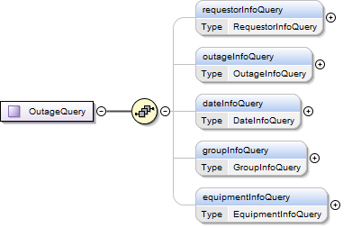
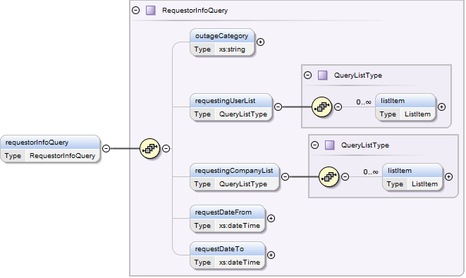
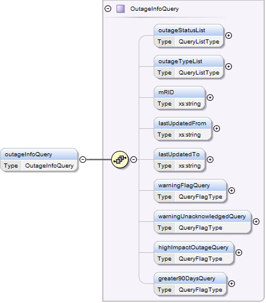
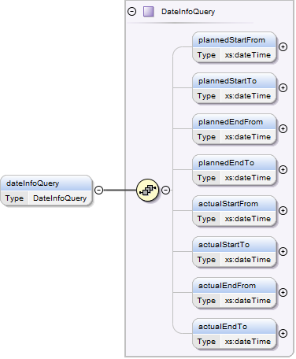
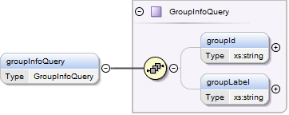
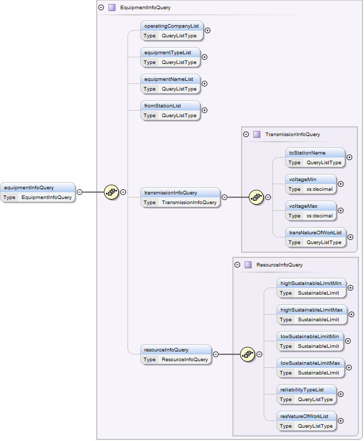

### Outage Query

When getting Outages, an OutageSet container class is used to return
zero or more outages that match the query criteria.

> [!WARNING]
> ERCOT will enforce a limitation on the number of outages that may be
> returned in response to an outage query request. The goal of this
> constraint is to protect the Nodal architecture and mitigate the risk
> of excessively large result sets negatively impacting the
> infrastructure and market operation. If a request arrives that
> discovers a larger number of outages than the enforced constraint
> allows, the response payload will not contain any outages. Instead,
> the response will contain a message indicating that the query exceeded
> the allowable number of outages. The response will further emphasize
> that the Market Participant should reduce the query duration to obtain
> an allowable number of outages.

The request message for querying outages would use the following
message fields:

Please note

mRID format `*<QSEID>.OTG.<outageType>.<outageCategory>.<outageIdent>*`

groupId format `*<QSEID>.OTG.<group_id>*`

<table>
<colgroup>
<col style="width: 34%" />
<col style="width: 65%" />
</colgroup>
<thead>
<tr class="header">
<th><mark>Message Element</mark></th>
<th><mark>Value</mark></th>
</tr>
</thead>
<tbody>
<tr class="odd">
<td>Header/Verb</td>
<td>get</td>
</tr>
<tr class="even">
<td>Header/Noun</td>
<td>OutageSet</td>
</tr>
<tr class="odd">
<td>Header/Source</td>
<td><em>Market participant ID</em></td>
</tr>
<tr class="even">
<td>Header/UserID</td>
<td><em>ID of user</em></td>
</tr>
<tr class="odd">
<td>Request/StartTime</td>
<td><em>Optional: start time of interest</em></td>
</tr>
<tr class="even">
<td>Request/EndTime</td>
<td><em>Optional: end time of interest</em></td>
</tr>
<tr class="odd">
<td>Request/ID</td>
<td>
<em>Optional:</em>

<em>mRID of the outage to be queried  or groupId of the GroupOutage
to be queried</em>
</td>
</tr>
<tr class="even">
<td>Payload</td>
<td>
<em>Optional - for Ad-Hoc Queries:</em>

<em>OutageQuery</em>
</td>
</tr>
</tbody>
</table>

> [!NOTE]
> - If startTime and endTime are not specified, only active outages will
> be returned.Here startTime represents plannedStartFrom and endTime
> represents plannedEndTo.

> - StartTime and endTime are optional but they should not be present when
>   an mRID is sent.

> - The mRID can be used to request details of a specific outage.

> - The GroupID can be used to request outages that are part of a group.

> - For Ad-Hoc Outage queries, OutageQuery (a container element for
>   querying outages) can be included in the payload with select query
>   elements populated.

The corresponding response messages would use the following message
fields:

| Message Element | Value                |
|-------------------------------------------|------------------------------------------------|
| Header/Verb                               | Reply                                          |
| Header/Noun                               | OutageSet                                      |
| Header/Source                             | ERCOT                                          |
| Reply/ReplyCode                           | *Reply code, success=OK, error=ERROR or FATAL* |
| Reply/Error                               | *Error message, if error encountered*          |
| Payload                                   | OutageSet                                      |

The following are XML examples for OutageQuery payload:

Example for querying Resource outages by requesting company:

~~~
<ns2:OutageQuery xmlns="http://www.ercot.com/schema/2007-06/nodal/ews"
    xmlns:ns2="http://www.ercot.com/schema/2007-06/nodal/ews">
    <ns2:requestorInfoQuery>
        <ns2:outageCategory>Resource</ns2:outageCategory>
        <ns2:requestingCompanyList>
            <ns2:listItem>QABC</ns2:listItem>
        </ns2:requestingCompanyList>
    </ns2:requestorInfoQuery>
</ns2:OutageQuery>
~~~

Example for querying outages with an *Accpt* status:

~~~
<OutageQuery xmlns="http://www.ercot.com/schema/2007-06/nodal/ews">
    <requestorInfoQuery/>
    <outageInfoQuery>
        <outageStatusList>
            <listItem>Accpt</listItem>
        </outageStatusList>
    </outageInfoQuery>
</OutageQuery>
~~~

Example for querying an outage using the mRID:

~~~
<Request>
    <ID>TLCRA.OTG.PL.Transmission.LCR00118301</ID>
</Request>
~~~
