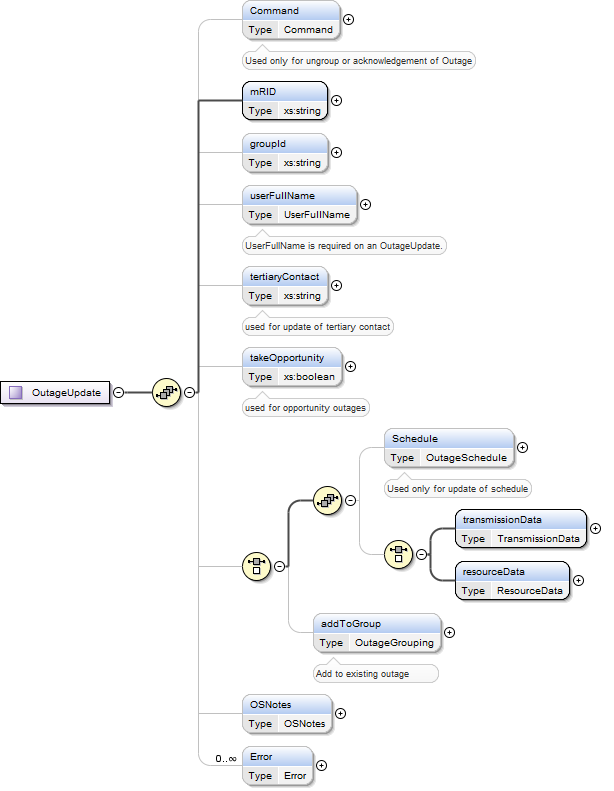

### Outage Update

The request message for outage update would use the following message
fields:

| Message Element | Value |
|-------------------------------------------|---------------------------------|
| Header/Verb                               | Change                          |
| Header/Noun                               | OutageSet                       |
| Header/Source                             | *Market participant ID*         |
| Header/UserID                             | *ID of user*                    |
| Payload                                   | *OutageUpdate*                  |

The corresponding response messages would use the following message
fields:

| Message Element | Value                |
|-------------------------------------------|------------------------------------------------|
| Header/Verb                               | Reply                                          |
| Header/Noun                               | OutageSet                                      |
| Header/Source                             | ERCOT                                          |
| Reply/ReplyCode                           | *Reply code, success=OK, error=ERROR or FATAL* |
| Reply/Error                               | *Error message, if error encountered*          |

On Outage “change” requests, the following items are used:

<table>
<colgroup>
<col style="width: 30%" />
<col style="width: 6%" />
<col style="width: 9%" />
<col style="width: 26%" />
<col style="width: 28%" />
</colgroup>
<thead>
<tr class="header">
<th><em>Element</em></th>
<th><em>Req?</em></th>
<th><em>Data type</em></th>
<th><em>Description</em></th>
<th><em>Values</em></th>
</tr>
</thead>
<tbody>
<tr class="odd">
<td>Command</td>
<td>N</td>
<td>string</td>
<td>Requestor Update</td>
<td>UNGROUP, ACKNOWLEDGE,</td>
</tr>
<tr class="even">
<td>OutageUpdate/mRID</td>
<td>Y</td>
<td>string</td>
<td>Outage Identity</td>
<td>mRID is in the  format of
&lt;QSEID&gt;.OTG.&lt;outageType&gt;.&lt;outageCategory&gt;.&lt;outageIdent&gt;</td>
</tr>
<tr class="odd">
<td>OutageUpdate/groupId</td>
<td>N</td>
<td>String</td>
<td>This is the id for a Group Outage</td>
<td></td>
</tr>
<tr class="even">
<td>OutageUpdate/userFullName</td>
<td>Y</td>
<td>String</td>
<td></td>
<td>UserFullName is required on a Submit, Update and Cancel. Note: the
element is defined as optional in the XSD.</td>
</tr>
<tr class="odd">
<td>OutageUpdate/tertiaryContact</td>
<td>N</td>
<td>string</td>
<td>Tertiary Contact Phone No.</td>
<td></td>
</tr>
<tr class="even">
<td>OutageUpdate/takeOpportunity</td>
<td>N</td>
<td>boolean</td>
<td>
For taking opportunity outage. i.e.

To accept the opportunity when a opportunity match exists.
</td>
<td>true/false</td>
</tr>
<tr class="odd">
<td>Schedule/plannedSart</td>
<td>N</td>
<td>dateTime</td>
<td>This is the date/time at which the Outage is planned to start.</td>
<td></td>
</tr>
<tr class="even">
<td>Schedule/plannedEnd</td>
<td>N</td>
<td>dateTime</td>
<td>This is the date/time at which the Outage is planned to end.</td>
<td></td>
</tr>
<tr class="odd">
<td>Schedule/earliestStart</td>
<td>N</td>
<td>dateTime</td>
<td>This is the earliest date/time at which the Outage may start.</td>
<td></td>
</tr>
<tr class="even">
<td>Schedule/latestEnd</td>
<td>N</td>
<td>dateTime</td>
<td>This is the latest date/time at which the Outage may end.</td>
<td></td>
</tr>
<tr class="odd">
<td>Schedule/actualStart</td>
<td>N</td>
<td>dateTime</td>
<td>This is the actual date/time at which the Outage started.</td>
<td></td>
</tr>
<tr class="even">
<td>Schedule/actualEnd</td>
<td>N</td>
<td>dateTime</td>
<td>This is the actual date/time at which the Outage ended.</td>
<td></td>
</tr>
<tr class="odd">
<td>Schedule/new_plannedStart</td>
<td>N</td>
<td>dateTime</td>
<td>This is the proposed date/time at which an Unavoidable Extension may
start.</td>
<td></td>
</tr>
<tr class="even">
<td>Schedule/new_plannedEnd</td>
<td>N</td>
<td>dateTime</td>
<td>This is the proposed date/time at which an Unavoidable Extension may
end.</td>
<td></td>
</tr>
<tr class="odd">
<td>Schedule/new_earliestStart</td>
<td>N</td>
<td>dateTime</td>
<td>This is the proposed earliest date/time at which a Resource
Opportunity Outage may start.</td>
<td></td>
</tr>
<tr class="even">
<td>Schedule/new_latestEnd</td>
<td>N</td>
<td>dateTime</td>
<td>This is the proposed latest date/time at which a Resource
Opportunity Outage may end.</td>
<td></td>
</tr>
<tr class="odd">
<td>transmissionData/emergencyRestorationTime</td>
<td>N</td>
<td>positiveInteger</td>
<td></td>
<td></td>
</tr>
<tr class="even">
<td>transmissionData/transNatureOfWork</td>
<td>N</td>
<td>string</td>
<td></td>
<td></td>
</tr>
<tr class="odd">
<td>resourceData/highSustainableLimit</td>
<td>N</td>
<td>integer</td>
<td></td>
<td></td>
</tr>
<tr class="even">
<td>resourceData/lowSustainableLimit</td>
<td>N</td>
<td>Integer</td>
<td></td>
<td></td>
</tr>
<tr class="odd">
<td>resourceData/resNatureOfWork</td>
<td>N</td>
<td>string</td>
<td></td>
<td></td>
</tr>
<tr class="even">
<td>addToGroup/groupId</td>
<td>N</td>
<td>string</td>
<td></td>
<td></td>
</tr>
<tr class="odd">
<td>addToGroup/name</td>
<td>Y</td>
<td>string</td>
<td></td>
<td></td>
</tr>
<tr class="even">
<td>ResourceOutage/operatingCompany</td>
<td>Y</td>
<td>string</td>
<td></td>
<td></td>
</tr>
<tr class="odd">
<td>ResourceOutage/station</td>
<td>Y</td>
<td>string</td>
<td>This is the station name of a Resource that is a Designated Resource
for this Outage.</td>
<td></td>
</tr>
<tr class="even">
<td>ResourceOutage/equipmentName</td>
<td>Y</td>
<td>string</td>
<td>This is the name of a Resource that is a Designated Resource for
this Outage.</td>
<td></td>
</tr>
<tr class="odd">
<td>ResourceOutage/equipmentIdentifier</td>
<td>Y</td>
<td>string</td>
<td></td>
<td></td>
</tr>
<tr class="even">
<td>ResourceOutage/resourceType</td>
<td>N</td>
<td>string</td>
<td>This is the type of a Resource that is a Designated Resource for
this Outage.</td>
<td>UN (Unit), LR (Load Resource), Distribution Generation Resource
(DGR) and Distribution Energy Storage Resource (DESR)</td>
</tr>
<tr class="odd">
<td>ResourceOutage/HSL</td>
<td>Y</td>
<td>Decimal</td>
<td>Resource Outage HSL</td>
<td></td>
</tr>
<tr class="even">
<td>ResourceOutage/LSL</td>
<td>Y</td>
<td>Decimal</td>
<td>Resource Outage LSL</td>
<td></td>
</tr>
<tr class="odd">
<td>ResourceOutage/mRID</td>
<td>N</td>
<td>string</td>
<td>Outage Identity</td>
<td>mRID is in the  format of
&lt;QSEID&gt;.OTG.&lt;outageType&gt;.&lt;outageCategory&gt;.&lt;outageIdent&gt;</td>
</tr>
<tr class="even">
<td>ResourceOutage/natureOfWork</td>
<td>Y</td>
<td>string</td>
<td>Resource Outage Nature of Work. . The allowable values for this
field are stated above.</td>
<td></td>
</tr>
<tr class="odd">
<td>GroupTransmissionOutage/operatingCompany</td>
<td>Y</td>
<td>string</td>
<td></td>
<td></td>
</tr>
<tr class="even">
<td>GroupTransmissionOutage/equipmentName</td>
<td>Y</td>
<td>string</td>
<td>The name of the Equipment that can be the subject of an Outage.</td>
<td></td>
</tr>
<tr class="odd">
<td>GroupTransmissionOutage/equipmentIdentifier</td>
<td>Y</td>
<td>string</td>
<td></td>
<td></td>
</tr>
<tr class="even">
<td>GroupTransmissionOutage/transmissionType</td>
<td>Y</td>
<td>string</td>
<td>The Type of the Transmission Equipment that can be the subject of an
Outage.</td>
<td></td>
</tr>
<tr class="odd">
<td>GroupTransmissionOutage/fromStation</td>
<td>Y</td>
<td>string</td>
<td>This is the name of the Station in which an Equipment resides for
all equipment types other than lines. For lines this refers to the
“From” station</td>
<td></td>
</tr>
<tr class="even">
<td>GroupTransmissionOutage/toStation</td>
<td>N</td>
<td>string</td>
<td>This is the name of the “To” Station in which an Equipment resides
for all lines.</td>
<td></td>
</tr>
<tr class="odd">
<td>GroupTransmissionOutage/normalState</td>
<td>N</td>
<td>string</td>
<td>This field, which is pertinent only for switching devices, contains
the normal state of the device: OPEN or CLOSED. This field is the same
as the Normal State of the Equipment entity.</td>
<td>Output only</td>
</tr>
<tr class="even">
<td>GroupTransmissionOutage/outageState</td>
<td>N</td>
<td>string</td>
<td>This field, which is pertinent (and required) only for switching
devices, contains the state of the device when taken out of service:
OPEN or CLOSED. This field is the opposite of the Normal State of the
Equipment entity.</td>
<td>“C’,”O” or “”</td>
</tr>
<tr class="odd">
<td>GroupTransmissionOutage/voltage</td>
<td>N</td>
<td>Decimal</td>
<td>The voltage level at which the Equipment resides. For transformers
it is the high side voltage level.</td>
<td></td>
</tr>
<tr class="even">
<td>GroupTransmissionOutage/projectName</td>
<td>N</td>
<td>String</td>
<td></td>
<td></td>
</tr>
<tr class="odd">
<td>GroupTransmissionOutage/emergencyRestorationTime</td>
<td>Y</td>
<td>positiveInteger</td>
<td>This is the time in hours necessary to terminate the Outage and
return the Equipment to service.</td>
<td></td>
</tr>
<tr class="even">
<td>GroupTransmissionOutage/mRID</td>
<td>N</td>
<td>string</td>
<td>Outage Identity</td>
<td>mRID is in the  format of
&lt;QSEID&gt;.OTG.&lt;outageType&gt;.&lt;outageCategory&gt;.&lt;outageIdent&gt;</td>
</tr>
<tr class="odd">
<td>GroupTransmissionOutage/natureOfWork</td>
<td>Y</td>
<td>string</td>
<td></td>
<td></td>
</tr>
<tr class="even">
<td>Opportunity/opportunityDuration/days</td>
<td>N</td>
<td>unsigned Byte</td>
<td>For Opportunity Outages, the outage no. of days.</td>
<td>Positive no.</td>
</tr>
<tr class="odd">
<td>Opportunity/opportunityDuration/hours</td>
<td>N</td>
<td>unsigned Byte</td>
<td>For Opportunity Outages, the outage no. of hours</td>
<td>Positive no.</td>
</tr>
<tr class="even">
<td>Opportunity/opportunityEnd</td>
<td>Y</td>
<td>DateTime</td>
<td>For Opportunity Outages, the outage end time</td>
<td>Date Time</td>
</tr>
<tr class="odd">
<td>Opportunity/designatedResource/equipmentName</td>
<td>Y</td>
<td>string</td>
<td>This is the Resource name of a Resource that has been designated to
an Opportunity</td>
<td></td>
</tr>
<tr class="even">
<td>Opportunity/designatedResource/equipmentIdentifier</td>
<td>Y</td>
<td>String</td>
<td></td>
<td></td>
</tr>
<tr class="odd">
<td>Opportunity/designatedResource/resourceType</td>
<td>Y</td>
<td>String</td>
<td>This is the Resource type of a Resource that has been designated to
an Opportunity</td>
<td>UN (Unit),LR (Load Resource), Distribution Generation Resource (DGR)
and Distribution Energy Storage Resource (DESR)</td>
</tr>
<tr class="even">
<td>Opportunity/designatedResource/station</td>
<td>Y</td>
<td>String</td>
<td></td>
<td></td>
</tr>
<tr class="odd">
<td>Opportunity/designatedResource/HSL</td>
<td>Y</td>
<td>Decimal</td>
<td></td>
<td></td>
</tr>
<tr class="even">
<td>Opportunity/designatedResource/desgOutageIdent</td>
<td>N</td>
<td>String</td>
<td>Designated Resource Outage Identifier corresponding to a valid TOO (
Transmission Opportunity Outage).</td>
<td>
Not required for outage create transaction.

Outage Schedule will populate this field in OS query
response
</td>
</tr>
<tr class="odd">
<td>Opportunity/designatedResource/desgOutageStart</td>
<td>N</td>
<td>dateTime</td>
<td>Designated Resource outage start dateTime</td>
<td>
Not required for outage create transaction.

Outage Schedule will populate this field in OS query
response
</td>
</tr>
<tr class="even">
<td>Opportunity/designatedResource/desgOutageEnd</td>
<td>N</td>
<td>dateTime</td>
<td>Designated Resource outage End dateTime</td>
<td>
Not required for outage create transaction.

Outage Schedule will populate this field in OS query
response
</td>
</tr>
<tr class="odd">
<td>OSNotes/RequestorNotes/Note/createdTime</td>
<td>Y</td>
<td>string</td>
<td rowspan="12">There are three sections that the requestor can enter
notes, Requestor Notes, Supporting Information, and Remedial Action or
Special Protection System notes. Notes are required for some outage
types but not all. They are not required when the outage is submitted
but are required for some outages to be completed.</td>
<td></td>
</tr>
<tr class="even">
<td>OSNotes/RequestorNotes/Note/createdBy</td>
<td>Y</td>
<td>string</td>
<td></td>
</tr>
<tr class="odd">
<td>OSNotes/RequestorNotes/Note/company</td>
<td>Y</td>
<td>string</td>
<td></td>
</tr>
<tr class="even">
<td>OSNotes/RequestorNotes/Note/comment</td>
<td>Y</td>
<td>string</td>
<td></td>
</tr>
<tr class="odd">
<td>OSNotes/SupportingNotes/Note/createdTime</td>
<td>Y</td>
<td>string</td>
<td></td>
</tr>
<tr class="even">
<td>OSNotes/SupportingNotes/Note/createdBy</td>
<td>Y</td>
<td>string</td>
<td></td>
</tr>
<tr class="odd">
<td>OSNotes/SupportingNotes/Note/company</td>
<td>Y</td>
<td>string</td>
<td></td>
</tr>
<tr class="even">
<td>OSNotes/SupportingNotes/Note/comment</td>
<td>Y</td>
<td>string</td>
<td></td>
</tr>
<tr class="odd">
<td>OSNotes/RASPSNotes/Note/createdTime</td>
<td>Y</td>
<td>string</td>
<td></td>
</tr>
<tr class="even">
<td>OSNotes/RASPSNotes/Note/createdBy</td>
<td>Y</td>
<td>string</td>
<td></td>
</tr>
<tr class="odd">
<td>OSNotes/RASPSNotes/Note/company</td>
<td>Y</td>
<td>string</td>
<td></td>
</tr>
<tr class="even">
<td>OSNotes/RASPSNotes/Note/comment</td>
<td>Y</td>
<td>string</td>
<td></td>
</tr>
<tr class="odd">
<td>Error/severity</td>
<td>N</td>
<td>string</td>
<td>Severity of Error Generated</td>
<td></td>
</tr>
<tr class="even">
<td>Error/area</td>
<td>N</td>
<td>string</td>
<td>Area of generated error</td>
<td></td>
</tr>
<tr class="odd">
<td>Error/interval</td>
<td>N</td>
<td>string</td>
<td></td>
<td></td>
</tr>
<tr class="even">
<td>Error/text</td>
<td>Y</td>
<td>string</td>
<td>Error Text</td>
<td></td>
</tr>
</tbody>
</table>

The following is an example for an Update OutageSet request that
updates schedule and emergency restoration time:

~~~
<OutageUpdate xmlns="http://www.ercot.com/schema/2007-06/nodal/ews" xmlns:xsi="http://www.w3.org/2001/XMLSchema-instance">
    <mRID>TABC.OTG.PL.Transmission.ABC00118301</mRID>
    <userFullName>Alex Smith</userFullName>
    <Schedule>
        <plannedStart>2016-08-16T11:00:00-05:00</plannedStart>
        <plannedEnd>2016-08-16T13:00:00-05:00</plannedEnd>
        <earliestStart>2016-08-16T11:00:00-05:00</earliestStart>
        <latestEnd>2016-08-16T14:00:00-05:00</latestEnd>
    </Schedule>
    <transmissionData>
        <emergencyRestorationTime>2</emergencyRestorationTime>
    </transmissionData>
</OutageUpdate>
~~~

The following is an example for an Update OutageSet request that add
equipment to a group outage:

~~~
<OutageUpdate xmlns="http://www.ercot.com/schema/2007-06/nodal/ews"
    xmlns:xsi="http://www.w3.org/2001/XMLSchema-instance">
    <mRID>TABC.OTG.M1.Transmission.ABC00116294</mRID>
    <userFullName>Alex Smith</userFullName>
    <tertiaryContact>512-555-5555</tertiaryContact>
    <addToGroup>
        <groupId>TABC.OTG.166835</groupId>
        <name>Grp1</name>
        <GroupTransmissionOutage>
            <operatingCompany>TABC</operatingCompany>
            <equipmentName>AB_2315</equipmentName>
            <equipmentIdentifier>_{ABCE0AC3-6111-4DCF-803F-27B372A3A081}</equipmentIdentifier>
            <transmissionType>CB</transmissionType>
            <fromStation>Station1</fromStation>
            <normalState>0</normalState>
            <outageState>O</outageState>
            <voltage>0</voltage>
            <projectName>Project1</projectName>
            <emergencyRestorationTime>1</emergencyRestorationTime>
            <natureOfWork>OT</natureOfWork>
        </GroupTransmissionOutage>
    </addToGroup>
    <OSNotes>
        <RequestorNotes>
            <Note>
                <createdTime>2016-03-10T11:13:51-06:00</createdTime>
                <createdBy>Alex Smith</createdBy>
                <company>TABC</company>
                <comment>Adding equipment</comment>
            </Note>
        </RequestorNotes>
    </OSNotes>
</OutageUpdate>
~~~
