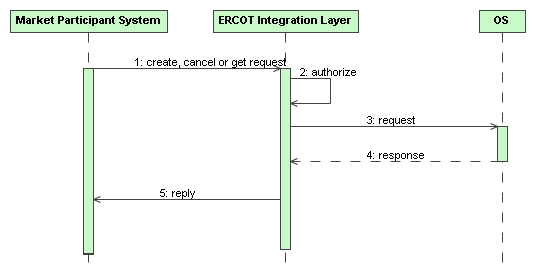

# Outage Scheduling Interfaces 

The purpose of this section is to describe interfaces related to the
creation, update, query, and cancellation of outages. These interfaces
would be used by QSEs and TPs, as needed to support integration with
their system.

## Interfaces Provided 

Interfaces are provided for the creation, update, query, and
cancellation of outages by QSEs and TPs. The interfaces use a basic
request/reply interaction pattern. The payload used for these interfaces
is an ‘OutageSet’, which is a container that may contain zero, one or
more ‘Outage’ objects.

Outages can be submitted by TP for transmission elements or by QSEs
for resources.

There are also notifications sent to MPs when outages are created or
changed. These are described in the Notifications section of this documentation.
