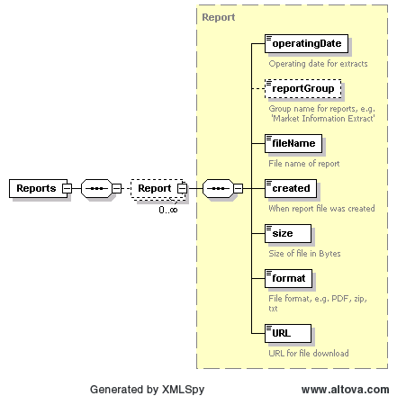

### Get Reports

The purpose of this interface is to provide the means to obtain a list
of URLs for reports related to a specific date range, and Report Id.
The URLs can then be used for downloading the reports.

The request message would use the following message fields:

| Message Element | Value               |
|-------------------------------------------|-----------------------------------------------|
| Header/Verb                               | get                                           |
| Header/Noun                               | Reports                                       |
| Header/Source                             | *Market participant ID*                       |
| Header/UserID                             | *ID of user*                                  |
| Request/StartTime                         | *Start Date & time of interest (Optional)* ** |
| Request/EndTime                           | *End Date & time of interest (Optional)* **   |
| Request/Option                            | *Report ID (Required)* **                    |

** Following are the valid query combinations for getReports

- Option & (StartTime & EndTime) – All reports for the requested
  reportID and time duration.

- Option & StartTime – All reports starting from StartTime till now
  (currentDateTime) for the requested reportID.

- Option & EndTime – All available reports till EndTime for the
  requested reportID.

- Only Option – All the available reports for the requested reportID.

The corresponding response messages would use the following message
fields:

| Message Element | Value                                                                                                              |
|-------------------------------------------|----------------------------------------------------------------------------------------------------------------------------------------------|
| Header/Verb                               | reply                                                                                                                                        |
| Header/Noun                               | Reports                                                                                                                                      |
| Header/Source                             | ERCOT                                                                                                                                        |
| Reply/ReplyCode                           | *Reply code, success=OK, error=ERROR*                                                                                                        |
| Reply/Error                               | *Error message, if error encountered*                                                                                                        |
| Payload/Reports                           | *List of Report structures, where each Report identifies a number of data items including the URL where the actual report may be downloaded* |

The following structure is used within the payload to convey a list of
reports:

| *Element*     | *Data type* | *Description*               | *Values* |
|---------------|-------------|-----------------------------|----------|
| operatingDate | date        | Operating date for extracts |          |
| reportGroup   | string      | Group name for reports      |          |
| filename      | String      | Report file name            |          |
| Created       | dateTime    | Date of report creation.    |          |
| Size          | Integer     | File size in Bytes          |          |
| Format        | string      | Report file format          |          |
| URL           | string      | URL for http download       |          |

Example:

~~~
<ns1:Reports xmlns:ns0="http://www.ercot.com/schema/2007-05/nodal/eip/il"
    xmlns:ns1="http://www.ercot.com/schema/2007-06/nodal/ews">
    <ns1:Report>
        <ns1:operatingDate>2009-12-16</ns1:operatingDate>
        <ns1:reportGroup>60 Day Disclosure</ns1:reportGroup>
        <ns1:fileName>rpt.00010029.0000000000000000.20091216.093316.dummy_file.zip</ns1:fileName>
        <ns1:created>2009-12-16T09:33:16</ns1:created>
        <ns1:size>1412</ns1:size>
        <ns1:format>zip</ns1:format>
        <ns1:URL>https://Host:Port/folder/?doclookupId=32423</ns1:URL>
    </ns1:Report>
    … 
</ns1:Reports>
~~~