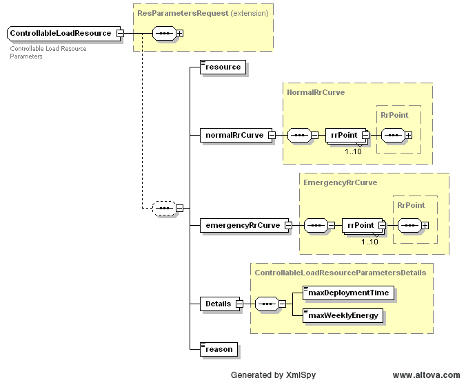
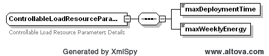

### Controllable Load Resource 

The following diagram defines the structure of a Controllable Load
Resource that could be included within a ResParametersSet, using the
ControllableLoadResource tag:

The error tag is used to return one or more errors that may be the
consequence of the failure of business or syntax validation rules for
Controllable Load Resource submittals.

On submission, the following table describes the items used for a
Controllable Load Resource change request.

| Element                               | Req? | Datatype | Description                                                    | Values                         |
|---------------------------------------|------|----------|----------------------------------------------------------------|--------------------------------|
| mRID                                  | N    | String   | ERCOT assigned                                                 |                                |
| ExternalId                            | N    | String   | External ID                                                    | QSE supplied                   |
| status                                | N    | String   | Return status                                                  | SUBMITTED, ACCEPTED, or ERRORS |
| Error/severity                        | N    | String   | Error if any                                                   | Error text                     |
| Error/area                            | N    | String   | Error if any                                                   | Error text                     |
| Error/interval                        | N    | String   | Error if any                                                   | Error text                     |
| Error/text                            | N    | String   | Error if any                                                   | Error text                     |
| resource                              | N    | String   | Resource name                                                  |                                |
| normalRrCurve/rrPoint/rampRateUp      | Y    | float    | MW/min                                                         |                                |
| normalRrCurve/rrPoint/rampRateDown    | Y    | float    | MW/min                                                         |                                |
| normalRrCurve/rrPoint/breakPoint      | Y    | float    |                                                                |                                |
| emergencyRrCurve/rrPoint/rampRateUp   | Y    | float    | MW/min                                                         |                                |
| emergencyRrCurve/rrPoint/rampRateDown | Y    | float    | MW/min                                                         |                                |
| emergencyRrCurve /rrPoint/breakPoint  | Y    | float    |                                                                |                                |
| Details/maxDeploymentTime             | Y    | float    |                                                                | time in hours                  |
| Details/maxWeeklyEnergy               | Y    | Integer  | max amount of energy a Resource is allowed to produce per week | MWh value                      |
| Details /reason                       | Y    | String   | text reason for changing parameters                            | Description in plain text      |

The following is an XML example of a Controllable Load Resource:

~~~
<ControllableLoadResource>
    <mRID>String</mRID>
    <externalId>String</externalId>
    <status>SUBMITTED</status>
    <error>
        <severity>ERROR</severity>
        <area>String</area>
        <interval>String</interval>
        <text>String</text>
    </error>
    <resource>String</resource>
    <normalRrCurve>
        <rrPoint>
            <rampRateUp>0</rampRateUp>
            <rampRateDown>0</rampRateDown>
            <breakPoint>0</breakPoint>
        </rrPoint>
    </normalRrCurve>
    <emergencyRrCurve>
        <rrPoint>
            <rampRateUp>0</rampRateUp>
            <rampRateDown>0</rampRateDown>
            <breakPoint>0</breakPoint>
        </rrPoint>
    </emergencyRrCurve>
    

        <maxDeploymentTime>0</maxDeploymentTime>
        <maxWeeklyEnergy>0</maxWeeklyEnergy>
    

    <reason>String</reason>
</ControllableLoadResource>
~~~
