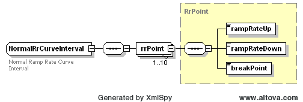
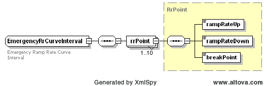
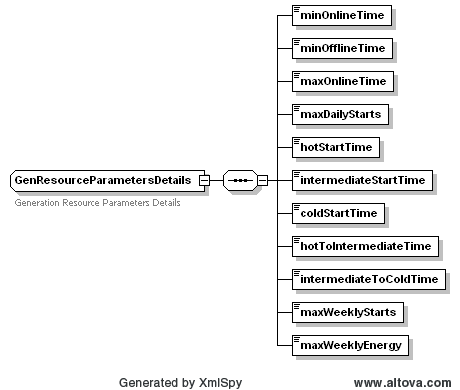

### Generator Resource Parameters 

The following diagram defines the structure of a Generator Resource
Parameters that could be included within a ResParametersSet, using the
GenResourceParameters tag:

The error tag is used to return one or more errors that may be the
consequence of the failure of business or syntax validation rules for
Generator Resource Parameter change submittals.

On submission, the following table describes the items used for a
ResParametersSet change request.

| *Element*                             | *Req?* | *Datatype* | *Description*                                                  | *Values*                       |
|---------------------------------------|--------|------------|----------------------------------------------------------------|--------------------------------|
| mRID                                  | N      | String     | ERCOT assigned                                                 |                                |
| externalId                            | N      | String     | External ID                                                    | QSE supplied                   |
| status                                | N      | String     | Return status                                                  | SUBMITTED, ACCEPTED, or ERRORS |
| Error/severity                        | N      | String     | Error if any                                                   | Error text                     |
| Error/area                            | N      | String     | Error if any                                                   | Error text                     |
| Error/interval                        | N      | String     | Error if any                                                   | Error text                     |
| Error/text                            | N      | String     | Error if any                                                   | Error text                     |
| resource                              | Y      | String     | Resource name                                                  |                                |
| normalRrCurve/rrPoint/rampRateUp      | Y      | float      | MW/min                                                         |                                |
| normalRrCurve/rrPoint/rampRateDown    | Y      | float      | MW/min                                                         |                                |
| normalRrCurve/rrPoint/breakPoint      | Y      | float      |                                                                |                                |
| emergencyRrCurve/rrPoint/rampRateUp   | Y      | float      | MW/min                                                         |                                |
| emergencyRrCurve/rrPoint/rampRateDown | Y      | float      | MW/min                                                         |                                |
| emergencyRrCurve/rrPoint/breakPoint   | Y      | float      |                                                                |                                |
| Details/minOnlineTime                 | Y      | float      |                                                                | time in hours                  |
| Details/minOfflineTime                | Y      | float      |                                                                | time in hours                  |
| Details/maxOnlineTime                 | Y      | float      |                                                                | time in hours                  |
| Details/maxDailyStarts                | Y      | Integer    |                                                                | time in hours                  |
| Details/hotStartTime                  | Y      | float      |                                                                | time in hours                  |
| Details/intermediateStartTime         | Y      | float      |                                                                | time in hours                  |
| Details /coldStartTime                | Y      | float      |                                                                | time in hours                  |
| Details /hotToIntermediateTime        | Y      | float      |                                                                | time in hours                  |
| Details / intermediateToColdTime      | Y      | float      |                                                                | time in hours                  |
| Details /maxWeeklyStarts              | Y      | Integer    |                                                                |                                |
| Details /maxWeeklyEnergy              | Y      | Integer    | max amount of energy a Resource is allowed to produce per week | MWh value                      |
| Details /reason                       | Y      | String     | text reason for changing parameters                            | Description in plain text      |

The following is an XML example of a GenResourceParameters:

~~~
<GenResourceParameters>
    <mRID>String</mRID>
    <externalId>String</externalId>
    <status>SUBMITTED</status>
    <error>
        <severity>ERROR</severity>
        <area>String</area>
        <interval>String</interval>
        <text>String</text>
    </error>
    <resource>String</resource>
    <normalRrCurve>
        <rrPoint>
            <rampRateUp>0</rampRateUp>
            <rampRateDown>0</rampRateDown>
            <breakPoint>0</breakPoint>
        </rrPoint>
    </normalRrCurve>
    <emergencyRrCurve>
        <rrPoint>
            <rampRateUp>0</rampRateUp>
            <rampRateDown>0</rampRateDown>
            <breakPoint>0</breakPoint>
        </rrPoint>
    </emergencyRrCurve>
    

        <minOnlineTime>0</minOnlineTime>
        <minOfflineTime>0</minOfflineTime>
        <maxOnlineTime>0</maxOnlineTime>
        <maxDailyStarts>0</maxDailyStarts>
        <hotStartTime>0</hotStartTime>
        <intermediateStartTime>0</intermediateStartTime>
        <coldStartTime>0</coldStartTime>
        <hotToIntermediateTime>0</hotToIntermediateTime>
        <intermediateToColdTime>0</intermediateToColdTime>
        <maxWeeklyStarts>0</maxWeeklyStarts>
        <maxWeeklyEnergy>0</maxWeeklyEnergy>
    

    <reason>String</reason>
</GenResourceParameters>
~~~
