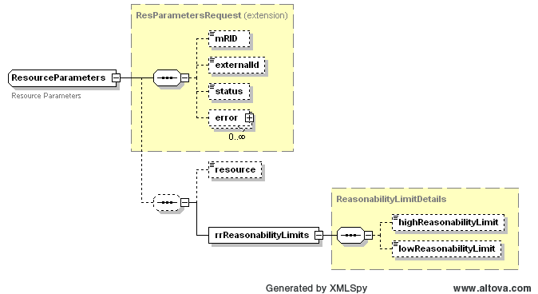

### Resource Parameters 

The following diagram defines the structure of a Resource Parameters
that could be included within a ResParametersSet, using the
ResourceParameters tag:

The error tag is used to return one or more errors that may be the
consequence of the failure of business or syntax validation rules for
Resource Parameter change submittals.

Please note that the Reasonability Limits are not changeable via this
interface and this interface is only used for retrieval purposes. The
following items are returned in a ResParametersSet “get” request.

| *Element*                                     | *Req?* | *Datatype* | *Description*            | *Values*                       |
|-----------------------------------------------|--------|------------|--------------------------|--------------------------------|
| mRID                                          | N      | String     | ERCOT assigned           |                                |
| externalId                                    | N      | String     | External ID              | QSE supplied                   |
| status                                        | N      | String     | Return status            | SUBMITTED, ACCEPTED, or ERRORS |
| Error/severity                                | N      | String     | Error if any             | Error text                     |
| Error/area                                    | N      | String     | Error if any             | Error text                     |
| Error/interval                                | N      | String     | Error if any             | Error text                     |
| Error/text                                    | N      | String     | Error if any             | Error text                     |
| resource                                      | Y      | String     | Resource name            |                                |
| rrreasonabilityLimits/ highReasonabilityLimit | N      | Float      | High Reasonability Limit | Single Point Precision         |
| rrreasonabilityLimits/ LowReasonabilityLimit  | N      | Float      | Low Reasonability Limit  | Single Point Precision         |

Figure 214 – ResourceParameters Requirements

The following is an XML example of a ResourceParameters:

~~~
<ResourceParameters>
		<mRID>String</mRID>
		<externalId>String</externalId>
		<status>SUBMITTED</status>
		<error>
			<severity>ERROR</severity>
			<area>String</area>
			<interval>String</interval>
			<text>String</text>
		</error>		
		<resource>String</resource>
		<rrReasonabilityLimits>
			<highReasonabilityLimit>3.1</highReasonabilityLimit>
			<lowReasonabilityLimit>3.1</lowReasonabilityLimit>
		</rrReasonabilityLimits>
	</ResourceParameters>
~~~
