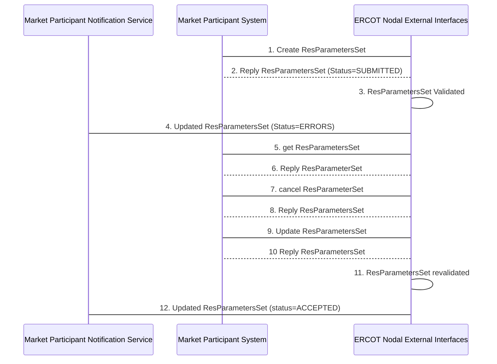

# Resource Parameter Transaction Service 

Each Market Participant can provide directions (using a
ResParametersSet) to ERCOT on any changes to resource parameters.  Any
changes submitted become effective upon completion and validation of the
submission for all applicable markets.  When submitted, ERCOT will
validate the submission, reporting format or submission errors to Market
Participants using notification messages. 

## Interfaces Provided 

The interfaces provide the means to create (i.e. change), get (i.e.
query), and cancel (i.e. delete) resource parameters for the next
trading date.  A single container class ‘ResParametersSet’ is used to
hold a request for changing resource parameters within the Payload
section of the message, where each of the requests may be of a different
type.

The following diagram shows an example message sequence, using the
‘verb’ and ‘noun’ convention. Where this section focuses on the requests
made by Market Participant systems to the ERCOT Nodal Web Services, the
sequence diagram also includes notification messages sent from ERCOT to
Market Participant Notification services (as described in section 5):

The message sequence example shown involves the following steps:

1.  Market participant sends a RequestMessage for ‘change
    ResParametersSet’ with an initial ResParametersSet in the payload to
    ERCOT.

2.  In response to step 1, ERCOT performs a simple syntax scan and
    typically sends a ResponseMessage with ReplyCode=OK. In the response
    payload, each ResParametersSet will identify a ‘SUBMITTED’ status
    and an mRID value. (An alternative example could result in a reply
    of ‘ERRORS’ if the syntax check failed, in which case steps 3 and 4
    would not occur). This reply is synchronous.

3.  ERCOT validates the Resource Parameters Set request within the
    ResParametersSet. This could take several minutes. This processing
    is done asynchronously.

4.  A notification message (using verb=changed) is sent to the
    notification interface provided by the Market Participant. The
    status of the Resource Parameters change requests within the
    ResParametersSet will indicate whether the request was
    PENDING/ACCEPTED or had ERRORS. This message will not include the
    complete ResParametersSet.

### Querying for Resource Parameters Set

The following table describes the parameters used in the “get” request
message (RequestMessage) for market information, noting that each
transaction has a request and a response message. The verb “get” is used
to query for ResParametersSet.

<table>
<colgroup>
<col style="width: 29%" />
<col style="width: 70%" />
</colgroup>
<thead>
<tr class="header">
<th><mark>Message Element</mark></th>
<th><mark>Value</mark></th>
</tr>
</thead>
<tbody>
<tr class="odd">
<td>Header/Verb</td>
<td><em>get</em></td>
</tr>
<tr class="even">
<td>Header/Noun</td>
<td>ResParametersSet</td>
</tr>
<tr class="odd">
<td>Header/Source</td>
<td><em>Market participant ID</em></td>
</tr>
<tr class="even">
<td>Header/UserID</td>
<td><em>ID of user</em></td>
</tr>
<tr class="odd">
<td>Request/ID</td>
<td>
ResParametersSet mRID:

Full:QSEID.&lt;ResParamatersTypeCode&gt;.&lt;resource&gt;

Short:QSEID.&lt;ResParamatersTypeCode&gt;
</td>
</tr>
</tbody>
</table>

The corresponding response messages (ResponseMessage) would use the
following message fields:

| Message Element | Value                                |
|-------------------------------------------|----------------------------------------------------------------|
| Header/Verb                               | reply                                                          |
| Header/Noun                               | ResParametersSet                                               |
| Header/Source                             | ERCOT                                                          |
| Reply/ReplyCode                           | *Reply code, success=OK, error=ERROR or FATAL*                 |
| Reply/Error                               | *May be any number of error message if the ReplyCode is ERROR* |
| Reply/Timestamp                           | *The time the submission was received by ERCOT*                |
| Payload                                   | ResParametersSet                                               |

Figure 196 - Message: reply to get ResParametersSet request

In the cases of payloads that would otherwise exceed 1 megabyte, the
payloads should be zipped, base64 encoded and stored within the
‘Payload/Compressed’ tag.

### Updating Resource Parameters Set

The following table describes the parameters used in the “change”
request message (RequestMessage) for market transaction, noting that
each transaction has a request and a response message. The verbs
“change” is used to submit update requests to for ResParametersSet.

| Message Element | Value                                                     |
|-------------------------------------------|-------------------------------------------------------------------------------------|
| Header/Verb                               | *change*                                                                            |
| Header/Noun                               | ResParametersSet                                                                    |
| Header/Source                             | *Market participant ID*                                                             |
| Header/UserID                             | *ID of user*                                                                        |
| Payload                                   | ResParametersSet (a single ResParametersSet may be used for update request messages |

The corresponding response messages (ResponseMessage) would use the
following message fields:

| Message Element | Value                                                                                                                                                                               |
|-------------------------------------------|---------------------------------------------------------------------------------------------------------------------------------------------------------------------------------------------------------------|
| Header/Verb                               | reply                                                                                                                                                                                                         |
| Header/Noun                               | ResParametersSet                                                                                                                                                                                              |
| Header/Source                             | ERCOT                                                                                                                                                                                                         |
| Reply/ReplyCode                           | *Reply code, success=OK, error=ERROR or FATAL*                                                                                                                                                                |
| Reply/Error                               | *May be any number of error message if the ReplyCode is ERROR*                                                                                                                                                |
| Reply/Timestamp                           | *The time the submission was received by ERCOT*                                                                                                                                                               |
| Payload                                   | ResParametersSet, where the status of each Res Par Change Request within the ResParametersSet may be SUBMITTED, ACCEPTED, or ERRORS. Specific errors may be identified for each Res Parameter Change Request. |

In the cases of payloads that would otherwise exceed 1 megabyte, the
payloads should be zipped, base64 encoded and stored within the
‘Payload/Compressed’ tag.

For the purposes of ResParametersSet, the verbs create and change can be
used interchangeably. Note that only one ResParametersSet “change”
request is permitted for a given message.

### Canceling Resource Parameters Set

The following table describes the parameters used in the “cancel”
request message (RequestMessage) for market transaction, noting that
each transaction has a request and a response message. The verbs
“cancel” is used to delete (cancel) a previously submitted “change”
ResParametersSet.

<table>
<colgroup>
<col style="width: 34%" />
<col style="width: 65%" />
</colgroup>
<thead>
<tr class="header">
<th><mark>Message Element</mark></th>
<th><mark>Value</mark></th>
</tr>
</thead>
<tbody>
<tr class="odd">
<td>Header/Verb</td>
<td><em>cancel</em></td>
</tr>
<tr class="even">
<td>Header/Noun</td>
<td>ResParametersSet</td>
</tr>
<tr class="odd">
<td>Header/Source</td>
<td><em>Market participant ID</em></td>
</tr>
<tr class="even">
<td>Header/UserID</td>
<td><em>ID of user</em></td>
</tr>
<tr class="odd">
<td>Request/ID</td>
<td>
ResParametersSet full mRID:

QSEID.&lt;ResParamatersTypeCode&gt;.&lt;resource&gt;
</td>
</tr>
</tbody>
</table>

The corresponding response messages (ResponseMessage) would use the
following message fields:

| Message Element | Value                                                                                                                                                                     |
|-------------------------------------------|-----------------------------------------------------------------------------------------------------------------------------------------------------------------------------------------------------|
| Header/Verb                               | reply                                                                                                                                                                                               |
| Header/Noun                               | ResParametersSet                                                                                                                                                                                    |
| Header/Source                             | ERCOT                                                                                                                                                                                               |
| Reply/ReplyCode                           | *Reply code, success=OK, error=ERROR or FATAL*                                                                                                                                                      |
| Reply/Error                               | *May be any number of error message if the ReplyCode is ERROR*                                                                                                                                      |
| Reply/Timestamp                           | *The time the submission was received by ERCOT*                                                                                                                                                     |
| Payload                                   | *ResParametersSet, where the status of each Res Par Change Request within the ResParametersSet may be CANCELED or ERRORS. Specific errors may be identified for each Res Parameter cancel Request.* |

In the cases of payloads that would otherwise exceed 1 megabyte, the
payloads should be zipped, base64 encoded and stored within the
‘Payload/Compressed’ tag.

## Message Specifications

A ResParametersSet is the payload type used for the submission and query
of Resource Parameter Set requests, and serves as a container for the
different types of ResParametersSet requests that are submitted by a
QSE.

An important note is that the ResParametersSet uses an XSD choice,
requiring one type of ResParametersSet to be provided at a time.

In order to query a ResParametersSet, A ResParametersSet is sent using
the ‘get’ verb, where the desired Resource Parameter requests for the
specific ResParametersSet is identified.

When a ResParametersSet is returned by a ‘get’ request, the status value
of each in the ResParametersSet is populated. Values could include:

- SUBMITTED (to indicate submission, but no further processing has been
  completed)

- ACCEPTED (to indicate successful validation and acceptance of the
  transaction)

- ERRORS (to indicate that there are one or more errors for the
  transaction)

The following sub sections describe the structure of specific
ResParameters types.

When submitting a ResParametersSet request using change, all
properties for the ResParametersSet must be specified. When performing
a get request, only those parameters that uniquely identify the
ResParameters must be specified through the use of an mRID. The
following diagram shows information commonly maintained for each type
of ResParameters: The status for a given ResParameters may be
SUBMITTED, ACCEPTED, or ERRORS. If the status is ERRORS, there may be
one or more error stings identified.

An mRID is constructed and returned in the payload of the response as
part of the ResParametersRequest structure in the following format

`*QSEID.<ResParamatersTypeCode>.<resource>`

Where ResParametersType can be:

<table>
<colgroup>
<col style="width: 48%" />
<col style="width: 51%" />
</colgroup>
<thead>
<tr class="header">
<th>ResParamatersType</th>
<th>ResParamatersTypeCode</th>
</tr>
</thead>
<tbody>
<tr class="odd">
<td>GenResourceParameters</td>
<td><blockquote>

GEN

</blockquote></td>
</tr>
<tr class="even">
<td>ControllableLoadResource</td>
<td><blockquote>

CON

</blockquote></td>
</tr>
<tr class="odd">
<td>NonControllableLoadResource</td>
<td><blockquote>

NON

</blockquote></td>
</tr>
<tr class="even">
<td>ResourceParameters</td>
<td><blockquote>

RES

</blockquote></td>
</tr>
</tbody>
</table>

The mRID is not supplied for the initial submission of a bid, but must
be supplied for query for a previously submitted ResParameters. When
an mRID is specified for a ‘get’ request, it is supplied using a
message request/ID tag.

Query by short-mRID is also supported in the following format (without
the resource):

`*QSEID.<ResParamatersTypeCode>*`

Invoking queries on these web service (via “get”) using short mRID,
returns Resource Parameters for all the resources that belong to the
requesting QSE for a given ResParamatersType.

The ‘externalId’ may be populated by the QSE with an identifier of
their choice. If supplied upon submission, the identifier will then be
used in conjunction with notifications of acceptance or rejection due
to errors.

[Generator Resource Parameters](/ews/Resource%20Parameter%20Messages/Generator%20Resource%20Parameters.md)

[Controllable Load Resource Parameters](/ews/Resource%20Parameter%20Messages/Controllable%20Load%20Resource.md)

[Non Controllable Load Resource Parameters](/ews/Resource%20Parameter%20Messages/Non%20Controllable%20Load%20Resource.md)

[Resource Parameters](/ews/Resource%20Parameter%20Messages/Resource%20Parameters.md)
