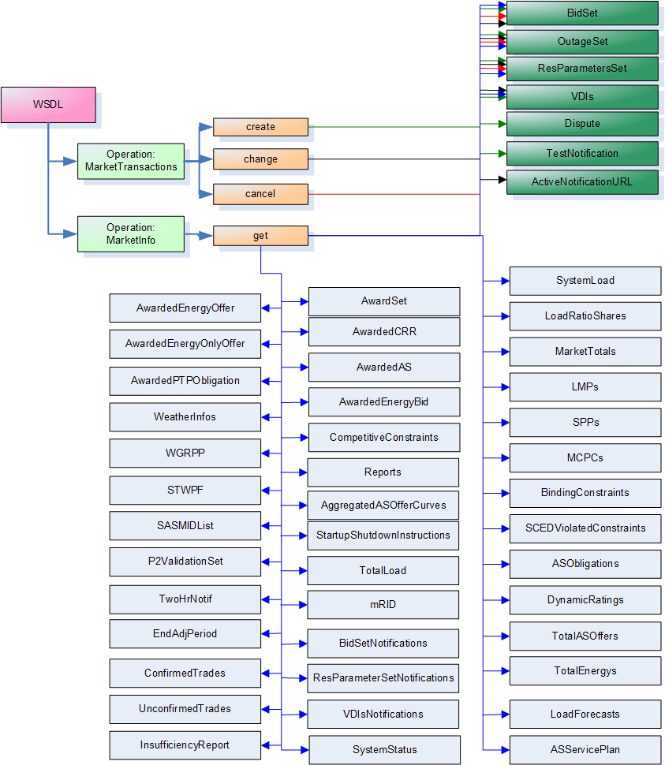
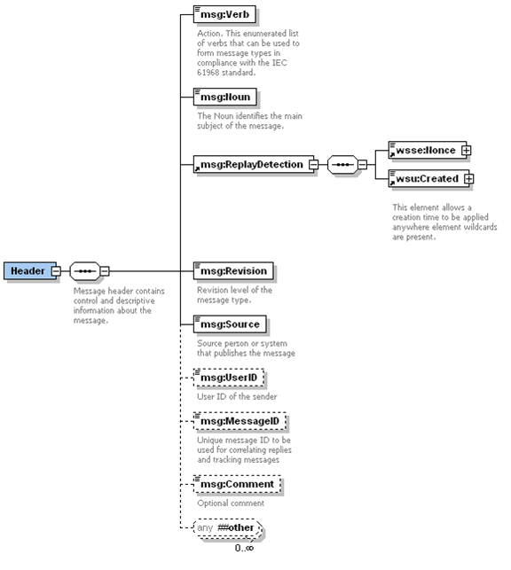
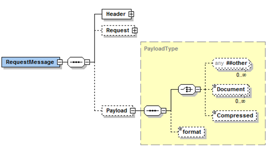
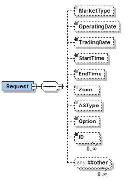
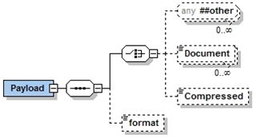
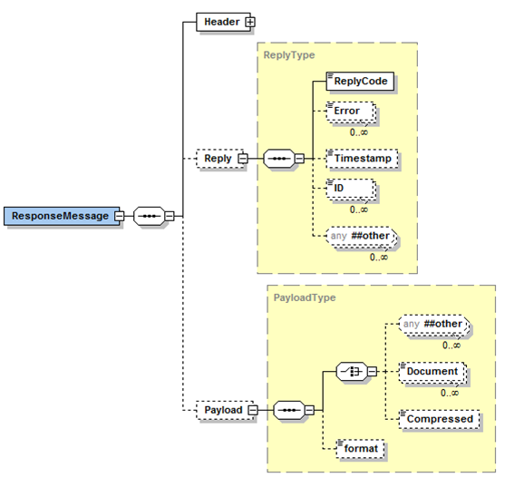
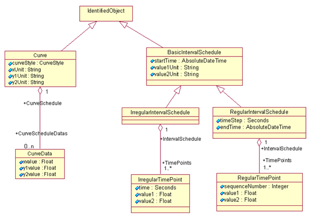
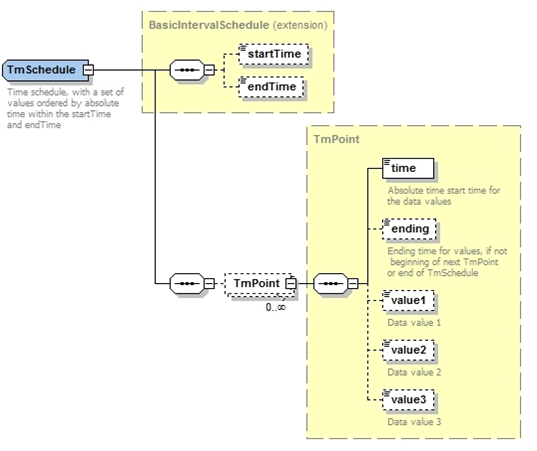
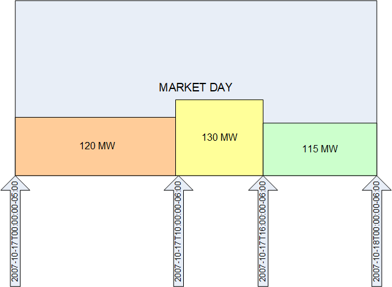
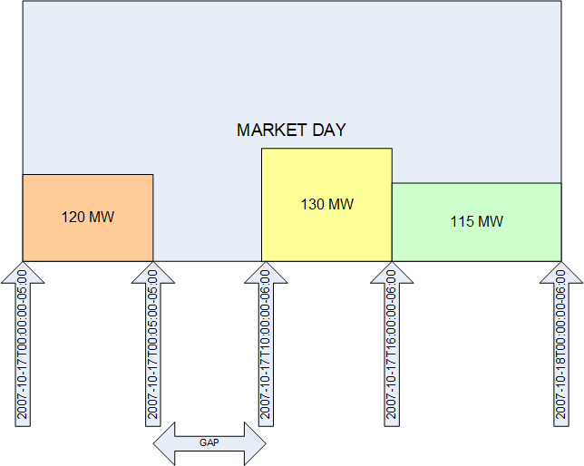

# Services Organization 

The services described by this document are defined using a combination
of Web Services Definition Language (WSDL) and XML Schema. The WSDLs are
organized as follows:

- One or more WSDLs defined by ERCOT, defining operations related to
  synchronous request/reply web service messages

- WSDL defined by OASIS for WS-Notifications to provide support for
  asynchronous messaging, using web services

In both of the above cases, one or more XML Schemas (XSD) is used to
define the structure of message payloads.

XSD Diagrams:

Throughout this document there are diagrams representing XSD structures.
Understanding the diagrams will assist in implementing any services
based on these XSDs. Below is a link which elaborates the details and
structures of the XSD diagrams.

<http://www.diversitycampus.net/Projects/TDWG-SDD/Minutes/SchemaDocu/SchemaDesignElements.html>

Example WSDL and XSD are provided in the appendices. It is anticipated
that these would be key design artifacts for developers.  The following 
diagram provides an overview of the interfaces described by this document.



## Common Message Structure

Unless otherwise specified, all messages use a common message envelope,
where a predefined structure is used for requests and another structure
is used for responses. This structure is based upon the IEC 61968-1
standard. Messages are constructed with several sections, including:

- Header: required for all messages, using a common structure for all
  service interfaces

- Request: optional, defining parameters needed to qualify request
  messages

- Reply: Used for response messages to indicate success, failure and
  error details

- Payload: optional, used to convey message information as a consequence
  of the ‘verb’ and ‘noun’ in the message Header. The payload structure
  provides options for payload compression.

### Message Header

Common to both the request and response messages is a header structure.
The header has several required fields that must be populated, these
include:

- Verb, to identify a specific action to be taken. There are an
  enumerated set of valid verbs, where commonly used values include
  ‘get’, ‘create’, ‘change’, ‘cancel’, ‘close’ and ‘reply’. For
  notification messages ‘past tense’ verbs are used, which can include
  ‘created’, ‘changed’, ‘canceled’ and ‘closed’. Implementations should
  treat verbs ‘update’ and ‘updated’ as synonyms to ‘change’ and
  ‘changed’. There is also a special case when the noun is ‘BidSet’,
  where a ‘create’ is equivalent to a ‘change’ due to the nature of the
  market system.

- Noun: to identify the subject of the action and/or the type of the
  payload (e.g. BidSet, Notification) if a payload is provided.

- Source: identifying the source of the message, which should be the ID
  of the Market Participant or ERCOT (typically for reply messages)?
  This should be the ‘short name’ of the QSE. (This will be verified
  against the DUNS number in the certificate)

- Revision: To indicate the revision of the message definition. This
  should be ‘1’ by default.

- Nonce: A unique number that would not be repeated by the Market
  Participant within the period of at least a day. This could be a
  sequence number, large random number or a GUID as described by the
  WS-Security standard. A combination of this number and the timestamp 
  make the message unique for a given time period.

- Created: A timestamp to indicate when the message was created. This
  value and the Nonce are used to protect against replay attacks. This
  is defined by WS-Security.

- UserID: Should be supplied as it may be required for some interfaces,
  depending upon underlying implementations.

The following diagram describes the header structure used for request
and response messages.



There are several optional fields that may be populated. In the above
diagram, the optional items are represented using dashed borders. If the
MessageID is populated on a request, it will be returned on the reply.
The Comment field is never used for any processing-related logic. The
UserID may be used to indicate the person responsible for initiating a
transaction, and will be logged as appropriate, but verification is the
responsibility of the Source system.

In order to identify the Market Participant in a uniform manner, the
registered ‘short name’ of the Market Participant should be supplied as
the value of Header/Source. ERCOT will verify that this value is
consistent with the Market Participant as identified by the certificate,
noting the DUNS number is contained within the certificate.

### Request Message Structures

The following diagram describes the structure of a request message that
would be used in conjunction with a WSDL operation.



The RequestMessage can also optionally contain a package with
parameters relevant to the request, called Request. It is likely that
different or variant Request packages may be defined to be used in
conjunction with messages for a specific web service operation. In
those cases, the corresponding WSDL and XSD would identify the
optional parameters. The description of the interface (in subsequent
sections of this document) would identify the usage of those
parameters. The following is an example RequestType used in the
definition of a Request package that defines some common parameters
used for requests, however it is important to note that these are
typically application specific. These parameters are most commonly
used in conjunction with ‘get’ requests as qualifiers.



One key use of the RequestType is to avoid the placement of
application specific request parameters in the header or within
payload definitions. Also, where a set of requests that were supported
by a specific web service operation had significantly different
requirements for information in the RequestType, it could justify the
use of RequestType variants, where each variant will be used for the
definition of messages for the specific web service operation.

### Payload Structures

There are some requests where a Payload must be provided, as would be
the case for a message with a verb of ‘create’ or ‘change’. Payloads
are typically XML documents that conform to a defined XML schema.
However, there are exceptions to this rule. Some XML payloads may not
have useful XML schemas, as in the case of RDF files or dynamic query
results, as well as non-XML formats such as CSV and PDF. There may
also be cases where a large payload must be compressed, in the event
that it would become very large and otherwise consume significant
network bandwidth. In order to accommodate a variety of payload format
options the following payload structure is used.



In the previous diagram, any type of XML document may be included,
using the XML ‘any’ structure. While this provides options for
loose-coupling, specific complex types defined by XML schemas (XSDs)
can be used as well. The WSDL in the appendix provides an example of
this case.

Payloads can also be supplied as XML encoded strings using the
‘Document’ tag, although this method is less preferred than used of
the XML ‘any’.

There are also some cases where a zipped, base64 encoded string is
necessary, and would be passed using the ‘Compressed’ tag. The Gnu Zip
compression shall be used in order to provide compatibility within
both Java and Microsoft .Net implementations. A Java example is
provided in Appendix G. Specific examples of the usage of payload
compression would be where:

1.  An XML payload, conforming to a recognized XML schema exceeds a
    predefined size (e.g. 1MB). This would be very common for large
    Market Participant sets of bids, offers, trades or schedules

2.  A payload has a non-XML format, such as PDF, Excel spreadsheet, CSV
    file or binary image

3.  A payload is XML, but has no XML schema and exceeds a predefined
    size, as would be the case of a dynamic query that would return an
    XML result set

When a payload is compressed and base64 encoded, it is stored within
the Payload/Compressed message element as a string.

The format tag can be used to identify specific data formats, such as
XML, RDF, PDF, DOC, CSV, etc. This is especially useful if the payload
is compressed. The use of this tag is optional, and would typically
only be used when the payload is stored using the Payload/Compressed
message element.

The above options provide an alternative to the use of SOAP
attachments. SOAP attachments are more difficult to secure since the
SOAP envelope signature signs the SOAP body but does not sign the
attachment. This also requires that the payload is processed
separately from the rest of the SOAP message (e.g. the message is
parsed to extract the payload, and then the payload is parsed and
processed). However, we believe this implementation approach is less
complex than using SOAP attachments.

### Response Message Structures

The following diagram describes the structure of a response message
that would be used in conjunction with a WSDL operation, as a response
to the request message.


The ReplyCode would be set to OK to indicate that the request was
successful, otherwise it would be set to either ERROR or FATAL, and one
or more Error elements would be provided to describe the error(s). FATAL
ReplyCode is indicative of an internal error having occurred. There may
also be more specific error information provided within the payload, as
in the case of bids within a BidSet container.

If the MessageID was set in the Header for the RequestMessage, the value
will be returned in the Header of the ResponseMessage.

## Common Security Implementation

This section will provide an overview of security from the perspective
of implementation requirements for Market Participants. Market
Participants MUST take two basic steps in securing their Web Services
Interaction with ERCOT:

1.  Secure the Transport layer

2.  Secure SOAP messages

### Secure the Transport layer 

The transport layer is secured by deploying Secure Socket Layer (SSL)
and Transport Layer Security (TLS) following these steps:

1.  Obtain client side certificate (these Certificates are issued by
    VeriSign under the ERCOT brand).

2.  Implement mutual authentication (explained below).

3.  Ensure minimum SSL/TLS security settings

Note that TLS is an enhanced specification based on SSL. References to
SSL refer to both SSL and TLS.

SSL is a standard mechanism for Web services that is available on
virtually all application servers. This widely used, mature
technology, which secures the communication channel between client and
server, will satisfy all of ERCOT’s use cases for secure Web Service
communications. Since it works at the transport layer, SSL covers all
information passed in the channel as part of a message exchange
between a client and a server, including attachments. Authentication
is an important aspect of establishing an HTTPS connection. Many
platforms support the following authentication mechanisms for Web
Services using HTTPS:

- The server authenticates itself to clients with SSL and makes its
  certificate available.

- The client uses basic authentication over an SSL channel.

- Mutual authentication with SSL, using the server certificate as well
  as the client certificate, so that both parties can authenticate to
  each other.

With Web Services, the interaction use case is usually machine to
machine; that is, it is an interaction between two application
components with no human involvement. Machine-to-machine interactions
have a different trust model from typical website interactions. In a
machine-to-machine interaction, trust must be established proactively,
since there can be no real-time interaction with a user about whether
to trust a certificate. Ordinarily, when a user interacts with a
website via a browser and the browser does not have the certificate
for the site, the user is prompted about whether to trust the
certificate. The user can accept or reject the certificate at that
moment. With Web Services, the individuals involved in the deployment
of the Web Service interaction must distribute and exchange the server
certificate, and the client certificate (for mutual authentication),
prior to the interaction occurrence.

The combination of the two settings—CONFIDENTIAL for transport
guarantee and CLIENT-CERT for auth-method—enables mutual
authentication. When set to these values, the containers for the
client and the target service both provide digital certificates
sufficient to authenticate each other. (These digital certificates
contain client-specific identifying information.)

### Secure SOAP messages

Besides creating a secure communication channel between a client and a
Web Service, ERCOT Web Service message exchanges require that security
information be embedded within the SOAP message itself. This is often
the case when a message needs to be processed by several intermediary
nodes before it reaches the target service or when a message must be
passed among several services to be processed.

Message-level security is very useful in XML document-centric
applications, since different sections of the XML document may have
different security requirements or be intended for different users.

SOAP messages’ signing is done through the following:

- Obtain application/system signing certificate. (These certificates are
  issued by VeriSign under the ERCOT brand).

- Sign all SOAP messages, using Web Services Security Standards and its
  X.509 Certificate Token Profile

- Message headers MUST include a timestamp and a nonce

- Validate all SOAP messages have:

  - Signature

  - Certificates

  - Revocation status of certificates

  - Use of timestamp and nonce (to prevent replay attacks)

There are a variety of signature method/security tokens that are
commonly used. ERCOT will sign outbound messages using SHA-1/RSA and
strongly recommends its use by market participants for signing
messages. However, the following SOAP signing methods will be
supported for incoming messages:

1.  MD5/RSA

2.  DSA (which implies SHA-1)

3.  SHA-256 and SHA-512 with RSA

4.  ECDSA

Appendix D provides examples for the generation of signatures.
Appendix E provides an annotated example of a SOAP message.

## Modeling and Conventions

There are several conventions that are used for definitions, data
items and information models. *Note that additional values and
conventions will be defined as market requirements are finalized.*

### Use of the IEC CIM

Where possible the IEC CIM should be leveraged. The ERCOT Nodal
project and related systems use the CIM as a key standard. One example
of this is for the submission and management of models through the
NMMS system. Examples of leveraging the CIM for external web services
include:

- The use of data structures defined by the IEC CIM where appropriate in
  payload definitions

- CIM naming conventions are used wherever possible, e.g. ClassName,
  propertyName

- The properties ‘startTime’ and ‘endTime’ are typically used to
  identify time intervals, as they are also used within many CIM
  classes. Instead of using combinations of start date, start hour and
  potentially an interval number (e.g. to represent 15 minute
  intervals), absolute times should be specified.

- The property ‘mRID’ is used to uniquely identify objects such as bids,
  offers, trades, awards and schedules

- A trade or operating date is always derived from the startTime of a
  bid, offer, trade, or schedule.

Where interfaces have references to resources, QSEs, settlement points
and electrical buses, the ‘name’ property is used for the reference,
as opposed to ‘mRID’. This is to maximize legibility and to provide
for consistency with underlying market applications. Consequentially,
simplified XML is used, where the use of the ‘name’ property is
implied as opposed to explicit use of a \<name\> tag.

The following class diagram describes the structure of CIM Curves,
IrregularIntervalSchedules, and RegularIntervalSchedules. These
classes are CIM building blocks, where there are many other classes in
the CIM that inherit from these three basic types of curves and
schedules (e.g. PriceCurve).



Figure 7 - CIM Curves and Schedules

For use within ERCOT Nodal, customizations and specializations of CIM
curves and schedules are defined. One example is that units (e.g.
xUnit, y1Unit, value1Unit) are not used.

For Curves:

- A curveStyle can be specified to identify the type of curve (e.g.
  CURVE, FIXED, VARIABLE) for interpretation of the curve by an
  application:

- A commonly used curve is a PriceCurve, where the curve is defined by

‘CurveData’ elements where the ‘xvalue’ is used for MW and the
‘y1value’ is used for \$/MWh. Not all curve styles are allowed for
each product type. The interpretation of curveStyle is as follows:

- FIXED: only one point is provided, where the intent is that the bid or
  offer is for all or nothing (i.e. either ‘xvalue’ or 0)

- VARIABLE: only one point is provided, but the intent is that any value
  in the range 0 to ‘Xvalue’ can be taken

- CURVE: Up to 10 points (to define up to 9 segments) can be provided

- Curves are often used where values are NOT plotted against time (e.g.
  MW vs. \$/MWh)

- For PriceCurve for ancillary services, ASCurveData elements are used
  (instead of CurveData elements) to define points for REGUP, REGDN, RRS
  and NSRS values.

The following is an example of a PriceCurve that is derived from a CIM
Curve:

```
<PriceCurve>
	<startTime>2008-01-01T00:00:00-06:00</startTime>
	<endTime>2008-01-01T10:00:00-06:00</endTime>
	<curveStyle>CURVE</curveStyle>
	<CurveData>
		<xvalue>60</xvalue>
		<y1value>40.00</y1value>
	</CurveData>
	<CurveData>
		<xvalue>80</xvalue>
		<y1value>45.00</y1value>
	</CurveData>
	<CurveData>
		<xvalue>90</xvalue>
		<y1value>47.00</y1value>
	</CurveData>
</PriceCurve>
```

In order to better meet the needs of ERCOT Market Participants for
interfaces related to bidding, an alternative to an
IrregularIntervalSchedule is defined. This is called a ‘TmSchedule’. A
TmSchedule has one or more ‘TmPoints’, where one or more values can be
specified at each point in time. This is illustrated by the following
diagram:



The following is an XML example of an EnergySchedule, which is based
upon a TmSchedule:

```
<EnergySchedule>
	<startTime>2007-10-17T00:00:00-05:00</startTime>
	<endTime>2007-10-18T00:00:00-06:00</endTime>
	<TmPoint>
		<time>2007-10-17T00:00:00-05:00</time>
		<value1>120</value1>
	</TmPoint>
	<TmPoint>
		<time>2007-10-17T10:00:00-06:00</time>
		<value1>130</value1>
	</TmPoint>
	<TmPoint>
		<time>2007-10-17T16:00:00-06:00</time>
		<value1>115</value1>
	</TmPoint>
</EnergySchedule>
```

It is important to note that a TmPoint identifies the *start* of an
interval. The following diagram provides a graphic depiction of the
XML example.



The optional ‘ending’ tag can be used to identify the end time for a
specific TmPoint. This allows a schedule to have gaps. This is
demonstrated by the following example.

```
<EnergySchedule>
	<startTime>2007-10-17T00:00:00-05:00</startTime>
	<endTime>2007-10-18T00:00:00-06:00</endTime>
	<TmPoint>
		<time>2007-10-17T00:00:00-05:00</time>
		<ending>2007-10-17T05:00:00-05:00</ending>
	<value1>120</value1>
	</TmPoint>
	<TmPoint>
		<time>2007-10-17T10:00:00-06:00</time>
		<value1>130</value1>
	</TmPoint>
	<TmPoint>
		<time>2007-10-17T16:00:00-06:00</time>
		<value1>115</value1>
	</TmPoint>
</EnergySchedule>
```

The following diagram provides a graphic depiction of the previous XML
example.



It is important to note a few conditions that may be treated as errors
by applications using the data represented in a TmSchedule:

- TmPoints should be provided in chronological order

- TmPoints that result in a zero width time interval may be treated as
  errors

- The endTime should be greater than the startTime of the TmSchedule

- For any TmPoint, if specified, the ending must be greater than the
  time value

- Each TmPoint must exist within the startTime and endTime of the
  TmSchedule

Also, the use of ‘ending’ is optional. If no ‘ending’ is supplied, the
last TmPoint is assumed to and at the ‘endTime’ for the TmSchedule.

### Representation of Time

The ISO 8601 standard is used to define the representations of time
values that are conveyed through interfaces. This avoids issues
related to time zones and daylight savings time changes.

- For timestamps in messages published by ERCOT would use Texas
  prevailing time, using the following format: 2007-03-27T14:00:00-05:00
  (as time changes from CDT to CST, the -05:00 would change to -06:00)

- Timestamps in messages sent to ERCOT by market participants could use
  any ISO 8601 compliant timestamp (with the exception of 24:00, as
  described in section 1.6)

It is extremely important to note that the use of ISO 8601 timestamps
within message definitions for the external interfaces defined by this
document in no way constrains other representations of time that may
include:

- User interfaces, where local time or market hours may be used as
  desired

- Reports, where reports would be generated using an appropriate local
  time

- Internal integration, where an application may internally require some
  other time structure

In some cases it may be desirable to convert between a timestamp and a
local time or a market hour. This can be readily accomplished using
software functions, XSL, and/or XPath expressions. Examples of time
conversion using XSL are provided in Appendix F. Most development
environments have a wide variety of APIs that can also be used for
necessary time conversions.

In cases where there are a sequence of startTime and endTime intervals
provided (as in the cases of ResourceStatus or MinimumEnergy
structures as examples), overlapping time intervals are not allowed
and will be flagged as an error. Typically in these cases the endTime
for one interval should identically match the startTime for the next
interval.

In cases where a time that is ‘aligned’ with an interval is expected,
but not provided on a request message (e.g.
2008-01-01T01:03:23-06:00), the integration layer may round the time
to the nearest minute. This may result in an error being generated by
the target application if the minute is not a valid interval boundary.
In cases where a time that is aligned with an hour boundary is
expected, but not provided on a request message, the integration layer
may round the time to the nearest hour. In this case, there may be no
generation of an error message.

###  Market Products

The market transaction interfaces described in this document use a
number of different market products, as well as several types of
schedules. The following table identifies each product or schedule
type, along with the set of message fields (aside from the market
participant ID of the submitting QSE, operating date, and operating
hour) that are used to distinctly identify a bid, trade, offer, or
schedule. In effect the primary key for each product type is formed by
the QSE ID (short name), operating date, operating hour, and items
described in the table of Figure 9. The table of Figure 10 provides a
mapping of the XML tag names for each product to the approved protocol
terms.

<table style="width:100%;">
<colgroup>
<col style="width: 15%" />
<col style="width: 8%" />
<col style="width: 6%" />
<col style="width: 4%" />
<col style="width: 5%" />
<col style="width: 6%" />
<col style="width: 5%" />
<col style="width: 8%" />
<col style="width: 7%" />
<col style="width: 5%" />
<col style="width: 6%" />
<col style="width: 6%" />
<col style="width: 5%" />
<col style="width: 6%" />
</colgroup>
<thead>
<tr class="header">
<th><em>Product or Schedule Type (XML tag)</em></th>
<th><em>resource</em></th>
<th><p><em>As</em></p>
<p><em>Type</em></p></th>
<th><em>sp</em></th>
<th><p><em>bid</em></p>
<p><em>Id</em></p></th>
<th><p><em>CRR</em></p>
<p><em>Id</em></p></th>
<th><p><em>Offer</em></p>
<p><em>Id</em></p></th>
<th><em>CRR AH<br />
Id</em></th>
<th><em>source</em></th>
<th><em>sink</em></th>
<th><em>buyer</em></th>
<th><em>seller</em></th>
<th><p><em>INC/</em></p>
<p><em>DEC</em></p></th>
<th><em>AVP Type</em></th>
</tr>
</thead>
<tbody>
<tr class="odd">
<td>ASOffer</td>
<td>X</td>
<td>X</td>
<td></td>
<td></td>
<td></td>
<td></td>
<td></td>
<td></td>
<td></td>
<td></td>
<td></td>
<td></td>
<td></td>
</tr>
<tr class="even">
<td>ASTrade</td>
<td></td>
<td>X</td>
<td></td>
<td></td>
<td></td>
<td></td>
<td></td>
<td></td>
<td></td>
<td>X</td>
<td>X</td>
<td></td>
<td></td>
</tr>
<tr class="odd">
<td>Availability Plan</td>
<td>X</td>
<td></td>
<td></td>
<td></td>
<td></td>
<td></td>
<td></td>
<td></td>
<td></td>
<td></td>
<td></td>
<td></td>
<td>X</td>
</tr>
<tr class="even">
<td>Capacity Trade</td>
<td></td>
<td></td>
<td></td>
<td></td>
<td></td>
<td></td>
<td></td>
<td></td>
<td></td>
<td>X</td>
<td>X</td>
<td></td>
<td></td>
</tr>
<tr class="odd">
<td>COP</td>
<td>X</td>
<td></td>
<td></td>
<td></td>
<td></td>
<td></td>
<td></td>
<td></td>
<td></td>
<td></td>
<td></td>
<td></td>
<td></td>
</tr>
<tr class="even">
<td>CRR (PTP Obl w/ Links to Option)</td>
<td></td>
<td></td>
<td></td>
<td></td>
<td>X</td>
<td>X</td>
<td>X</td>
<td>X</td>
<td>X</td>
<td></td>
<td></td>
<td></td>
<td></td>
</tr>
<tr class="odd">
<td>EFC</td>
<td>X</td>
<td></td>
<td></td>
<td></td>
<td></td>
<td></td>
<td></td>
<td></td>
<td></td>
<td></td>
<td></td>
<td></td>
<td></td>
</tr>
<tr class="even">
<td>EnergyBid</td>
<td></td>
<td></td>
<td>X</td>
<td>X</td>
<td></td>
<td></td>
<td></td>
<td></td>
<td></td>
<td></td>
<td></td>
<td></td>
<td></td>
</tr>
<tr class="odd">
<td>Energy Only Offer</td>
<td></td>
<td></td>
<td>X</td>
<td>X</td>
<td></td>
<td></td>
<td></td>
<td></td>
<td></td>
<td></td>
<td></td>
<td></td>
<td></td>
</tr>
<tr class="even">
<td>EnergyTrade</td>
<td></td>
<td></td>
<td>X</td>
<td></td>
<td></td>
<td></td>
<td></td>
<td></td>
<td></td>
<td>X</td>
<td>X</td>
<td></td>
<td></td>
</tr>
<tr class="odd">
<td>IncDecOffer</td>
<td>X</td>
<td></td>
<td></td>
<td></td>
<td></td>
<td></td>
<td></td>
<td></td>
<td></td>
<td></td>
<td></td>
<td>X</td>
<td></td>
</tr>
<tr class="even">
<td>OutputSchedule</td>
<td>X</td>
<td></td>
<td></td>
<td></td>
<td></td>
<td></td>
<td></td>
<td></td>
<td></td>
<td></td>
<td></td>
<td></td>
<td></td>
</tr>
<tr class="odd">
<td>PTPObligation</td>
<td></td>
<td></td>
<td></td>
<td>X</td>
<td></td>
<td></td>
<td></td>
<td>X</td>
<td>X</td>
<td></td>
<td></td>
<td></td>
<td></td>
</tr>
<tr class="even">
<td>RTMEnergyBid</td>
<td>X</td>
<td></td>
<td></td>
<td></td>
<td></td>
<td></td>
<td></td>
<td></td>
<td></td>
<td></td>
<td></td>
<td></td>
<td></td>
</tr>
<tr class="odd">
<td>SelfArrangedAS</td>
<td></td>
<td>X</td>
<td></td>
<td></td>
<td></td>
<td></td>
<td></td>
<td></td>
<td></td>
<td></td>
<td></td>
<td></td>
<td></td>
</tr>
<tr class="even">
<td>SelfSchedule</td>
<td></td>
<td></td>
<td></td>
<td></td>
<td></td>
<td></td>
<td></td>
<td>X</td>
<td>X</td>
<td></td>
<td></td>
<td></td>
<td></td>
</tr>
<tr class="odd">
<td>ThreePartOffer</td>
<td>X</td>
<td></td>
<td></td>
<td></td>
<td></td>
<td></td>
<td></td>
<td></td>
<td></td>
<td></td>
<td></td>
<td></td>
<td></td>
</tr>
</tbody>
</table>

The items marked with an ‘X’ are required key fields needed for
submission. The operating date for each bid, trade, offer, or schedule
is derived from the startTime provided by the bid, offer, trade, or
schedule.

The XML schema provided to describe product types has all fields
optional. This is because the schemas can be used for “create”, “get”
and “cancel” operations. A bid, offer, trade or schedule can be
referenced for a ‘get’ or ‘cancel’ request by specifying the
transaction ID (mRID) of the desired bids, offers, trades or schedules
(using the mRID that was returned by the reply to the submission
request).

In each section related to market products, a table is provided that
describes data requirements. Please note that fields that are used as
‘keys’ to identify a bid/offer/trade/schedule are identified by ‘K’.
Required fields are identified by ‘Y’, option fields are identified by
‘N’. There are some exception cases where identified key fields are
identified as not being required (e.g. expiration), and are notated as
‘K, N’.

### Management and Use of Transaction IDs (mRIDs)

In order to uniquely identify a bid, offer or trade, a transaction ID
is allocated by ERCOT. The name of the tag used for the transaction ID
is ‘mRID’, as this conforms to the IEC CIM. This transaction ID is
returned immediately in response to the submission of a BidSet, where
each bid, offer, or trade within the BidSet is given its own
transaction ID. If a set of N valid unique bids are submitted using a
BidSet, there will be N transaction IDs supplied, each corresponding
to the order of the bid/offer/trade/schedule on the input BidSet. This
transaction ID (mRID) may be used for the following purposes:

- To query the status of a specific transaction

- To cancel a specific transaction

- To relate an award to a bid

It is important to note that an update or change to a transaction does
not use an mRID. To update a transaction it is simply resubmitted,
where it will overwrite the previous submission of the bid. The
resulting mRID for both the original submission and the revised
submission will be the same.

A transaction ID (mRID) is a string that takes the following form:

`<QSE ID>.<date>.<key string>`

Within this, the following substrings are defined:

- QSE ID: ID of the market participant

- Date in format YYYYMMDD

- Key string, a derived string that includes required key fields for
  each market product

Examples of transaction ID (mRID) are as follows:

SOMEQSE.20081112.COP.UnitABC

QSE2.20081112.TPO.UnitXYZ

When referring to a specific hour of a bid, the hour may be appended
to the transaction ID, resulting in a string of the following form:

`<QSE ID>.<date>.<key string>.<hour>`

Examples of transaction ID as would be used for hourly awards are as
follows:

QSE2.20081112.TPO.UnitXYZ.1

QSE2.20081112.TPO.UnitXYZ.2

QSE2.20081112.TPO.UnitXYZ.2R (example for change to CST from CDT)

QSE2.20081112.TPO.UnitXYZ.3

QSE2.20081112.TPO.UnitXYZ.4

On a day with 25 hours, the mRID that represents the ‘repeated’ hour
is suffixed with an ‘R’, e.g. ‘QSE2.20081112.TPO.UnitXYZ.2R’.

Additionally when referring to a specific continuous set of hours
(i.e. 11, 12, 13), the following convention is used:

`<QSE ID>.<date>.<key string>.<hour1>-<hour2>`

Following table can be used as reference to convert CST, CDT time
format values into hours for cancel and query(get) operations.

<table>
<colgroup>
<col style="width: 20%" />
<col style="width: 23%" />
<col style="width: 34%" />
<col style="width: 20%" />
</colgroup>
<thead>
<tr class="header">
<th>StartTime</th>
<th>EndTime</th>
<th>Hours in mRID</th>
<th>Comments</th>
</tr>
</thead>
<tbody>
<tr class="odd">
<td>2010-01-01T00:00:00-06:00</td>
<td>2010-01-01T01:00:00-06:00</td>
<td><p>Hour: 01</p>
<p>Example mRID:</p>
<p>&lt;QSE ID&gt;.&lt;date&gt;.&lt;key string&gt;.01</p></td>
<td></td>
</tr>
<tr class="even">
<td>2010-01-01T02:00:00-06:00</td>
<td>2010-01-01T06:00:00-06:00</td>
<td><p>Hours: 03-06</p>
<p>Example mRID:</p>
<p>&lt;QSE ID&gt;.&lt;date&gt;.&lt;key string&gt;.03-06</p></td>
<td></td>
</tr>
<tr class="odd">
<td>2010-01-01T04:00:00-06:00</td>
<td>2010-01-02T00:00:00-06:00</td>
<td><p>Hours: 05-24</p>
<p>Example mRID:</p>
<p>&lt;QSE ID&gt;.&lt;date&gt;.&lt;key string&gt;.05-24</p></td>
<td></td>
</tr>
<tr class="even">
<td>2010-03-14T01:00:00-06:00</td>
<td>2010-03-14T03:00:00-05:00</td>
<td><p>Hours: 02</p>
<p>Example mRID:</p>
<p>&lt;QSE ID&gt;.&lt;date&gt;.&lt;key string&gt;.02</p></td>
<td>DST short day. Hours 01:00:00-06:00 – 03:00:00-05:00 constitute one
hour i.e hour 2.</td>
</tr>
<tr class="odd">
<td>2010-03-14T00:00:00-06:00</td>
<td>2010-03-14T03:00:00-05:00</td>
<td><p>Hours: 01-02</p>
<p>Example mRID:</p>
<p>&lt;QSE ID&gt;.&lt;date&gt;.&lt;key string&gt;.01-02</p></td>
<td>DST short day. Hours 00:00:00-06:00 – 03:00:00-05:00 constitute
hours 1 and 2.</td>
</tr>
<tr class="even">
<td>2010-03-14T03:00:00-05:00</td>
<td>2010-03-14T08:00:00-05:00</td>
<td><p>Hours: 04-08</p>
<p>Example mRID:</p>
<p>&lt;QSE ID&gt;.&lt;date&gt;.&lt;key string&gt;.04-08</p></td>
<td></td>
</tr>
<tr class="odd">
<td>2010-11-07T00:00:00-05:00</td>
<td>2010-11-07T01:00:00-05:00</td>
<td><p>Hours: 01</p>
<p>Example mRID:</p>
<p>&lt;QSE ID&gt;.&lt;date&gt;.&lt;key string&gt;.01</p></td>
<td></td>
</tr>
<tr class="even">
<td>2010-11-07T00:00:00-05:00</td>
<td>2010-11-07T01:00:00-06:00</td>
<td><p>Hours: 01-02</p>
<p>Example mRID:</p>
<p>&lt;QSE ID&gt;.&lt;date&gt;.&lt;key string&gt;.01-02</p></td>
<td><p>Hours</p>
<p>(00:00:00-05:00 to 01:00:00-05:00 ) and</p>
<p>(01:00:00-05:00 to 01:00:00-06:00 )</p></td>
</tr>
<tr class="odd">
<td>2010-11-07T00:00:00-05:00</td>
<td>2010-11-07T02:00:00-06:00</td>
<td><p>Hours: 01-2R</p>
<p>Example mRID:</p>
<p>&lt;QSE ID&gt;.&lt;date&gt;.&lt;key string&gt;.01-2R</p></td>
<td><p>Hours</p>
<p>(00:00:00-05:00 to 01:00:00-05:00 ),</p>
<p>(01:00:00-05:00 to 01:00:00-06:00 )</p>
<p>And</p>
<p>(01:00:00-06:00 to 02:00:00-06:00)* DST extra hour</p></td>
</tr>
<tr class="even">
<td>2010-11-07T01:00:00-05:00</td>
<td>2010-11-07T01:00:00-06:00</td>
<td><p>Hour: 02</p>
<p>Example mRID:</p>
<p>&lt;QSE ID&gt;.&lt;date&gt;.&lt;key string&gt;.02</p></td>
<td>Normal Hour 2</td>
</tr>
<tr class="odd">
<td>2010-11-07T01:00:00-06:00</td>
<td>2010-11-07T02:00:00-06:00</td>
<td><p>Hour: 2R</p>
<p>Example mRID:</p>
<p>&lt;QSE ID&gt;.&lt;date&gt;.&lt;key string&gt;.2R</p></td>
<td>DST extra hour</td>
</tr>
<tr class="even">
<td>2010-11-07T00:00:00-05:00</td>
<td>2010-11-07T03:00:00-06:00</td>
<td><p>Hours: 01-03</p>
<p>Example mRID:</p>
<p>&lt;QSE ID&gt;.&lt;date&gt;.&lt;key string&gt;.01-03</p></td>
<td>Including DST extra hour.</td>
</tr>
<tr class="odd">
<td>2010-11-07T01:00:00-05:00</td>
<td>2010-11-07T02:00:00-06:00</td>
<td><p>Hours: 02-2R</p>
<p>Example mRID:</p>
<p>&lt;QSE ID&gt;.&lt;date&gt;.&lt;key string&gt;.02-2R</p></td>
<td>Normal 2nd hour &amp; DST extra hour</td>
</tr>
<tr class="even">
<td>2010-11-07T01:00:00-05:00</td>
<td>2010-11-07T04:00:00-06:00</td>
<td><p>Hours: 02-04</p>
<p>Example mRID:</p>
<p>&lt;QSE ID&gt;.&lt;date&gt;.&lt;key string&gt;.02-04</p></td>
<td></td>
</tr>
<tr class="odd">
<td>2010-11-07T01:00:00-06:00</td>
<td>2010-11-07T04:00:00-06:00</td>
<td><p>Hours: 2R-04</p>
<p>Example mRID:</p>
<p>&lt;QSE ID&gt;.&lt;date&gt;.&lt;key string&gt;.02-2R</p></td>
<td></td>
</tr>
<tr class="even">
<td>2010-04-01T00:00:00-05:00</td>
<td>2010-04-02T00:00:00-05:00</td>
<td><p>Hour: 01-24</p>
<p>Example mRID:</p>
<p>&lt;QSE ID&gt;.&lt;date&gt;.&lt;key string&gt;</p></td>
<td>If all 24hous then not need to mention hours at the end of
mRID.</td>
</tr>
</tbody>
</table>

When referring to “trades” queries (AS Trades, Capacity Trades, and
Energy Trades), querying for trades (confirmed or unconfirmed)
specifying the trades which was entered by other parties other than
the submitting entity, it can be stated as a last token in the
pertinent trades mRID:

Token to Trades mRID – Please note that use of otherPartySubmitted
(“true” or “false”) token is for querying purposes only (it is not
populated on the create/change)

- AS Trades:
  `<QSE>.<DATE>.AST.asType.buyer.seller.otherPartySubmitted`

- Capacity Trades:
  `<QSE>.<DATE>.CT.buyer.seller.otherPartySubmitted`

- Energy Trades:
  `<QSE>.<DATE>.ET.SP.buyer.seller.otherPartySubmitted`

The otherPartySubmitted element is returned in the payload of these
three trade types returned result set. If no otherPartySubmitted is
specified in these trade queries, it will be treated as a wild card
and all trades will be returned for the stated mRID.

Within the definitions of bids, trades, offers and awards, the
transaction ID is conveyed using the ‘mRID’ property. This is for
consistency with the IEC CIM. The following table describes the
initial scheme to be used for each product type.

<table>
<colgroup>
<col style="width: 24%" />
<col style="width: 14%" />
<col style="width: 22%" />
<col style="width: 37%" />
</colgroup>
<thead>
<tr class="header">
<th><blockquote>
<p><em>Product or Schedule Type</em></p>
<p><em>(Protocol term)</em></p>
</blockquote></th>
<th><blockquote>
<p><em>Section Reference</em></p>
</blockquote></th>
<th><blockquote>
<p><em>Product or Schedule Type (XML tag)</em></p>
</blockquote></th>
<th><p><em>Key String Composition</em></p>
<p><em>(all are prefixed with QSE ID and date to form
mRID)</em></p></th>
</tr>
</thead>
<tbody>
<tr class="odd">
<td><blockquote>
<p>Ancillary Service Offer</p>
</blockquote></td>
<td><blockquote>
<p>3.3.4</p>
</blockquote></td>
<td><blockquote>
<p>ASOffer</p>
</blockquote></td>
<td><blockquote>
<p>ASO.resource.asType</p>
</blockquote></td>
</tr>
<tr class="even">
<td><blockquote>
<p>Ancillary Service Trade</p>
</blockquote></td>
<td><blockquote>
<p>3.3.5</p>
</blockquote></td>
<td><blockquote>
<p>ASTrade</p>
</blockquote></td>
<td><blockquote>
<p>AST.asType.buyer.seller</p>
</blockquote></td>
</tr>
<tr class="odd">
<td><blockquote>
<p>Availability Type</p>
</blockquote></td>
<td><blockquote>
<p>3.3.6</p>
</blockquote></td>
<td><blockquote>
<p>AVP</p>
</blockquote></td>
<td><blockquote>
<p>AVP.resource.avpType</p>
</blockquote></td>
</tr>
<tr class="even">
<td><blockquote>
<p>Capacity Trade</p>
</blockquote></td>
<td><blockquote>
<p>3.3.7</p>
</blockquote></td>
<td><blockquote>
<p>CapacityTrade</p>
</blockquote></td>
<td><blockquote>
<p>CT.buyer.seller</p>
</blockquote></td>
</tr>
<tr class="odd">
<td><blockquote>
<p>Current Operating Plan</p>
</blockquote></td>
<td><blockquote>
<p>3.3.9</p>
</blockquote></td>
<td><blockquote>
<p>COP</p>
</blockquote></td>
<td><blockquote>
<p>COP.resource</p>
</blockquote></td>
</tr>
<tr class="even">
<td><blockquote>
<p>PTP Obligation w/ Links to Option</p>
</blockquote></td>
<td><blockquote>
<p>3.3.8</p>
</blockquote></td>
<td><blockquote>
<p>CRR</p>
</blockquote></td>
<td><blockquote>
<p>CRR.crrId.offerid.crrAHId.source.sink</p>
</blockquote></td>
</tr>
<tr class="odd">
<td><blockquote>
<p>DAM Energy Bid</p>
</blockquote></td>
<td><blockquote>
<p>3.3.10</p>
</blockquote></td>
<td><blockquote>
<p>EnergyBid</p>
</blockquote></td>
<td><blockquote>
<p>EB.sp.bidID</p>
</blockquote></td>
</tr>
<tr class="even">
<td><blockquote>
<p>DAM Energy-Only Offer</p>
</blockquote></td>
<td><blockquote>
<p>3.3.11</p>
</blockquote></td>
<td><blockquote>
<p>EnergyOnlyOffer</p>
</blockquote></td>
<td><blockquote>
<p>EOO.sp.bidID</p>
</blockquote></td>
</tr>
<tr class="odd">
<td><blockquote>
<p>Energy Trade</p>
</blockquote></td>
<td><blockquote>
<p>3.3.12</p>
</blockquote></td>
<td><blockquote>
<p>EnergyTrade</p>
</blockquote></td>
<td><blockquote>
<p>ET.sp.buyer.seller</p>
</blockquote></td>
</tr>
<tr class="even">
<td><blockquote>
<p>Exceptional Fuel Cost</p>
</blockquote></td>
<td><blockquote>
<p>3.3.12</p>
</blockquote></td>
<td><blockquote>
<p>EFC</p>
</blockquote></td>
<td><blockquote>
<p>EFC.resource</p>
</blockquote></td>
</tr>
<tr class="odd">
<td><blockquote>
<p>Incremental and Decremental Energy Offer Curves</p>
</blockquote></td>
<td><blockquote>
<p>3.3.3</p>
</blockquote></td>
<td><blockquote>
<p>IncDecOffer</p>
</blockquote></td>
<td><blockquote>
<p>IDO.resource.type</p>
</blockquote></td>
</tr>
<tr class="even">
<td><blockquote>
<p>Output Schedule</p>
</blockquote></td>
<td><blockquote>
<p>3.3.13</p>
</blockquote></td>
<td><blockquote>
<p>OutputSchedule</p>
</blockquote></td>
<td><blockquote>
<p>OS.resource</p>
</blockquote></td>
</tr>
<tr class="odd">
<td><blockquote>
<p>PTP Obligation Bid</p>
</blockquote></td>
<td><blockquote>
<p>3.3.14</p>
</blockquote></td>
<td><blockquote>
<p>PTPObligation</p>
</blockquote></td>
<td><blockquote>
<p>PTP.bidID.source.sink</p>
</blockquote></td>
</tr>
<tr class="even">
<td><blockquote>
<p>Real-Time Market Energy Bid</p>
</blockquote></td>
<td><blockquote>
<p>3.3.16</p>
</blockquote></td>
<td><blockquote>
<p>RTMEnergyBid</p>
</blockquote></td>
<td><blockquote>
<p>REB.resource</p>
</blockquote></td>
</tr>
<tr class="odd">
<td><blockquote>
<p>Self-Arranged Ancillary Service Quantities</p>
</blockquote></td>
<td><blockquote>
<p>3.3.2</p>
</blockquote></td>
<td><blockquote>
<p>SelfArrangedAS</p>
</blockquote></td>
<td><blockquote>
<p>SAA.asType</p>
</blockquote></td>
</tr>
<tr class="even">
<td><blockquote>
<p>Self-Schedule</p>
</blockquote></td>
<td><blockquote>
<p>3.3.15</p>
</blockquote></td>
<td><blockquote>
<p>SelfSchedule</p>
</blockquote></td>
<td><blockquote>
<p>SS.source.sink</p>
</blockquote></td>
</tr>
<tr class="odd">
<td><blockquote>
<p>Three Part Supply Offer</p>
</blockquote></td>
<td><blockquote>
<p>3.3.1</p>
</blockquote></td>
<td><blockquote>
<p>ThreePartOffer</p>
</blockquote></td>
<td><blockquote>
<p>TPO.resource</p>
</blockquote></td>
</tr>
<tr class="even">
<td><blockquote>
<p>Outage Schedule</p>
</blockquote></td>
<td><blockquote>
<p>6.2.1</p>
</blockquote></td>
<td><blockquote>
<p>OutageSet</p>
</blockquote></td>
<td><blockquote>
<p>ID assigned by Outage Scheduler</p>
</blockquote></td>
</tr>
</tbody>
</table>

Figure 10 - mRID Structures

An important consideration has to do with the use of the interfaces
described in this document in conjunction with the submission of bids
by a user using a web-based user interface. The web-based user
interface for bidding has no notion of the transaction ID itself, just
the individual values used to construct the key string.

Another important note is that mRID values should not be used for
purposes of non-repudiation. It is the intent of the signature of the
SOAP message, as referenced in section 2.2.2 to provide mechanisms
that can be leveraged for non-repudiation.

Please refer to following sections for the pertinent mRID compositions
for non-bid centric transactions:

- Outage Scheduling Interface – Section 6.2.1

- Resource Parameter Transactions – Section 9.1

- Verbal Dispatch Instructions – Section 11.1

*Note: The structure of the transaction ID (mRID) is subject to change
in the future.* The ‘get mRID’ interface described in section 8.2.1
provides a mechanism to generate an mRID given a set of ‘key’ values.

### Other Conventions

The following are other conventions that must be followed by this
specification:

- Within XML definitions, tags should be namespace qualified. For
  example, a tag of \<tag\> should be prefixed by a specific namespace
  reference, e.g. \<ns: tag\>. This will help to eliminate ambiguity.
  *(Note that many examples in this document are not namespace qualified
  for brevity and to aid legibility)*

- Units for power quantities are in megawatts (MW).

- Units for capacity quantities are in megawatts (MW).

- Units for energy quantities are in megawatt-hours (MWh).

- Units for energy prices are in \$/MWh.

- Valid market types include: DAM, RTM, DRUC, HRUC, SCED, and SASM .
  Note that these are not currently required by bidding interfaces

- Trading dates are specified using YYYY-MM-DD, which indicates the
  operating day

- Valid ancillary service types. Individual sections in 3.3 and 4.3
  contain more information.

- Settlement point names are the same as the name of the associated
  electrical bus, if defined at a bus level. They may also be defined at
  other levels (e.g. hubs, load zones).

- QSE short names (as opposed to DUNS numbers) are used to identify the
  QSE as well as ‘buyer’ and ‘seller’ for trades.

### Precision 

The following is a general guideline to be followed when dealing with
input and output values while interacting with Market Management
System. These restrictions are enforced at the XML schema level, upon
submittals.

- Market Submission items

  - Enforcement of tenths of MW will be done at time of submission at
    the EWS XSD level to enforce submission of floating point numbers
    (excluding price related data) to 1 decimal point.

- All price related date elements (incoming to ERCOT via EWS or output
  from MMS) will have 2 decimal digits after the decimal point.

- All MMS generated Notifications sent to market participants will be
  compliant to:

  - One decimal digit after the decimal point for all non-price related
    floating point numbers that deal with MW awards, obligations,
    trades, etc.

  - Two digits after the decimal point for all price related floating
    point numbers.

### XML Special Characters 

The following table contains reserved characters in XML.  In order to
use these characters in an XML payload (for example, in Outage
Creation “comments” field), they must contain entities to avoid
unintended results such as XSD violations.  Refer to the following
table for entities to be used with each reserved character: 

| XML Special Character | Description  | To be replaced by |
|-----------------------|--------------|-------------------|
| &                     | ampersand    | &amp;             |
| ‘                     | apostrophe   | &apos;            |
| \<                    | greater than | &gt;              |
| \>                    | less than    | &lt;              |
| “                     | double quote | &quot;            |

## Delivery Approach

ERCOT will provide the following:

- Interface specifications for web services

- Design artifacts, including XML schemas and WSDLs

- An environment for testing the interactions between the Market
  Participants and ERCOT. This environment will eventually be used for
  qualification of QSEs.

## Technical Interoperability

There are several strategies that are being employed in order to achieve
technical interoperability of MPs with ERCOT. These include:

- Use of open standards

- API subgroup allows input from Market Participants on interoperability
  issues

- The early deployment of a sandbox environment that enables ERCOT to
  work with the Market Participants to insure interoperability issues
  are addressed prior to market trials

- Deployment of interfaces via the sandbox environment for early testing
  by Market Participants, so that feedback can be provided to ERCOT

Open standards are a key part of the strategy to achieve technical
interoperability. Standards of particular interest include:

- W3C standards

- OASIS WS-\* standards

- IEC Common Information Model and related standards (e.g. IEC 61968-1)

It is very important that the implementation of Web Service interfaces
not be dependent upon any proprietary, third party products. Another key
requirement is that implementation of web service clients must be
possible using both Java and .Net development tools.

More details on technical interoperability will be provided as a
consequence of existing web services provided by ERCOT, detailed design
and experience with the Sand Box environment.

## Service Level Agreements

Please see Service Level Agreement (SLA) for Nodal Early Delivery
Systems (EDS) Environments document found on the ERCOT Website at
<http://www.ercot.com/services/sla/> .

## Auditing, Monitoring and Management

ERCOT will perform auditing, monitoring and management for Web
Services described by this specification using common services.
Internal auditing by ERCOT will be used to track and insure that SLAs
are met by ERCOT. All Web Service requests will be logged by ERCOT in
order to permit calculations related to SLAs. The signatures supplied
on SOAP messages will be recorded with transactions as a means of
non-repudiation of each transaction.

It is important to recognize that ERCOT is not responsible for the
monitoring and management of Market Participant software and network
connectivity. Therefore ERCOT cannot guarantee that notification
interfaces provided by Market Participants are accessible as needed
for timely delivery of notifications.

## Versioning

It is important to recognize that new versions of interfaces may be
provided over time, largely as a consequence of:

- Staging of initial implementation

- New requirements

- Upgrades to vendor products

Wherever possible, interfaces will be evolved through augmentation,
where a newer version of an interface is compatible with a previous
version of an interface. However, this will not always be possible. New
versions of interfaces will be manifested by:

- Changes to WSDLs

- Changes to XML Schemas

- Changes to software implementations

New versions will be deployed within a Sand Box environment for a
testing/trial period. WSDL and XML schemas namespaces will include a
date reference. Messages will use the Header/Revision field to
identify a specific revision - this will enable ERCOT to process
multiple versions of an interface where appropriate.

A detailed versioning strategy will be developed and presented for
approval to the API Subgroup and TPTF.

## Governance

The web service interfaces will be critical to the operations of both
ERCOT and Market Participants. The Web Services will evolve for many
reasons, especially as the needs of the market evolve. Governance
policies and processes will need to be defined for the Web Service
lifecycle that provide strict guidelines related to:

- Design

- Implementation

- Testing

- Deployment

- Management

A comprehensive governance strategy will need to be developed and
implemented by ERCOT with input from the API Subgroup and TPTF.

## Web Service Configuration Standards

ERCOT will configure its web servers with specific parameters for use
of Web Services by Market Participants (e.g. for security).  ERCOT
will define specific configuration details and parameters to be used
by Market Participants.

Detailed web service configuration standards will be provided to the
API Subgroup and TPTF and will be refined through detailed design and
experience with the Nodal Sand Box environment.

Market Participants will also need to set up Web Service listener(s)
to handle outgoing notifications from ERCOT.  ERCOT Web services
infrastructure supports and provisions for two notification listener
URIs (Primary and Backup) for each market participant.  Additionally
ERCOT provides an interface through which ERCOT is requested to change
the Market Participant’s active listener (see section 7.2.4).  It is
however recommended that Market Participant expose their Web Services
Listeners’ URI (2 or more) through a load balance device which
provides both real time redundancy as well as better performance.

## Web Service Design Assumptions and Limitations

Please note the following restrictions on the use of the ERCOT Nodal
Web Services when dealing with submitting transactions to ERCOT
Market.

<u>Homogeneous files</u>- BidSets submitted as part of the “create”
and “change” BidSet Market Transactions must be limited to a single
Product Type (Bid Type).  BidSets that consist of multiple Product
Types, also referred to as “complex” or “heterogeneous” BidSets are
not supported and will result in rejection and a fatal error upon
submission.  ERCOT in response to the Bid Submittal requests will
never send a heterogeneous BidSet response back to the market
participants.  Please note that ERCOT external web services XML schema
will enforce homogeneous BidSet payloads on submittals and conformance
to these XML schemas is encouraged at the web services client side.

<u>Size limits</u>- The total size of each BidSet contained in the
submission Web Services message payload must be less than 3 Mb in
size(Pre-compression).  This limitation will be carried forward from
the previous testing performed during the EDS testing in early 2008
and frequently re-evaluated during market trials to consider changes
based on market trials results.  The goal of this threshold is to
protect the Nodal architecture and mitigate the risk of excessively
large submissions negatively impacting the infrastructure and market
operation.

In the event that a Market Participant needs to submit transactions
greater than this size, they should be prepared to divide the BidSet
payload into smaller homogeneous BidSet transactions..  This can be
done by limiting the number of resources being offered in the file
(rather than submitting the entire portfolio) or by limiting to the
number of hours of the day for the submissions (submit 12-hours at a
time, rather than 24-hours).

It is also important to note that the 3MB threshold is pre-compression
and the compressed payload size will be set to a lower limit.  ERCOT
external web services infrastructure will enforce this payload size
limit on submittals and exceeding such limit will be rejected by
ERCOT.

<u>Sequencing</u>- It is important to note that the ERCOT Nodal Web
Services will enforce sequential processing for each Market
Participant.  The following verb and noun combinations will be
processed in the order they are received by ERCOT (i.e. a first in,
first out fashion). 

Verbs: create, change, and cancel

Nouns: BidSet, OutageSet, ResParametersSet, Dispute, and VDIs

This will ensure any dependencies among transactions from a given
Market Participant are maintained.  As such, the Market Participant is
responsible for adhering to the payload size limits and homogeneous
submission guidelines stated above while also ensuring their
submissions are submitted to ERCOT in the proper sequence.  ERCOT
infrastructure will then guarantee these submissions are processed in
the order they are received.  ERCOT will base the sequence of
submissions on receipt time where the “receipt time” is the time the
submissions enters ERCOT’s infrastructure.  Therefore, Market
Participants should avoid invoking the Nodal web service with two
related and/or dependent submissions simultaneously as the risk exists
that these requests could be processed out of order.  For related
submissions, the Market Participant should instead submit one
create/change/cancel BidSet request and wait for the synchronous
response from ERCOT before submitting the second create/change/cancel
BidSet request.

