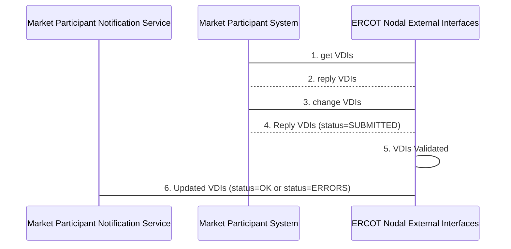

# Verbal Dispatch Instructions 

Each Market Participant can retrieve (via “get”) a Verbal Dispatch
Instructions (VDIs) from ERCOT and acknowledge it (via “change”) VDIs
request to ERCOT.

## Interfaces Provided 

The interface provides the means to get (i.e. query) or acknowledge
(i.e. change) Verbal Dispatch Instructions. A single container class
‘VDIs’ is used to hold a request for changing VDIs within the Payload
section of the message.

The following diagram shows an example message sequence, using the
‘verb’ and ‘noun’ convention, where this section focuses on the requests
made by Market Participant systems to the ERCOT Nodal Web Services. This
transaction is a synchronous for “get” requests and asynchronous for
“change” requests:

Figure 215 - Example Verbal Dispatch Instructions Sequence Diagram

The message sequence example shown involves the following steps:

1.  Market participant sends a RequestMessage for ‘get ‘VDIs with a
    constructed mRID (explained in section 12.3 below).

2.  In response to step 1, ERCOT performs a simple syntax scan and sends
    the request on to the Market Management System and passes the
    ResponseMessage with ReplyCode=OK back to the requester, holding the
    VDIs in response message payload. An alternative example could
    result in a reply of ‘ERRORS’ if the syntax checks failed. This
    reply is synchronous.

3.  Market participant sends a RequestMessage for ‘change VDIs’ to ERCOT
    for a specific resource or “change VDIs” for multiple resources by
    having multiple VDIs filled in the payload.

4.  In response to step 3, ERCOT performs a simple syntax scan and
    typically sends a ResponseMessage with ReplyCode=OK. In the response
    payload VDIs requests will identify a ‘SUBMITTED’ status. (An
    alternative example could result in a reply of ‘ERRORS’ if the
    syntax check failed, in which case steps 5 and 6 would not occur).
    This reply is synchronous.

5.  ERCOT validates the VDIs request within the message payload. This
    processing is done asynchronously.

6.  A notification message (using verb=reply) is sent to the
    notification interface provided by the Market Participant, stating
    “Acknowledged” in the reply part of the notification message.

## Interfaces Required 

The following tables describes the parameters used in the request
message (RequestMessage) for market information and transactions, noting
that each transaction has a request and a response message. The verbs
“get” and “change” is respectively used to retrieve and query Verbal
Dispatch Instructions.

<table>
<colgroup>
<col style="width: 34%" />
<col style="width: 65%" />
</colgroup>
<thead>
<tr class="header">
<th><mark>Message Element</mark></th>
<th><mark>Value</mark></th>
</tr>
</thead>
<tbody>
<tr class="odd">
<td>Header/Verb</td>
<td><em>get</em></td>
</tr>
<tr class="even">
<td>Header/Noun</td>
<td>VDIs</td>
</tr>
<tr class="odd">
<td>Header/Source</td>
<td><em>Market participant ID</em></td>
</tr>
<tr class="even">
<td>Header/UserID</td>
<td><em>ID of user</em></td>
</tr>
<tr class="odd">
<td>Request/ID</td>
<td>
mRID (<em>QSEID.VDI.&lt;resource&gt;)</em>

See section 12.3
</td>
</tr>
</tbody>
</table>

| Message Element | Value                                |
|-------------------------------------------|----------------------------------------------------------------|
| Header/Verb                               | reply                                                          |
| Header/Noun                               | VDIs                                                           |
| Header/Source                             | ERCOT                                                          |
| Reply/ReplyCode                           | *Reply code, success=OK, error=ERROR or FATAL*                 |
| Reply/Error                               | *May be any number of error message if the ReplyCode is ERROR* |
| Reply/Timestamp                           | *The time the submission was received by ERCOT*                |
| Payload                                   | Unacknowledged VDIs                                            |

| Message Element | Value |
|-------------------------------------------|---------------------------------|
| Header/Verb                               | *change*                        |
| Header/Noun                               | VDIs                            |
| Header/Source                             | *Market participant ID*         |
| Header/UserID                             | *ID of user*                    |
| Payload                                   | VDIs (VDIs to be acknowledged)  |

The corresponding response messages (ResponseMessage) would use the
following message fields:

| Message Element | Value                                                                                                                                     |
|-------------------------------------------|---------------------------------------------------------------------------------------------------------------------------------------------------------------------|
| Header/Verb                               | reply                                                                                                                                                               |
| Header/Noun                               | VDIs                                                                                                                                                                |
| Header/Source                             | ERCOT                                                                                                                                                               |
| Reply/ReplyCode                           | *Reply code, success=OK, error=ERROR or FATAL*                                                                                                                      |
| Reply/Error                               | *May be any number of error message if the ReplyCode is ERROR*                                                                                                      |
| Reply/Timestamp                           | *The time the submission was received by ERCOT*                                                                                                                     |
| Payload                                   | VDIs, where the status of each VDI Change Request within the payload may be ACKNOWLEDGED, or ERRORS. Specific errors may be identified for each VDI Change Request. |

In the cases of payloads that would otherwise exceed 1 megabyte, the
payloads should be zipped, base64 encoded and stored within the
‘Payload/Compressed’ tag.

For the purposes of VDIs, the verbs create and change can be used
interchangeably.

## Message Specifications

VDIs is the payload type used for the submission of Verbal Dispatch
Instructions requests and serves as a container for submitting an
acknowledgement of a VDIs request that are submitted by a QSE.

In order to query VDIs, A request is sent using the ‘get’ verb, where
the desired VDIs change requests for the specific resource is
identified.

Once a VDI is acknowledged, the queries will no longer return that
VDI. If all the VDIs have been acknowledged, the query will not return
anything.

The following subsection describes the structure of Verbal Dispatch
Instructions.

When submitting a VDI request using change, all properties for that
VDI must be specified. When performing a get request, only those
parameters that uniquely identify the VDI must be specified through
the use of an mRID.

An mRID should be manually constructed and used in the Message Request
as part of the VDIs “get” requests in the following format

`*QSEID.VDI.<resource>*`

An mRID is not supplied for the submission of a VDI change
(acknowledge) request, but must be supplied for query for a particular
resource. When an mRID is specified for a ‘get’ request, it is
supplied using a message request/ID tag.

Query by short-mRID is also supported in the following format (without
the resource):

`*QSEID.VDI*`

Invoking queries (via “get”) using short mRID, returns VDIs for all
the resources that belong to the requesting QSE.

The ‘externalId’ may be populated by the QSE with an identifier of
their choice. If supplied upon submission, the identifier will then be
used in conjunction with notifications of acceptance or rejection due
to errors.

### Verbal Dispatch Instructions Structure

The following diagram defines the structure of a Verbal Dispatch Instructions:

The error tag is used to return one or more errors that may be the
consequence of the failure of business or syntax validation rules for
VerbalDispatchInstruction submittals.

On submission, the following table describes the items used for a VDI
change request.

| *Element*                  | *Req?* | *Datatype* | *Description*                                      | *Values*                           |
|----------------------------|--------|------------|----------------------------------------------------|------------------------------------|
| mRID                       | N      | String     | ERCOT assigned                                     |                                    |
| externalId                 | N      | String     | External ID                                        | QSE supplied                       |
| status                     | N      | String     | Return status                                      | SUBMITTED, ACKNOWLEDGED, or ERRORS |
| Error/severity             | N      | String     | Error if any                                       | Error text                         |
| Error/area                 | N      | String     | Error if any                                       | Error text                         |
| Error/interval             | N      | String     | Error if any                                       | Error text                         |
| Error/text                 | N      | String     | Error if any                                       | Error text                         |
| resource                   | N      | String     | Resource name                                      | text                               |
| Details/ercotOperartorName | Y      | String     |                                                    | text                               |
| Details/instructionType    | Y      | String     | description/category of instruction                | free text field                    |
| Details/currentOprLevel    | N      | Float      | Current MW value for Resource is to be deployed to | MW value to one decimal            |
| Details/currentState       | N      | String     | current state of the Resource,                     | off/on, etc.  free text field      |
| Details/notificationTime   | Y      | DateTime   |                                                    | DateTime                           |
| Details/initiationTime     | N      | DateTime   |                                                    | DateTime                           |
| Details/completionTime     | N      | DateTime   |                                                    | DateTime                           |
| Details/vdiRefNum          | Y      | string     | VDI reference                                      | Text                               |
| Details/otherInformation   | N      | string     | Other Information                                  | Text                               |
| Details/finalOprlevel      | N      | Float      | Final MW value for Resource is to be deployed to   | MW value to one decimal            |
| Detail/finalState          | N      | string     | final state of the Resource,                       | off/on, etc.  free text field      |

> InstructionType values

| Instruction Type | Instruction Description                    |
|------------------|--------------------------------------------|
| AB_PQ_LEV        | STAY AT/ABOVE X MW/MVAR LEVEL              |
| ALT_FUEL         | BEGIN ALTERNATIVE FUEL USAGE               |
| AT_PQ_LEV        | STAY AT X MW/MVAR LEVEL                    |
| AT_PRE_BP        | BE AT PREVIOUS BP                          |
| AT_VOL_LEV       | HOLD X VOLTAGE LEVEL                       |
| BE_PQ_LEV        | STAY AT/BELOW X MW/MVAR LEVEL              |
| BLT              | IMPLEMENT BLT DURING EMERGENCY             |
| CANNOT_RET       | CAN NOT RETURN EARLY FROM OUTAGE           |
| CAN_COM          | CANCEL RUC COMMIT                          |
| COMMIT           | COMMIT                                     |
| CONS_FREQ        | OPERATE AT CONSTANT FREQUENCY              |
| DC_TIE           | PROVIDE EMERGENCY POWER FROM DC TIE        |
| DECOMMIT         | DECOMMIT                                   |
| OOME             | FLEET OOME                                 |
| OTHER_QSE        | OTHER FOR QSE                              |
| OTHER_RES        | OTHER FOR RESOURCE                         |
| OTHER_TSP        | OTHER FOR TSP                              |
| OTH_ALLQSE       | OTHER FOR ALL QSE                          |
| OTH_ALLTSP       | OTHER FOR ALL TSP                          |
| PROT_UNIT        | PROTECT UNIT AGAIN FREEZING CONDITIONSE    |
| RAP_MP           | IMPLEMENT RAP/MP FOR LINE/BREAKER          |
| REACT_DEV        | ENERGIZE/DE_ENERGIZE REACTIVE DEVICE       |
| RRS_1_2          | RRS DEPLOYMENT FROM GROUP 1 & 2            |
| RRS_GR_1         | RRS DEPLOYMENT FROM GROUP 1                |
| RRS_GR_2         | RRS DEPLOYMENT FROM GROUP 2                |
| RRS_NCLR         | RRS DEPLOYMENT FROM NON-CONTROLLABLE LR    |
| SHED_BLCLD       | SHED X MW LOAD IN 100 MW BLOCKS            |
| SHED_LOAD        | SHED X MW LOAD IN SPECIFIC AREA/SUBSTATION |
| TAP_CHG          | TAP TRANSFORMER UP/DOWN                    |

The following is an XML example of a VDI:

~~~
<VDIs>
    <VDI>
        <mRID>QSE.VDI.Resource1</mRID>
        <externalId></externalId>
        <status>SUBMITTED</status>
        <error>
            <severity>INFORMATIVE</severity>
            <text> Successfully retrieved the ERCOT VERBAL_DISP_INSTRUCT. </text>
        </error>
        <resource>Resource1</resource>
        

            <ercotOperatorName>Tester1</ercotOperatorName>
            <instructionType>RAP_MP</instructionType>
            <currentOprLevel>3.1</currentOprLevel>
            <currentState>OPEN</currentState>
            <notificationTime>2009-09-24T15:05:31-05:00</notificationTime>
            <initiationTime>2009-09-24T15:05:34-05:00</initiationTime>
            <completionTime>2009-09-24T15:05:36-05:00</completionTime>
            <vdiRefNum>689</vdiRefNum>
            <otherInformation>Unacknowledged</otherInformation>
            <finalState>CLOSE</finalState>
        

    </VDI>
</VDIs>
~~~              
